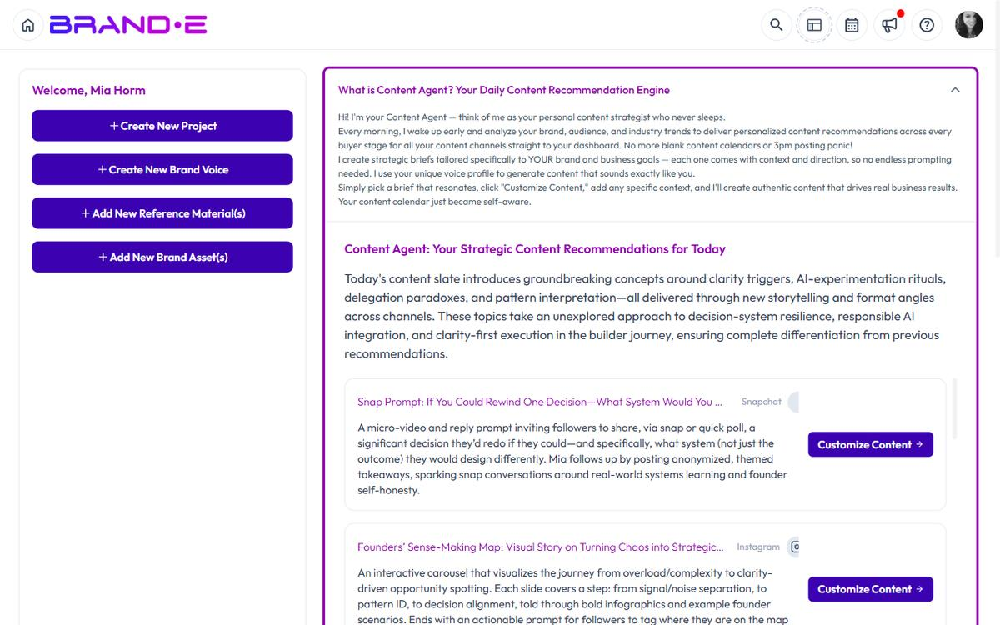

# Brande.ai Mental Model

## What Brande.ai Is (At a High Level)

Brande.ai is not a writing tool.

It is a **brand-aware content operating system** that turns your brand strategy into consistent written and visual content—without requiring you to plan, prompt, or micromanage every piece of content.

Instead of asking:
> "What should I write today?"

Brande.ai starts with:
> "Who is this brand, who is it for, and what should it say right now?"

---

## The Three Systems That Power Brande.ai

Everything in Brande.ai is built on three connected systems.

Understanding these systems explains how the product works.

### 1. Brand DNA System

**Defines who you are**

This system captures and stores the strategic foundation of your brand so content never starts from scratch.

Brand DNA includes:

- Your business objectives
- Your audience's purchase triggers
- Your content channels
- Your brand assets (documents, links, videos, images)
- Your brand voice (tone, storytelling style, emotional patterns)

Once set up, this information becomes the **single source of truth** used across all content and images.

You do not re-explain your brand every time you create content.

Brande.ai already knows it.

### 2. Content Agent System

**Decides what you should create**

Most tools help you write after you already know what to create.

Content Agent works before writing begins.

It analyzes:

- Your Brand DNA
- Your website and existing content
- Your competitors and market patterns
- Your channels and goals

Then it delivers **daily, brand-specific content briefs** directly to your dashboard.

Each brief tells you:

- What to create
- Why it matters
- Where it fits in your strategy

You choose which briefs to act on.

Brande.ai removes the guesswork—not your control.

### 3. Content Creation System

**Turns strategy into finished content**

Once you select a brief or start a project, Brande.ai generates content that:

- Matches your brand voice
- Aligns with your goals
- Fits the selected channel
- Maintains consistency across formats

This includes:

- Written content (posts, pages, threads, long-form)
- Visual content (on-brand images generated alongside text)

You are not prompting an AI.

You are **executing a strategy that already understands your brand**.

## How These Systems Work Together

Think of Brande.ai as a pipeline:

1. **Brand DNA** defines the rules
2. **Content Agent** creates the plan
3. **Content Creation** executes the work

Each system builds on the one before it.

If Brand DNA is incomplete, results feel generic.

If Content Agent is ignored, creation becomes reactive.

If Content Creation is rushed, consistency suffers.

When all three systems are used together, content scales without losing quality or voice.

## How Brande.ai Is Different From Other Tools

Most content tools start with:

- Prompts
- Templates
- Single pieces of content

Brande.ai starts with:

- Strategy
- Brand governance
- Repeatable systems

You are not generating content one piece at a time.

You are operating a **content engine**.

## How Agencies Think About Brande.ai

For agencies, Brande.ai functions as a **multi-brand content operating system**.

Each client has:

- Their own Brand DNA
- Their own Content Agent logic
- Their own projects, assets, and approvals

Agencies manage everything from a single workspace without mixing brands or workflows.

This turns content strategy into:

- A repeatable service
- A scalable deliverable
- A defensible operating model

## How to Use Brande.ai Successfully

If you remember only three things:

1. Set up Brand DNA thoroughly
2. Check Content Agent before creating content
3. Treat content creation as execution—not ideation

When you do this, Brande.ai stops feeling like a tool and starts behaving like a system.

## Where to Go Next

- [Understand Brand DNA](/section-1-getting-started/understand-brand-dna)
- [Complete Your Brand Profile Step by Step](/section-1-getting-started/complete-brand-profile)
- [How To Use Content Agent](/section-2-content-agent/use-content-agent)
