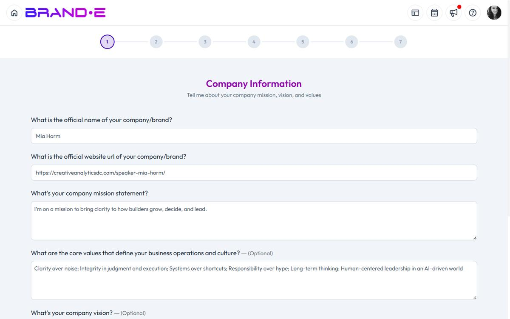

# Complete Your Brand Profile Step by Step

Your brand's DNA determines the quality of every recommendation, every piece of content, and every image Brande.ai generates.

Weak Brand DNA creates generic output, low engagement, and early product abandonment.

A complete Brand Profile transforms Brande.ai from a tool into a content engine that understands your market position and speaks directly to your audience.

## What You'll Need

- A Brande.ai account (any plan)
- 3–5 examples of your brand voice (website copy, LinkedIn posts, or a brand guidelines doc)
- Your logo as a PNG with transparent background
- 15 minutes

## Why Brand Profile Setup Matters

Content generation is only as good as the information behind it.

When you provide clear, specific answers to onboarding questions, Brande.ai:
- Extracts your actual brand voice (not AI-invented voice)
- Understands your specific audience triggers
- Recommends content aligned with real business goals
- Generates images that match your visual identity
- Avoids costly revisions and rejections

When answers are vague, generic, or incomplete:
- Output feels corporate and inauthentic
- Content misses your audience's pain points
- Image generation doesn't match your brand
- You waste time editing instead of publishing

The onboarding wizard lives at `/onboard` and walks you through five key sections over about 15 minutes.

You can update any section later in your **Brand Profile** page (Account sidebar, brand owner only).

## The Five Onboarding Sections

### 1. Brand Basics

**What you enter:** Brand name, company stage, logo, and business category.

**Why this matters:** Brande.ai uses this to set context and avoid generic positioning.

**Good answers look like:**
- Brand name: Clear, memorable name (not "SaaS Tool #47")
- Stage: Specific stage indicator (Pre-launch, Scaling, Mature) that affects message strategy
- Logo: High-quality PNG or SVG that feeds into image generation
- Category: Specific vertical (e.g., "Accounting automation for contractors" not "B2B SaaS")

**Weak answers look like:**
- Brand name: Placeholder or unclear
- Stage: Vague ("growing" vs "raising Series B")
- Logo: Low resolution, cropped, or missing
- Category: Generic ("technology" or "services")

**Tip:** Your logo should be a clean, transparent background version. If it contains text, make sure the text is legible at small sizes—Brande.ai will use it in image generation.

---

### 2. Business Objectives

**What you enter:** 2–3 specific, measurable outcomes your brand is trying to achieve in the next 6–12 months.

Examples:
- "Establish thought leadership in fractional CFO services for 5–20 person startups"
- "Drive leads from LinkedIn to our consulting booking page"
- "Increase brand awareness among senior marketing ops managers"
- "Build a community of product managers who trust our UX audit methodology"

**Why this matters:** Content Agent uses business objectives to decide what you should create. Without them, recommendations are unfocused.

**Good answers look like:**
- Specific audience ("senior marketing ops managers" not "marketers")
- Clear outcome ("establish thought leadership" not "get more visibility")
- Measurable where possible ("drive 20 leads/month" not "drive leads")
- Tied to a channel or format where content actually converts

**Weak answers look like:**
- Vague ("grow our business", "be known in the market")
- Too many objectives (5+ creates noise)
- Missing the channel ("increase sales" without saying where the customer comes from)

**Tip:** If you're struggling, ask: "How will this brand succeed in the next 12 months? What one thing must happen?" That answer is your objective.

---

### 3. Audience & Purchase Triggers

**What you enter:** Who your customer is and what problem or trigger moves them to buy.

Examples:
- "Fractional CMOs managing 2–4 clients who are overwhelmed by content planning and want a repeatable system"
- "Senior engineers frustrated with flaky CI/CD pipelines and looking for a fast alternative"
- "Coaches selling group programs who know they *should* be on LinkedIn but don't have time"

**Why this matters:** Brande.ai references this in every piece of content. Content Agent uses it to recommend topics that resonate. Images are generated with this audience in mind.

**Good answers look like:**
- Specific role or title ("VP of Product at seed-stage SaaS" not "business people")
- Specific pain point ("content planning takes 30% of week" not "busy")
- Specific trigger ("competitor launched, now losing market share" not "growth pressure")
- One or two audience segments—if you have more, list the primary one

**Weak answers look like:**
- Too broad ("anyone in marketing", "business owners")
- Generic pain ("they want to save time", "they want better results")
- Missing the trigger (why *now* do they care?)

**Tip:** Look at your best customer. Why did they buy? What was happening in their world when they needed you? That's your audience trigger.

---

### 4. Content Channels

**What you enter:** Select the platforms where you will publish content.

Available channels: Blog, Podcasts, Paid Ads, Email, Facebook, Instagram, Twitter, LinkedIn, TikTok, YouTube, Pinterest, Snapchat, Discord

**Why this matters:** Content Agent recommends topics suited to your channels. Content generation adjusts format and tone for each platform. If you omit a channel, Content Agent won't recommend for it.

**Good answers look like:**
- Select 2–4 channels where your audience *actually spends time*
- Choose channels where you can commit to consistent publishing
- If unsure, LinkedIn and Blog are safe defaults for B2B

**Weak answers look like:**
- Selecting all channels (dilutes focus, overwhelming to execute)
- Selecting channels you don't actually use ("we might do TikTok someday")
- Omitting your main channel (missing 50% of Content Agent value)

**Tip:** You can update channels later in your Brand Profile. Start with where you know you'll publish regularly. You can expand as you scale.

---

### 5. Brand Voice & Assets

**What you enter:** Examples of your brand's actual voice and visual style.

Content types: Text, File, Media File, URL

Examples:
- **Text:** Paste a paragraph from your website, a LinkedIn post, or customer testimonial
- **File:** Upload a brand guidelines PDF, company handbook, or past marketing plan
- **Media File:** Upload a video of you speaking, a podcast episode, or a brand video
- **URL:** Link to your website, LinkedIn profile, or published article

**Why this matters:** Brande.ai analyzes your voice examples to extract tone, storytelling patterns, and emotional voice. Everything you generate matches this profile. Your assets feed the Brand DNA that powers image generation and content recommendations.

**Good examples look like:**
- A recent LinkedIn post that shows your actual voice (3–5 posts is ideal)
- Website copy from your homepage or services page
- A brand guidelines PDF (if you have one)
- A link to your LinkedIn profile or a recorded founder video
- Customer testimonials or case study excerpts

**Weak examples look like:**
- Only one sample (Brande.ai needs 2–3 to identify patterns)
- Old content that doesn't reflect current voice
- ChatGPT-generated copy or generic templates
- Competitor content instead of your own
- Assets with no context (a random file with no label)

**Tip:** The more recent and authentic your examples, the better. If you have a brand guidelines document, that's gold—upload it. If not, find 3–5 of your best recent posts or pages.

---

## The Analyzer Step

After you enter text, file, or media inputs, click **Analyze**.

Brande.ai extracts your voice characteristics and generates a summary: tone, storytelling style, emotional voice, key messaging patterns.

Review the analysis and click **Save Analysis** if it feels accurate.

If something is wrong ("we're not always motivational"), you can re-enter inputs or edit the analysis manually.

This step takes 30 seconds to 2 minutes depending on file size.

---

## What Happens Next

Once you complete the wizard, you are redirected to `/onboard-success`.

From there:

1. **Go to your Brand Profile** (Account sidebar → Brand Profile) to review or update answers anytime
2. **Check Content Agent** (Content Opportunities sidebar) to see what Brande.ai recommends you create first
3. **Create your first project** (Alt+N) using a Content Agent recommendation

---

## Update Your Brand Profile Over Time

Brands evolve.

As your product, positioning, or audience changes, update your Brand Profile:

- **Brand Voice:** Add new examples quarterly. When your voice shifts, re-run the analyzer.
- **Business Objectives:** Update annually or when strategy changes. Content Agent watches this closely.
- **Audience Triggers:** Revisit when you learn new customer insights.
- **Channels:** Add or remove as your distribution strategy changes.
- **Assets:** Keep brand guidelines and voice examples current.

Outdated inputs create outdated outputs.

---

## Related Topics

- [Understand Brand DNA](/section-1-getting-started/understand-brand-dna)
- [Update Your Brand Profile Over Time](/section-1-getting-started/update-profile-settings)
- [Understand Brand Voice Analyzer](/section-1-getting-started/understand-brand-voice-analyzer)