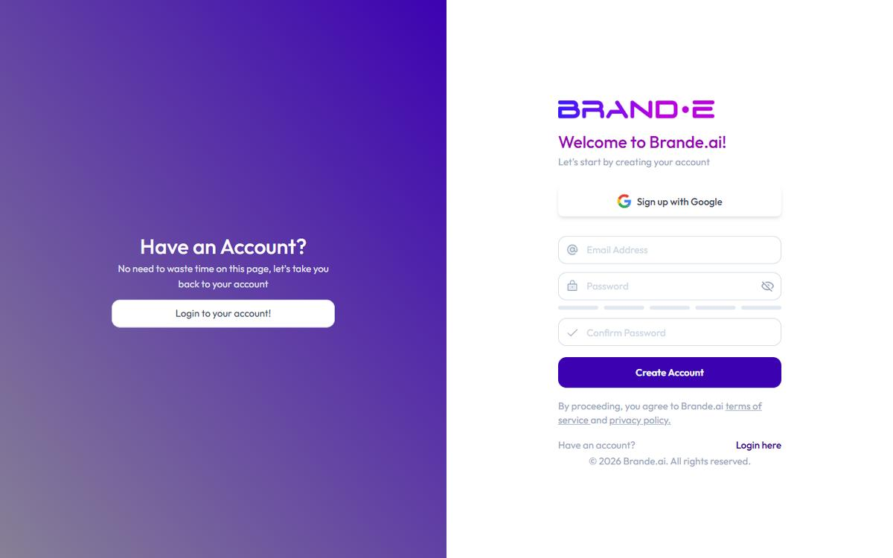

# Create Your Account and First Brand

Getting started with Brande.ai takes less than five minutes. You'll create an account, verify your email, and walk through a guided setup that teaches Brande.ai how your brand sounds, looks, and thinks.

## What You'll Need

- A valid email address
- A password (minimum 8 characters, with at least one uppercase letter, one lowercase letter, and one number)
- 3–5 examples of your brand voice (website copy, LinkedIn posts, or a brand guidelines doc) — you can add these during onboarding or later

## Steps

1. **Go to the signup page.** Open your browser and navigate to your Brande.ai signup URL.

2. **Enter your email address.** Type your email in the **Email** field. This becomes your login email — use one you check regularly.

3. **Create a password.** Type your password in the **Password** field, then confirm it in the **Confirm Password** field. Both must match exactly.
   - Minimum 8 characters
   - At least one uppercase letter (A–Z)
   - At least one lowercase letter (a–z)
   - At least one number (0–9)
   - A strength indicator shows how secure your password is as you type

4. **Submit the form.** Click the signup button to create your account.

5. **Verify your email.** Check your inbox for a verification email from Brande.ai. Click the verification link to activate your account.
   - If you don't see the email within a few minutes, check your spam or promotions folder.
   - Add noreply@brande.ai to your contacts to prevent future filtering.

6. **Log in.** Once verified, go to the login page and sign in with your email and password.

7. **Start the onboarding wizard.** After your first login, Brande.ai walks you through setting up your first brand. The wizard captures your brand profile, business objectives, audience, and content channels — everything Brande.ai needs to generate content that sounds like you, not like a generic template.

## What Happens Next

Your account is live and your first brand is being set up. The onboarding wizard guides you through completing your Brand DNA — the strategic foundation that powers every piece of content and every image Brande.ai generates. The more specific you are during setup, the better your results from day one.

For a detailed walkthrough of every onboarding step, see [Complete Your Brand Profile Step by Step](/section-1-getting-started/complete-brand-profile).

## Tips

- **Use your primary work email.** Team invitations and notifications go to this address. If you're an agency, use your agency email — not a client's.
- **Don't skip the onboarding wizard.** Brande.ai uses your Brand DNA to generate content. Skipping setup means Brande.ai has nothing to work with, and your outputs will be generic.
- **Invited by a team member?** If you received an invite link, signing up with that exact email address automatically connects you to the team's workspace. No extra steps needed.

## Troubleshooting

**"This email is already taken":** You already have a Brande.ai account with this email. Go to the login page and sign in, or use **Forgot Password** if you don't remember your credentials.

**Verification email never arrives:** Wait 5 minutes, then check spam and promotions folders. If it still hasn't arrived, see [Account and Login Issues](/troubleshooting/account-login) for detailed steps.

**Password validation error:** Make sure both password fields match exactly and meet all requirements (8+ characters, uppercase, lowercase, number). Check that Caps Lock is off.

## Related Topics

- [Complete Your Brand Profile Step by Step](/section-1-getting-started/complete-brand-profile)
- [Understand Brand DNA](/section-1-getting-started/understand-brand-dna)
- [Upload and Manage Brand Assets](/section-1-getting-started/upload-brand-assets)
- [Account and Login Issues](/troubleshooting/account-login)
