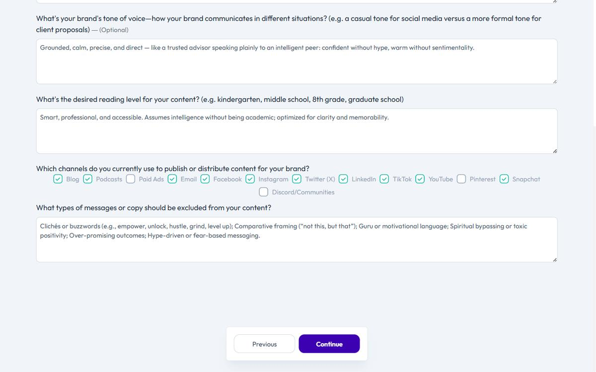

# Select Your Content Channels

Content Agent only recommends for the channels you select.

If you omit a channel, you're ignoring half of what Content Agent can do for you.

If you select every channel, you overwhelm your execution capacity and dilute focus.

Get channel selection right, and Content Agent becomes your content strategy.

## What Channels Are

Channels are the platforms where you publish content.

Brande.ai supports:

- **Blog** — Long-form articles on your website
- **Podcasts** — Audio episodes (you manage publishing separately)
- **Paid Ads** — Copy optimized for Facebook, Google, or other ad platforms
- **Email** — Newsletters and email sequences
- **Facebook** — Facebook Posts and Threads
- **Instagram** — Reels, carousel posts, stories
- **Twitter** — Tweets and threads
- **LinkedIn** — Posts, articles, and thought leadership
- **TikTok** — Short-form video captions and hooks
- **YouTube** — Video descriptions, thumbnails, and scripts
- **Pinterest** — Pins and pin descriptions
- **Snapchat** — Stories and captions
- **Discord** — Messages, announcements, and discussions

Content Agent analyzes your brand and recommends topics for each selected channel.

Content Creation adjusts format and tone for each platform.

## How to Select Channels During Onboarding

During the onboarding wizard, you'll see a channel selection screen.

Select the platforms where you *will consistently publish* in the next 90 days.

If unsure, start with 2–4 channels:

- **B2B SaaS founders and agencies:** LinkedIn + Blog
- **Social-first brands:** LinkedIn + Instagram + TikTok
- **Email-driven businesses:** Email + Blog
- **Creator/Coach brands:** LinkedIn + YouTube + Email

You can update channels anytime in your **Brand Profile** (Account sidebar, brand owner only).

## How to Select Channels After Onboarding

Navigate to **Account** → **Brand Profile**.

Scroll to the **Content Channels** section.

Check or uncheck channels as needed.

Click **Save**.

Changes take effect immediately in Content Agent.

## Strategy for Channel Selection

### Select only channels where you have distribution capacity

Do not select a channel because you think you *should* use it.

Select a channel because you can publish consistently—weekly at minimum.

If you select 8 channels but only publish to 2, Content Agent will recommend 8x more content than you can execute.

Result: You ignore Content Agent, feel overwhelmed, and abandon Brande.ai.

### Start narrow, expand gradually

Pick your 2–3 core channels first.

Master content generation and publishing on those.

After 4–6 weeks, add a new channel if you have capacity.

### Match channels to your audience

LinkedIn works for B2B professionals and founders.

TikTok works for younger audiences and visual learners.

Email works when you own your audience list.

YouTube works for comprehensive tutorials and thought leadership.

Blog works for SEO-driven discovery and long-form strategy.

If your audience isn't on a platform, don't select it.

### Account for format differences

Some channels accept only images (Pinterest, Instagram).

Some accept video (YouTube, TikTok, LinkedIn).

Some accept text (Blog, Email, Twitter).

Some accept mixed formats (LinkedIn, Discord, Facebook).

Select channels that match the formats you can produce consistently.

## How Channels Affect Content Agent

Content Agent recommends content tailored to your selected channels.

If you select **LinkedIn only**, Content Agent suggests professional thought leadership topics (industry analysis, career advice, business strategy).

If you select **TikTok + Instagram**, Content Agent suggests trending topics, visual storytelling, and behind-the-scenes content.

If you select **Blog + Email**, Content Agent suggests long-form educational content and newsletter themes.

Content Agent is smart about channel context.

Use this intelligence.

If Content Agent recommends a topic and you don't have the channel selected, it means Brande.ai thinks this topic matters for your brand *and* that you should consider that channel.

## Example Channel Setups

**B2B SaaS Founder (Lean Team)**
- LinkedIn (professional credibility, audience concentration)
- Blog (SEO, owned traffic, thought leadership archiving)

**Fractional CMO (Agency)**
- LinkedIn (client case studies, thought leadership)
- Blog (SEO for service keywords)
- Email (newsletter for leads and nurture)

**Social-First Creator**
- Instagram (primary audience)
- TikTok (viral reach, algorithm discovery)
- Email (direct relationship, offers)

**Consultancy**
- Blog (authority and SEO)
- LinkedIn (distribution and network)
- Email (weekly insights, client nurture)
- Podcast (audio distribution alternative)

## Update Channels as Your Strategy Changes

When you launch a new initiative or audience segment, add a channel.

When a channel stops performing or you run out of capacity, remove it.

Content Agent updates instantly.

Brands that treat channels as fixed assets miss growth opportunities.

---

## Related Topics

- [Complete Your Brand Profile Step by Step](/section-1-getting-started/complete-brand-profile)
- [Understand Content Agent](/section-2-content-agent/understanding-content-agent)