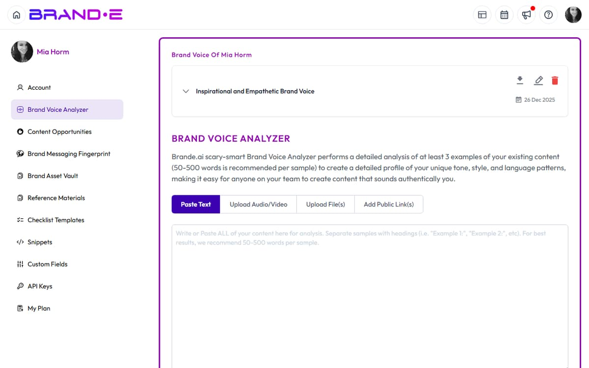

# Understand the Brand Voice Analyzer

The Brand Voice Analyzer is how Brande.ai learns to speak like your brand.

It listens to your content, extracts voice patterns, and creates a profile that shapes every piece of content you generate.

Without voice analysis, your output sounds generic.

With it, your output sounds like you.

## What the Brand Voice Analyzer Does

The analyzer examines your actual content—posts, pages, videos, documents—and extracts:

- **Tone:** Formal, friendly, direct, empathetic, playful, authoritative, conversational
- **Storytelling patterns:** How you structure narratives, what you emphasize, what you ask
- **Emotional voice:** What emotions you evoke (inspiration, confidence, belonging, urgency, humor)
- **Word and phrase patterns:** Signature words, metaphors, sentence structure, pacing

The result is a voice profile—a description of how your brand communicates.

Brande.ai uses this profile as a filter for all future content generation.

## Why Brand Voice Analysis Matters

Without voice analysis, Brande.ai generates content in "default AI voice"—corporate, generic, inauthentic.

With voice analysis, Brande.ai generates content that sounds like your founding team wrote it.

This is the difference between:

> "Our platform helps you create content faster and more efficiently, saving you time and resources."

And:

> "You shouldn't need a copywriter to publish weekly. Our tool handles the thinking so you can focus on strategy."

The second one sounds real because it matches an actual brand voice.

## Where to Find the Brand Voice Analyzer

Navigate to **Account** → **Brand Voice**.

You'll see a page with options to add content inputs.

## How to Use the Analyzer

### 1. Add Content Input

Click **Add Content** or **+**.

Choose a content type:

- **Text:** Paste a paragraph, post, email, or any written content
- **File:** Upload a document (PDF, Word, plain text)
- **Media File:** Upload video, audio, or image file containing your voice
- **URL:** Link to a webpage, LinkedIn profile, or published article

### 2. Provide Context (Optional)

Add a label or note about the content.

**Examples:**
- "Recent LinkedIn posts (January 2024)"
- "Homepage copy from our website"
- "Founder interview video"
- "Customer testimonial"

This helps you (and Brande.ai) remember where the content came from.

### 3. Click Analyze

Brande.ai processes the input and extracts voice characteristics.

Processing time: 30 seconds to 2 minutes depending on file size.

### 4. Review the Analysis

Brande.ai generates a voice profile summary:

**Example output:**
> "Your brand voice is conversational and direct. You use short sentences. You emphasize speed and simplicity over features. You address the reader's pain point first, then present your solution. You use casual language ("you shouldn't need to...") mixed with confidence. Your emotional tone is pragmatic but encouraging."

Read this carefully.

Does it sound right?

Does it miss something important?

### 5. Save or Edit

Click **Save Analysis** to confirm.

If something is wrong, click **Edit** to refine the description manually.

You can also add notes or context to guide future generation.

**Example edit:**
> "Add: We use short words and avoid jargon. We make jokes sometimes but stay professional. We address founders specifically, not general audiences. We focus on the emotional benefit (control, simplicity) not the technical benefit."

## What Good Voice Analysis Looks Like

Good analysis captures:

- **Actual patterns from your content** (not invented)
- **Specific language details** (short vs long sentences, formal vs casual, metaphorical vs literal)
- **Emotional intent** (what you're trying to make your audience feel)
- **Audience address** (who you're talking to and how)
- **Signature elements** (recurring words, phrases, structures that mark you)

Bad analysis looks like:

- Generic ("professional, friendly, helpful")
- Invented ("you use lots of emojis" when you don't)
- Conflicting ("formal and playful" with no nuance)
- Missing context ("no mention of your actual audience or pain points")

## Adding Multiple Voice Examples

One example is not enough.

Brande.ai learns voice patterns best with 3–5 examples.

Add examples from different formats:

- 2–3 LinkedIn posts (recent, best-performing)
- 1 website or "About" page copy
- 1 email or newsletter excerpt
- 1 video (optional)

Diverse examples help Brande.ai distinguish between one-off content and genuine patterns.

## Analyzing Video & Audio

If you upload video or audio, Brande.ai transcribes it and extracts voice characteristics.

This is powerful because video captures tone, pace, emotion, and word choice in ways written copy alone cannot.

A 2–3 minute founder video is worth 10 written examples.

## When to Re-Analyze Your Voice

Re-run the analyzer when:

- **Your brand voice shifts** (you've evolved your positioning or tone)
- **You've published new best-performing content** (quarterly check-in)
- **You hired a new team member who speaks for the brand** (add their voice examples)
- **Your audience or market has changed** (your voice may have shifted in response)
- **Output doesn't match your voice** (re-analyze to correct the profile)

Brands evolve.

Your voice profile should evolve too.

## Example: Voice Analysis Workflow

**Week 1: Initial setup**
- Upload 3 LinkedIn posts
- Upload homepage copy
- Click Analyze
- Review and save

**Month 3: Refinement**
- Content generated feels slightly off
- Re-analyze with 2 new recent posts
- Edit profile to add detail: "Add emphasis on speed and simplicity—we never mention technical complexity"
- Save updated profile

**Month 6: Evolution**
- Repositioning complete
- Upload new content examples reflecting new voice
- Re-analyze
- Profile updates to capture new tone and messaging

---

## Related Topics

- [Complete Your Brand Profile Step by Step](/section-1-getting-started/complete-brand-profile)
- [Update Your Brand Voice](/section-1-getting-started/update-brand-voice)
- [Understand Brand DNA](/section-1-getting-started/understand-brand-dna)