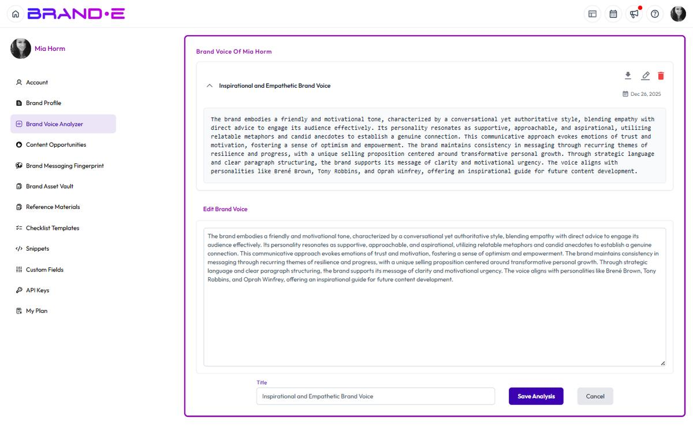

# Update Your Brand Voice

Your voice evolves as your brand grows.

Quarterly updates keep your Brand DNA fresh and your content generation accurate.

Stale voice profiles create stale output.

## When to Update Your Brand Voice

### After you publish new, best-performing content

If you've published content in the last month that performed better than usual:
- A LinkedIn post with high engagement
- An email with strong open rates
- A blog post with high traffic

Add these examples to your voice profile.

They signal a shift in your communication style.

### When your messaging or positioning changes

If you've repositioned your brand:
- New target audience
- New value proposition
- New business model

Add new content examples that reflect the new positioning.

Then re-analyze.

Your voice profile should match your current positioning, not your old one.

### Quarterly wellness check

Every 90 days, review your voice profile.

Is it accurate?

Are you publishing content that matches this profile?

Is the profile still guiding good output?

If anything feels off, refresh it.

### When output doesn't match your voice

If Brande.ai generates content that feels off-brand:
- Wrong tone (too formal when you're casual)
- Wrong audience address (generic when you're specific)
- Wrong emotional tone (serious when you're playful)

Your voice profile may be outdated or incomplete.

Re-analyze with current content examples.

## How to Update Your Brand Voice

### 1. Navigate to Brand Voice

Go to **Account** → **Brand Voice Analyzer**.

You'll see your existing voice profile and any previous analyses.

### 2. Add New Content Examples

Click **Add Content** or **+**.

Choose a type: Text, File, Media File, or URL.

Add 1–2 new examples of your recent best-performing content.

### 3. Label the New Content

Add a note to yourself:

**Good labels:**
- "Recent LinkedIn posts performing well"
- "New positioning - focus on speed, not features"
- "Founder video from March 2024"
- "Updated homepage copy"

This helps you remember what changed.

### 4. Click Analyze

Brande.ai processes the new content and generates an updated analysis.

### 5. Review the Updated Analysis

Compare the new analysis to the old one.

What changed?

What stayed the same?

**Look for:**
- New emotional tone or storytelling patterns
- Shift in audience address or language style
- New signature words or phrases
- Changes in formality or pacing

### 6. Edit if Needed

If the analysis misses something, click **Edit** and add detail.

**Example addition:**
> "Previous profile: 'You use casual language.' Updated note: We've shifted to more professional language in recent months. Tone is still conversational but less jokey. Balance is now 70% professional, 30% casual."

### 7. Save the Updated Profile

Click **Save Analysis**.

The updated profile takes effect immediately.

All future content generation references this new profile.

## What Changes in a Voice Update

### Adding specificity

**Old profile:**
> "Your tone is conversational and friendly."

**Updated profile:**
> "Your tone is conversational, direct, and audience-focused. You acknowledge the reader's pain first, then present your solution. You use short sentences and avoid jargon. You're friendly without being jokey."

### Capturing new patterns

**Old profile:**
> (No mention of emojis or formatting)

**Updated profile:**
> "You use one emoji per LinkedIn post, strategically placed for emphasis, not decoration. You format lists with dashes, not numbers. You use line breaks for pacing."

### Evolving emotional tone

**Old profile:**
> "Your emotional tone is confident and authoritative."

**Updated profile:**
> "Your emotional tone has evolved. You project confidence but also accessibility. You've moved away from authority and toward partnership. You want your audience to feel 'we can do this together,' not 'follow the expert.'"

### Reflecting audience shifts

**Old profile:**
> "You address seasoned marketers."

**Updated profile:**
> "You now address two audiences equally: (1) CMOs managing large teams, and (2) solo founders doing marketing themselves. Your messaging acknowledges both, avoiding jargon for the solo founders while addressing strategic complexity for the CMOs."

## Best Practices for Voice Updates

### Don't update on one piece of content

Wait until you have 2–3 pieces of new content that show a pattern.

A single viral post doesn't mean your voice changed.

### Update with diverse examples

Don't update with only LinkedIn posts.

If you've launched a newsletter, update with a newsletter excerpt.

If you've recorded videos, update with a video.

Diversity prevents over-correction.

### Keep old analyses for reference

If you ever want to see how your voice has evolved, you can review old analyses.

Some platforms let you view version history.

Use it.

### Edit the analysis, not just add examples

Simply adding new examples and re-analyzing isn't always enough.

If Brande.ai's description is missing nuance, edit it directly.

Add context, clarify contradictions, call out new patterns.

The more detailed your voice profile, the better your output.

### Test output after updating

After updating your voice profile, create a test project.

Does the generated content feel more on-brand?

Or does it still feel off?

If still off, the profile may need more work.

## Example: Voice Update Workflow

**Initial Setup (Month 1)**

Voice profile created during onboarding with:
- 3 LinkedIn posts
- Homepage copy

Analyzer summary:
> "Professional but accessible. You speak to busy marketing leaders. Short sentences. Focus on time and simplicity."

**Month 3: First Update**

Performance data shows:
- Emotional, personal posts outperform formal ones
- Audience includes more founders than C-suite

Actions:
- Add 2 new LinkedIn posts with higher personal vulnerability
- Add founder interview video
- Re-analyze

Updated profile:
> "Professional but human. You speak to marketing leaders and founders equally. You share challenges before solutions. Short sentences. Focus on simplicity and speed. You're confident but not arrogant—you acknowledge that marketing is hard."

**Month 6: Second Update**

New brand positioning launched.

Actions:
- Add new website copy with updated messaging
- Add customer testimonial reflecting new positioning
- Re-analyze

Updated profile:
> "You've shifted from 'tools for marketing teams' to 'brand-aware content system.' Professional but human tone stays. New emphasis: you're solving for consistency and governance, not just speed. You now mention 'Brand DNA' as a core concept. Emotional tone is partnership-focused."

---

## Related Topics

- [Understand Brand Voice Analyzer](/section-1-getting-started/understand-brand-voice-analyzer)
- [Understand Brand DNA](/section-1-getting-started/understand-brand-dna)
- [Complete Your Brand Profile Step by Step](/section-1-getting-started/complete-brand-profile)