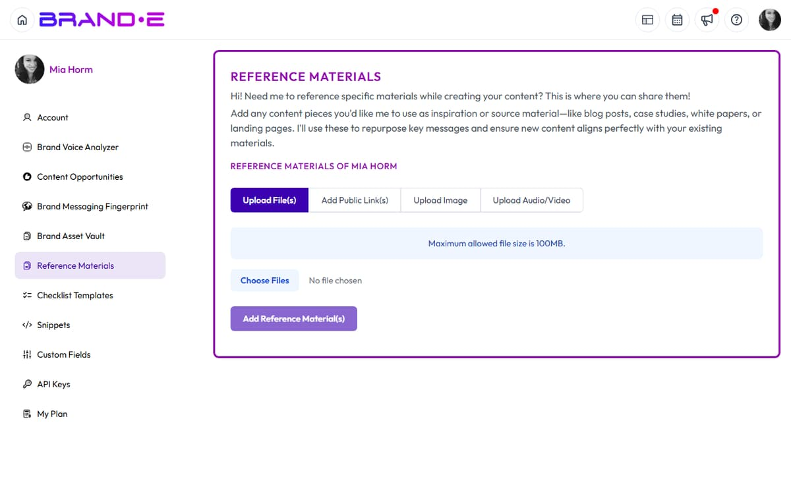

# Update Your Reference Materials

Reference materials are the data, statistics, and proof points that ground your content in truth.

As your business grows, your reference materials should grow too.

Stale statistics and outdated case studies weaken your credibility.

Keep them current and specific.

## When to Update Reference Materials

### After new customer wins

When you close a major customer:
- Add a case study or success story
- Add specific results metrics
- Update customer count or portfolio materials

**Example update:**
> Before: "Clients see increased engagement"
>
> After: "ABC Corp increased content engagement by 35% in 60 days and saved 12 hours per week on planning"

### When new data becomes available

When you conduct customer research or gather new insights:
- Add new customer statistics
- Update market trend data
- Add product usage metrics

**Example update:**
> Before: "Most customers are in tech"
>
> After: "72% of customers are in tech, 18% in services, 10% in other. 65% are in companies 10–100 people."

### When you publish new proof points

If you've published articles, case studies, or research:
- Add links to the new materials
- Update relevant statistics or claims

**Example update:**
> Add: "We published research showing 45% of marketers cite content planning as bottleneck (published March 2024)"

### Quarterly competitive refresh

Every 90 days, review:
- Are your statistics still current (less than 1 year old)?
- Have you learned new customer insights?
- Have competitors changed (do your competitive claims still hold)?

Update if needed.

### When business fundamentals change

When your business model, target audience, or features evolve:
- Remove reference materials tied to old positioning
- Add new materials reflecting new direction

**Example update:**

Old reference materials:
> "We serve SMBs only"
> "We focus on agencies"
> "We have 10 integrations"

New reference materials:
> "We serve companies 10–500 people"
> "We work for agencies, consultancies, and in-house teams"
> "We have 28 integrations including Stripe, HubSpot, Zapier"

## How to Update Reference Materials

### 1. Navigate to Reference Materials

Go to **Account** → **Reference Materials**.

You'll see all existing reference materials.

### 2. Review Existing Materials

Look at each material.

- Is it still accurate?
- Is data less than 1 year old?
- Does it reflect current positioning?
- Is it still relevant?

Mark materials for removal if they're outdated or incorrect.

### 3. Remove Outdated Materials

Click on a material.

Select **Delete** or **Remove**.

Items to remove:
- Statistics older than 12 months without confirmation they're still true
- Case studies from customers you no longer work with
- Competitive claims that are no longer accurate
- Product details that have changed
- Customer counts that are significantly different

### 4. Add New Materials

Click **Add Reference** or **+**.

Choose a content type:

- **Text:** Write or paste a statistic, quote, or fact
- **File:** Upload a document with research, case study, or data
- **Media File:** Upload a video with testimonial or demo
- **URL:** Link to an external source of proof (article, case study, research)

### 5. Label Clearly

Add a label so you remember what the material is and why it matters.

**Good labels:**
- "Customer Success: 78% see engagement lift in 30 days"
- "Product Feature: 28 AI models"
- "Market Trend: Content demand up 35% YoY"
- "Competitive Positioning: Fastest deployment vs agencies"
- "Testimonial: CEO of ABC Corp"

**Poor labels:**
- "data"
- "quote"
- "success story"

### 6. Test Output After Updates

After adding new reference materials, create a test project.

Does generated content reference your new proof points?

Is output more specific and credible?

If not, you may need more or better materials.

## Example Reference Material Updates

### Update: New Customer Success Data

**Remove:**
- "78% of clients see results" (without timeframe)

**Add:**
- "78% of clients report increased engagement within 30 days"
- "Average time savings: 12 hours per week on content planning"
- "Case study: ABC Corp (recent customer, measurable results)"

**Why:** Specific metrics are more credible than generic claims. Recent results matter more than old ones.

### Update: Expanded Product Feature Set

**Remove:**
- "10 integrations"
- "Supports 5 AI models"

**Add:**
- "Supports 28 AI models including OpenAI, Anthropic, Perplexity, Ollama, Replicate"
- "Integrations: Stripe, HubSpot, Zapier, Slack, Airtable, Google Drive, Notion" (with actual list)

**Why:** Expanded capabilities deserve expanded reference materials. Brande.ai will mention specific integrations in relevant content.

### Update: Market Data

**Remove:**
- "Content budgets are growing" (vague)

**Add:**
- "B2B SaaS content budgets grew 35% YoY (Gartner 2024)"
- "LinkedIn has 900 million professional users"
- "82% of prospects engage with email content (HubSpot 2024)"

**Why:** Specific, sourced data is more credible. Vague claims undermine your position.

### Update: Competitive Positioning

**Remove:**
- "Better than agencies"
- "Faster than competitors"

**Add:**
- "Unlike traditional agencies, we deliver content in hours not weeks at 1/10 the cost"
- "Our Brand DNA approach reduces content approval cycles from 5 days to 24 hours"
- "Only platform that analyzes competitor content automatically"

**Why:** Specific competitive claims backed by data persuade better than generic superiority claims.

### Update: Testimonials

**Remove:**
- Generic testimonial from random customer with no context

**Add:**
- Detailed testimonial: "We reduced content creation time from 8 hours to 2 hours per week while improving engagement by 40%" — Jane Doe, VP Marketing at ABC Corp

**Why:** Specific, attributed testimonials with metrics are infinitely more credible than generic praise.

## Best Practices for Reference Material Updates

### Prioritize specificity

Specific, sourced data beats vague claims every time.

**Weak reference material:**
> "We help teams save time"

**Strong reference material:**
> "78% of our customers report reducing content creation time by 60% within 60 days. Average time savings: 12 hours per week."

### Keep materials audit-ready

Every statistic should be:
- Sourced (where did it come from?)
- Dated (when was it collected?)
- Relevant (does it still apply?)

**Good format:**
> "45% of marketing teams cite content planning as their top bottleneck (HubSpot State of Marketing 2024)"

### Avoid competitor references

Instead of "Competitor X is worse at Y", focus on "We excel at Z."

Positive proof points are more credible than negative claims about others.

### Mix quantitative and qualitative

Use both metrics and quotes:

- Metrics: "78% engagement increase"
- Quotes: "This tool changed how we think about content strategy"

Both together are powerful.

### Update materials before they become embarrassing

If a statistic is 2 years old, replace it.

If a customer logo appears but they're no longer a customer, remove it.

Stale materials undermine credibility.

### Maintain 5–10 materials minimum

One reference material is almost useless.

Aim for 5–10 across different categories:

- 2–3 customer success metrics
- 2 competitive positioning claims
- 1–2 testimonials or success quotes
- 1–2 market trend statistics
- 1 product feature detail

Variety gives Brande.ai more truth to work with.

## Troubleshooting Reference Material Updates

**Link doesn't work:**
- Verify the page is public and not behind a paywall
- Check if URL changed
- Try removing and re-adding the link

**File won't upload:**
- Check file size (max 100 MB)
- Check file format (PDF, Word, text supported)
- Try a different file

**Brande.ai doesn't reference a material:**
- It takes time for new materials to integrate
- Create a new project and they should appear
- If still missing, check if the material label is clear enough for Brande.ai to understand

---

## Related Topics

- [Use Reference Materials to Ground Your Content](/section-1-getting-started/reference-materials)
- [Understand Brand DNA](/section-1-getting-started/understand-brand-dna)
- [Complete Your Brand Profile Step by Step](/section-1-getting-started/complete-brand-profile)