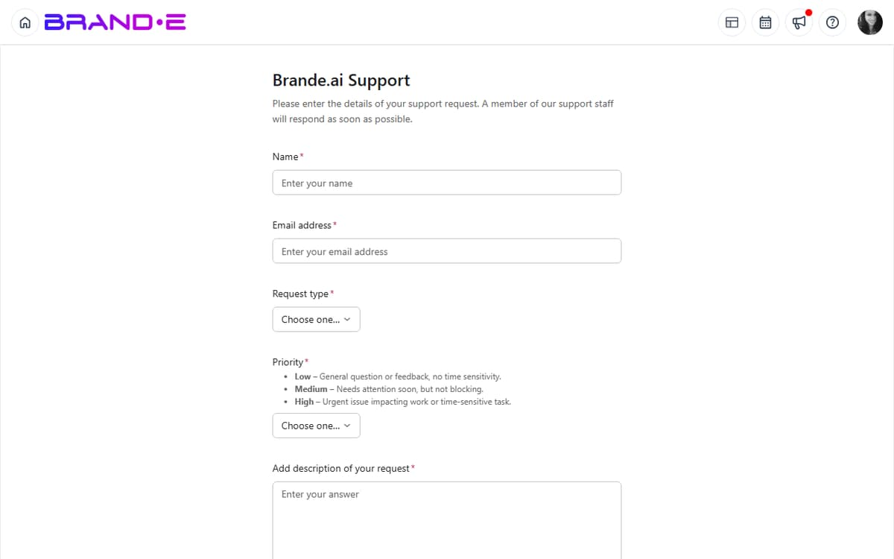

# Get Support

When you get stuck, can't find an answer, or discover a bug, support is a few clicks away.

Submit a support ticket and the team will help you resolve the issue, get clarification, or find a workaround.

## Access Support

**Option A: Help Center (Fastest)**
1. Click your profile icon (top right)
2. Select **Help** or **Help Center**
3. Click the **"Contact Support"** card
4. Select **"Submit a Support Ticket"**
5. Support form opens

**Option B: Direct Link**
Navigate to **/support** in the Brande.ai URL bar to go directly to the support form.

There is no separate "Support" entry in the Account sidebar — use the help dialog or `/support` directly.

## Support Ticket Form

The `/support` page embeds an Asana intake form. Fill in every field the form asks for, then submit. Useful information to include in any support ticket:

**A clear subject line.** Examples:
- "Can't create projects in my Brand Profile"
- "Invites not sending to team members"
- "Projects disappearing from calendar after scheduling"
- "Billing issue: charged twice last month"

**A detailed description**, covering:
- What you were trying to do
- What happened instead
- What you expected to happen
- Any error messages you saw
- Steps to reproduce (if it's a bug)

**Severity** — mark the ticket as urgent only when work is genuinely blocked, so the team can prioritize correctly.

**Attachments** — screenshots make bug reports far easier to diagnose. Attach the error message, the broken UI, or a short screen recording where helpful.

## Writing Effective Support Tickets

**Be Specific About What Went Wrong**
- Bad: "The app is broken"
- Good: "When I try to create a new project using the LinkedIn Post template, I click 'New Project' (Ctrl+Alt+N), select the template, but then get an error message: 'Internal server error 500' and the dialog closes without creating the project"

**Include Steps to Reproduce**
If it's a bug, list exactly how to recreate it:
1. Go to Dashboard
2. Click "New Project" button
3. Search for "Email"
4. Select "Email Sequence" template
5. [Error occurs here]

**Mention Your Plan Type**
Tell support which plan you're on. Some features are plan-specific:
- "I'm on the Starter plan"
- "I'm on the Agency plan"

**Include Account Details**
If it's an account issue:
- Your account email
- Which brand(s) are affected
- When the issue started

**Attach Screenshots**
A picture is worth 1000 words:
- Screenshot of the error message
- Screenshot of what you see vs. what you expect
- Screenshot of the broken feature

**Note Your Browser and Device**
Support sometimes needs this for technical issues:
- "I'm using Chrome on Windows 10"
- "I'm using Safari on Mac"
- "I'm using mobile/iPhone"

## Types of Issues to Report

### Bugs and Technical Problems

**Report to Support:**
- App crashes or freezes
- Features not working as documented
- Error messages when using normal features
- Data not saving
- Login issues
- Integration failures

**Example Ticket:**
"When I click the Approve button on a project, the button disappears but the project status doesn't update to 'Approved.' If I refresh the page, the approval didn't save."

### Account and Billing Issues

**Report to Support:**
- Can't log in to your account
- Billing charges or payment issues
- Account access or permissions problems
- Password reset issues
- Email verification issues

**Example Ticket:**
"I was charged $99 twice on March 15. I only have one subscription. Please investigate the duplicate charge and refund one of them."

### Feature Questions

**Report to Support (if docs don't help):**
- How to use a feature that isn't covered in docs
- Why a feature works a certain way
- Whether a feature is available in your plan
- How to integrate with an external tool

**Example Ticket:**
"I'm trying to invite a client to approve projects. The invite was sent but they say they received no email. Can you help debug this?"

### Data Loss or Urgent Issues

**Report to Support Immediately:**
- Projects or content disappeared
- Team member accounts were deleted
- Unauthorized access or security concerns
- Critical feature stopped working
- Can't meet a deadline due to app issue

**Example Ticket:**
"All my projects from March disappeared from the calendar. I can see them in the Projects list, but they're not appearing on the calendar anymore. Can you help restore them?"

## Support Ticket Response Times

Response times vary by ticket severity and your plan. The team aims to respond within one to two business days for most issues, faster for tickets that block all work. Response times may be longer on weekends and holidays.

You'll receive an email acknowledgment from Asana when your ticket is created.

## What to Do While Waiting for Support

**Check the Documentation**
While you're waiting, search the help docs (brande.ai/docs) for your issue. You might find a solution faster than support response.

**Try Alternatives**
If there's a workaround, use it to keep working. Example: If the calendar is slow, use the Projects list view temporarily.

**Provide More Information**
If you think of additional details, add a comment to your ticket (don't open a new one). This helps support help you faster.

## Following Up on Your Ticket

**Respond to Support Messages**
Support will email you updates and questions. Reply to the email to continue the conversation.

Don't open a new ticket—reply to the existing one so the conversation stays together.

**Provide Requested Information**
If support asks for more details, provide them quickly. The faster you respond, the faster they can help.

## Support Ticket Best Practices

**Submit Early**
Don't wait days to report a bug. Submit tickets as soon as you encounter issues.

**Be Honest About Impact**
If something doesn't block your work, mark it as low priority. This helps support prioritize urgent issues.

**Follow Up If Needed**
If 3+ business days pass with no response on a medium-priority ticket, send a follow-up comment asking for an update.

**Provide Positive Feedback**
If support solves your issue, let them know you appreciate it. A few kind words helps morale.

**Search Before Submitting**
Before submitting, search the docs or feedback board to see if your issue is already reported. If it is, comment on the existing report instead of creating a duplicate.

## Escalation

If your support ticket isn't resolved to your satisfaction:

1. Add a comment asking to escalate
2. Explain why the proposed solution doesn't work
3. Provide additional context or examples
4. Support will reassign to a senior team member

Escalations are taken seriously and usually receive attention within 24 hours.

## Billing and Account Support

For billing or account issues, support may ask for:
- Your account email
- Last 4 digits of credit card (for verification)
- Screenshots of the billing issue
- Dates of relevant transactions

Provide this information securely. Never email full credit card numbers or sensitive passwords.

## Troubleshooting

**Q: I submitted a ticket but haven't received a confirmation email.**
A: Check your spam folder. If you don't find it, resubmit. If resubmitting fails, try again in a few minutes (the system may be temporarily slow).

**Q: How do I reference my support ticket number?**
A: The confirmation email includes your ticket number. Use it in follow-ups: "Ref: TICKET-12345"

**Q: Can I get a phone call from support?**
A: Brande.ai support is handled through the in-app help dialog and the `/support` Asana form. Live phone support isn't part of the standard offering.

**Q: What if my issue is urgent (critical deadline)?**
A: Set priority to "Critical" in the form. Include "URGENT" in the subject. In the description, explain the deadline and business impact. Support will prioritize accordingly.

**Q: Can I get a refund for downtime or issues?**
A: Contact support with documentation of the issue (screenshots, timestamps). If the app was down or caused data loss, support can discuss credits or refunds.

## Related Topics

- [Use the Help Center](/section-10-help/use-help-center)
- [Submit Product Feedback](/section-10-help/submit-feedback)
- [Understand Product Updates and Changelogs](/section-10-help/understand-product-updates)
