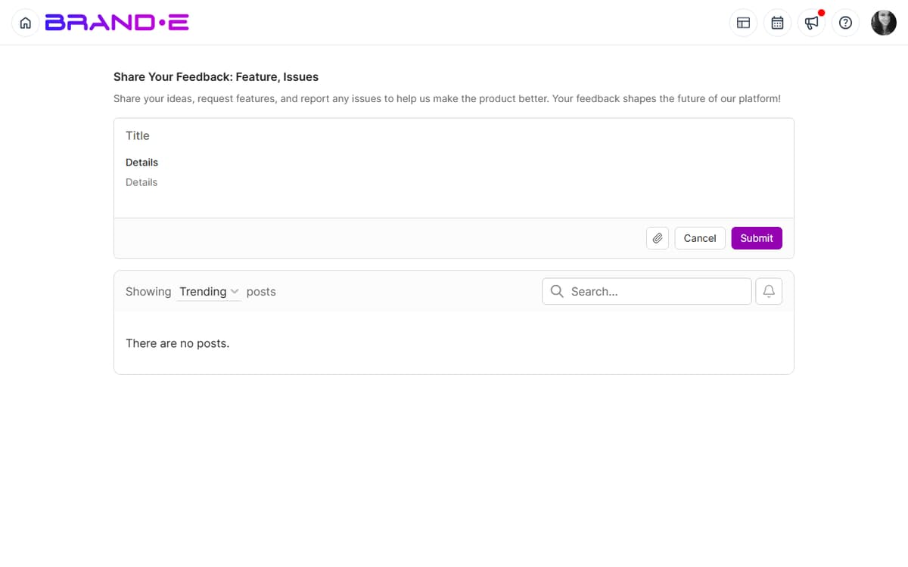

# Request New Features

Have an idea that would make Brande.ai better?

Submit a feature request and watch the community vote on it. The most-requested features make it to the development roadmap.

## What's a Feature Request?

A feature request is feedback asking for something new or improved.

**Examples:**
- "Add ability to schedule posts to go live at specific times"
- "Let me filter projects by team member to see who's working on what"
- "Create a 'favorites' feature to mark my most-used templates"
- "Add Slack integration to post updates when projects are approved"
- "Allow multiple approvers on one project (sequential approval workflow)"

## Submit a Feature Request

Feature requests go through the same feedback form as other feedback.

**To Request a Feature:**

1. Open Help Center (profile icon > Help)
2. Click **"Give Feedback"** → **"Share Product Feedback"**
3. Fill in the form:
   - **Title:** Clear, short description of the feature
   - **Description:** Explain what problem it solves and why you need it
   - **Category:** Select the relevant area (e.g., "Collaboration", "Projects", "Calendar")
   - **Priority:** How important is this to you?
   - **Attachments:** Add a sketch, screenshot, or mockup if helpful

4. Click **Submit**
5. Your feature request is posted to the public feedback board

## Writing Effective Feature Requests

**Be Specific**
- Bad: "Make the app better"
- Good: "Add ability to bulk-assign multiple projects to a folder at once. Currently I have to open each project individually, which takes 20 minutes when I have 50+ projects per month."

**Explain the Problem**
- Bad: "I want dark mode"
- Good: "I work late into the evenings and dark mode would reduce eye strain. I notice most design tools have dark mode built-in."

**Show the Impact**
- Bad: "Would be nice to have email scheduling"
- Good: "I spend 2 hours per week scheduling emails across multiple client accounts. Native scheduling would consolidate this to one place and save time daily."

**Describe How You'd Use It**
- Bad: "Add better search"
- Good: "I'd like to search for projects by client name, not just project title. For example, search 'Acme Corp' to see all projects related to that client across all brands."

**Consider the Scope**
- Small features (e.g., "Add a 'Copy' button to projects") are more likely to ship
- Large features (e.g., "Completely redesign the dashboard") take longer but are appreciated if demand is high

## Common Feature Request Categories

### Workflow and Process

- Bulk operations (bulk delete, bulk assign, bulk status change)
- Keyboard shortcuts for common tasks
- Project templates and workflows
- Automation (auto-save, auto-notifications)

### Visibility and Organization

- Project filtering and search
- Sorting options (by date, status, team member)
- Project grouping (by client, channel, folder)
- Dashboard customization

### Collaboration

- Sequential approval workflows (approval #1, then #2)
- Comments and feedback on projects
- @mention notifications for team
- Activity logs and audit trails

### Integration and Connection

- Integrations with external tools (Slack, Monday.com, Asana)
- Webhook support
- API enhancements
- Import/export capabilities

### Personalization

- User preferences and defaults
- Theme customization (colors, fonts)
- Notification preferences
- Workspace branding

## Upvoting Feature Requests

You don't just submit features—you advocate for others' ideas too.

**To Upvote a Feature:**

1. Go to the feedback board (Help Center > Give Feedback, or navigate to /feedback)
2. Browse or search for ideas you support
3. Click **Upvote** or **+1** button
4. Your vote is recorded

**Why Upvote?**
- Highly-voted features get built first
- The team prioritizes by demand
- Your upvote shows the team you want this feature
- You help shape the product roadmap

**Upvote Strategy:**
- Upvote features you'll actually use
- Upvote features that solve problems for many people
- Upvote features that would save you time

## Tracking Your Feature Requests

**After You Submit:**

1. You receive a confirmation email with a link to your request
2. Your request appears on the public feedback board
3. Other users can upvote and comment
4. The status shows: Under Review, Planned, In Progress, Shipped, Closed, or Duplicate

**Check Status Regularly:**

1. Go to Help Center > Give Feedback
2. Look for **"My Feedback"** or **"Your Submissions"** tab
3. See the status and upvote count of each request

**Watch for It to Ship:**

1. Status changes from "Planned" to "In Progress"
2. A date appears: "Shipping in [month]"
3. The feature ships
4. Status changes to "Shipped"
5. A changelog entry documents the new feature
6. You get a notification

## Feature Request Best Practices

**One Feature Per Request**
Submit separate requests for different features. It's easier for the team to prioritize and for others to upvote what they want.

**Add Context and Use Cases**
Include real-world scenarios: "I manage 3 client brands. When I switch brands, I lose track of which projects are due today across all brands. A unified calendar view would solve this."

**Consider Technical Feasibility**
Some features are harder to build than others. The team will provide estimates, but generally:
- Small UI additions are fast
- New integrations take longer
- Complete redesigns take the longest

**Engage with Comments**
If someone comments on your feature request, respond. Discuss how it could work and why it matters. This helps the team understand the value.

**Link to Related Features**
If your request builds on another request: "This is related to [Request #456] about project bulk operations"

**Be Patient**
Great features take time. Your feature might:
- Ship in 2 weeks (small, high-demand features)
- Sit in "Planned" for 6 months (good idea, not highest priority)
- Not ship at all (low demand or doesn't fit product vision)

No outcome is failure—you still influenced the product.

## What Happens to Feature Requests

**Shipped**
Your request became a feature. You influenced the product.

**Planned**
The team decided to build this. It's on the roadmap.

**In Progress**
The team is actively building it. It will ship soon.

**Under Review**
The team is considering it. Might become planned if demand is high enough.

**Duplicate**
Your request is similar to an existing one. They've been merged. The original request gets the combined upvotes.

**Closed**
The team decided not to build this. Reasons usually include:
- Low demand (not enough upvotes)
- Doesn't fit product vision
- Technically infeasible
- Better alternative exists

**Wontfix**
The team has decided this won't be built. If you disagree, comment on the request and explain why it's important to you.

## Feature Request Examples

### Example 1: Bulk Operations

**Title:** "Bulk assign multiple projects to folders"

**Description:** "When I create 10+ projects at the start of a sprint, I manually open each one and assign it to a folder. This takes 20+ minutes. If I could select multiple projects and drag them to a folder (or right-click > assign to folder), it would save significant time."

**Category:** Projects & Organization

**Impact:** Medium (saves time, affects many users)

**Likelihood of Shipping:** Medium (moderate scope, high demand)

### Example 2: Integration

**Title:** "Slack integration for project approvals"

**Description:** "When a client approves a project in Brande.ai, I could receive a Slack notification with a direct link to the approved project. This would let me immediately publish without logging in to Brande.ai."

**Category:** Integration

**Impact:** High (improves workflow efficiency)

**Likelihood of Shipping:** Medium (integration builds require platform coordination)

### Example 3: Workflow

**Title:** "Sequential approval workflows (primary + secondary approval)"

**Description:** "For critical projects, I want two approvals: first from the client, then from our legal/compliance team. Currently I can only track one approval. Sequential approvals would enforce this process."

**Category:** Collaboration

**Impact:** High (improves governance)

**Likelihood of Shipping:** Medium-High (complex feature, clear demand from agencies)

## Troubleshooting

**Q: I submitted a feature request but don't see it on the board.**
A: It may take a few minutes to appear. Refresh the page. If it still doesn't appear after 10 minutes, contact support.

**Q: Can I edit my feature request after submitting it?**
A: Editing depends on the Canny.io board's settings. If editing isn't available, add a comment to your post to clarify or extend your request.

**Q: My feature request was closed. Can I appeal?**
A: Yes. Comment on the closed request explaining why it's important. The team will reconsider if new information changes the calculus.

**Q: How long does it take to ship a feature?**
A: Highly variable:
- Small features: 2-4 weeks
- Medium features: 1-3 months
- Large features: 3-6+ months

Demand (upvotes) affects priority. More upvotes = faster development.

## Related Topics

- [Submit Product Feedback](/section-10-help/submit-feedback)
- [Understand Product Updates and Changelogs](/section-10-help/understand-product-updates)
- [Use the Help Center](/section-10-help/use-help-center)
