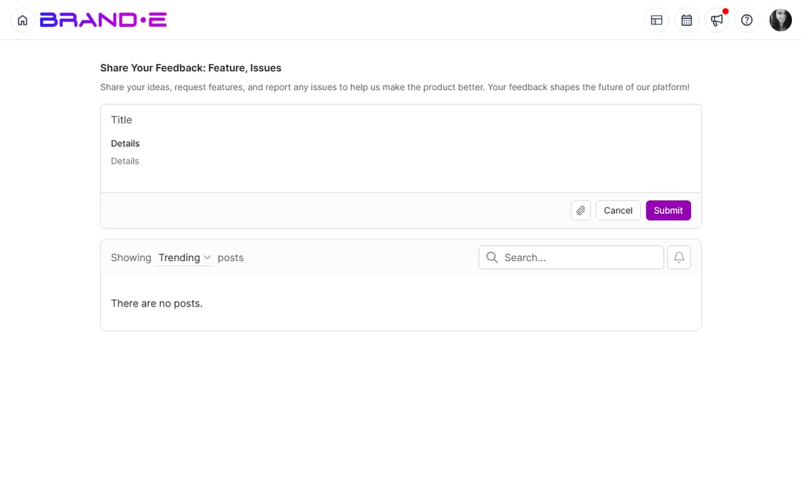

# Submit Product Feedback

Your feedback shapes Brande.ai's roadmap.

Whether you want a new feature, think a feature could work better, or have a clever idea—submit it in two minutes and watch other users vote on it.

## Why Your Feedback Matters

Every feature in Brande.ai started as feedback from users like you.

When you submit feedback:
- The product team reads it
- Users can upvote features they also want
- Highly-voted features move to the development roadmap
- You influence what Brande.ai becomes

Your voice matters. Use it.

## Access the Feedback Form

**Option A: From Help Center**
1. Click your profile icon (top right)
2. Select **Help** or **Help Center**
3. Click the **"Give Feedback"** card
4. Select **"Share Product Feedback"**
5. Feedback form opens

**Option B: Direct Link**
Navigate to **/feedback** in the Brande.ai URL bar to go directly to the feedback page.

**Option C: Help Dialog**

Click the help icon in the header to open the Help Center dialog, then click **Share Product Feedback**. This opens the same Canny.io feedback board at `/feedback`.

## Feedback Form Fields

The feedback form typically contains:

**Title** (Required)
A short, clear summary of your feedback.

Examples:
- "Add dark mode toggle"
- "Make calendar searchable by project name"
- "Show project approval history in a timeline"

**Description** (Required)
A longer explanation of your feedback. Include:
- What problem you're trying to solve
- Why this would help you
- How you imagine it working

**Category** (Optional)
Select which part of Brande.ai your feedback is about:
- Dashboard
- Content Creation
- Agency Features
- Collaboration
- Integrations
- Other

The live category list is whatever is configured on the Canny.io board at `/feedback` — expect it to drift over time as the team adds areas.

**Priority** (Optional)
How important is this to you:
- Nice to have (would be cool)
- Important (would help a lot)
- Critical (blocks my workflow)

Priority labels are board-configurable in Canny.io and may change. Use the closest match to express urgency.

**Attachments** (Optional)
Upload a screenshot, mockup, or file that illustrates your feedback.

This is helpful if you're showing a UI improvement or new feature idea.

## Types of Feedback to Submit

### Feature Requests

Ask for new capabilities:
- "Add ability to schedule content to post at specific times"
- "Create templates for email sequences"
- "Add integration with Slack"
- "Allow projects to have custom status values"

### Improvement Suggestions

Suggest ways to improve existing features:
- "Make the calendar mobile-friendly"
- "Add a 'Copy' button to easily duplicate projects"
- "Show project creation date on project cards"
- "Allow filtering projects by channel"

### Usability Feedback

Report confusing or cumbersome workflows:
- "The invite process requires too many clicks"
- "It's hard to find old projects in the sidebar"
- "The approval flow isn't clear—I didn't know clients could unapprove"

### Integration Requests

Ask for connections with other tools:
- "Integrate with Google Drive to auto-sync brand guidelines"
- "Connect with Calendly for scheduling"
- "Add webhook support for Zapier"

### Performance or Reliability Issues

Report non-urgent technical problems:
- "The calendar takes a long time to load"
- "Projects sometimes don't save immediately"
- "Notifications are delayed by 5+ minutes"

For anything that blocks your work — "app down", "projects disappearing", "can't log in" — file a support ticket via `/support` instead. Feedback is for ideas and pattern-level improvements; support is for incident-level issues.

## Writing Effective Feedback

**Be Specific**
- Bad: "The app is slow"
- Good: "The calendar takes 3+ seconds to load when viewing monthly view with 50+ projects"

**Explain the Problem You're Solving**
- Bad: "Add more colors"
- Good: "I manage 10 brands and want to color-code projects by brand in the calendar for better visibility"

**Show How You'd Use It**
- Bad: "Make approvals better"
- Good: "When a client approves a project, send me an in-app notification so I can publish immediately. Currently I have to manually check if they've approved"

**Give Context**
- Bad: "Feature request: bulk operations"
- Good: "I create 5-10 projects per day for different clients. Bulk actions (select 5 projects, assign to folder, or mark as 'in progress') would save 15 minutes daily"

**Avoid Demands**
- Instead of: "You NEED to add this"
- Try: "This would help me [specific goal]. I imagine it working like [description]"

## After You Submit Feedback

**Confirmation Email**
You'll receive an email confirming your feedback was submitted.

The email includes:
- Your feedback title and description
- A unique feedback ID (for reference)
- A link to view and share your feedback
- Option to get notified when the feature ships

**Public Feedback Board**

The `/feedback` page is a Canny.io board, and posts default to public on the board. Other users can:
- Read your feedback
- Upvote features they also want
- Add comments
- Discuss alternatives

**Team Review**
The product team reviews all feedback weekly:
- Categorizes by feature area
- Tallies upvotes
- Discusses priority and effort
- Adds highly-voted items to the roadmap

**Status Updates**
As feedback moves through the roadmap, you'll be notified:
- When your feature is scheduled for development: "We're building this!"
- When it ships: "Your feedback is now live!"

## Voting on Others' Feedback

You can also vote on feedback from other users:

1. Browse the feedback board (accessible from Help Center or **/feedback**)
2. Skim feedback titles to find ideas you support
3. Click an idea to expand it
4. Click **Upvote** or **+1** button
5. Your vote is recorded

Upvote features you want to see. The most upvoted ideas are more likely to be built.

## Viewing Your Submitted Feedback

To see feedback you've submitted:

1. Go to **/feedback** page
2. Look for a **"My Feedback"** or **"Your Submissions"** tab
3. Click to see a list of all feedback you've submitted
4. View status (Planned, In Progress, Shipped, Closed, Duplicate)
5. See how many upvotes each has

This helps you track your ideas and see if others have voted on them.

## What Happens to Your Feedback

**Shipped**
Your feedback became a feature. Celebrate! You influenced the product.

**Planned**
The team has decided to build this. It's on the roadmap.

**Under Review**
The team is considering it. Could become planned.

**Closed**
The team decided not to build this (usually due to low demand or technical constraints).

**Duplicate**
Your feedback is similar to another request. The team merged them, and the original will get the upvotes.

No feedback is wasted. All feedback is reviewed.

## Feedback Best Practices

**One Idea Per Submission**
If you have 5 ideas, submit 5 separate feedback items. This makes it easier for others to upvote the ones they want.

**Link to Related Ideas**
In your feedback description, mention related ideas: "This is related to [Feedback #123] about project templates"

**Respond to Comments**
If someone comments on your feedback, respond. Discuss how the feature could work and why it matters. This helps the team understand value.

**Be Patient**
Great features take time. Don't expect your feedback to ship next week. Priority depends on demand (upvotes) and effort.

**Support Others' Ideas**
If you see feedback that would help you, upvote it. A feature with 100 upvotes gets built faster than a feature with 1 upvote.

## Troubleshooting

**Q: I submitted feedback but don't see a confirmation email.**
A: Check your spam folder. If you don't find it, resubmit the feedback. If resubmitting fails, contact support.

**Q: Can I edit feedback after submitting it?**
A: Editing depends on the Canny.io board configuration. If you can't edit, add a comment to your post to extend or clarify it instead of resubmitting.

**Q: I want to upvote feedback but can't find it on the board.**
A: Try searching for a keyword. Or browse the relevant category. If you still can't find it, submit your own feedback—it may duplicate an existing request, which the team will merge.

**Q: How do I contact the team about my feedback?**
A: Comment on your feedback submission or contact support with your feedback ID.

## Related Topics

- [Use the Help Center](/section-10-help/use-help-center)
- [Request New Features](/section-10-help/request-new-features)
- [Get Support](/section-10-help/get-support)
