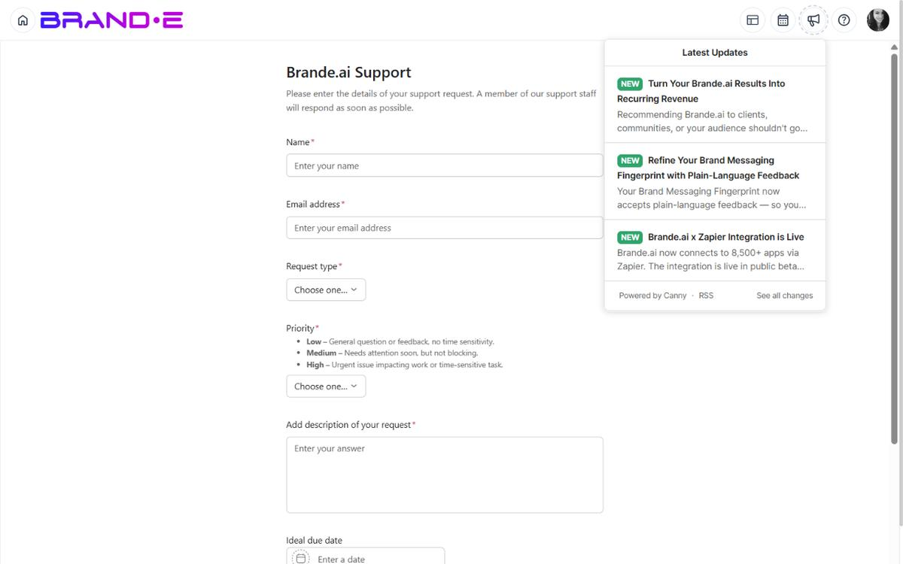

# Understand Product Updates and Changelogs

Brande.ai ships improvements and new features continuously.

A changelog widget in the app shows exactly what's changed, what's coming next, and what bugs were fixed—keeping you informed without forcing you to check external websites.

## Product Updates and Changelogs

Every time Brande.ai ships an update, it's documented in the changelog.

**Updates include:**
- New features (e.g., "Added dark mode toggle")
- Feature improvements (e.g., "Calendar now loads 50% faster")
- Bug fixes (e.g., "Fixed: Projects sometimes saved without content")
- Integrations (e.g., "New Zapier integration available")
- Performance optimizations
- Security patches

**You see updates in:**
- In-app changelog widget (header or dashboard)
- Email announcements (if you've opted in)
- Brande.ai blog and social media

## Accessing the Changelog

**Option A: Announcements Icon**
In the header (top of the page), look for a **megaphone**, **bell**, or **announcements icon**.

Click it to open the changelog widget showing recent updates.

**Option B: Help Center**
Click your profile icon (top right) > **Help Center** > Look for a **"What's New"** or **"Updates"** section.

**Option C: Header Announcements**

The **Announcements** button in the top header is a Canny.io changelog widget anchored to the bell area. Click it to open the changelog popover. The dashboard itself does not include a changelog card.

## What the Changelog Shows

The Canny changelog widget displays:

**Recent Updates** (Most Recent First)
- Update title (e.g., "Project Templates Are Now Live")
- Brief description of what changed
- Date of update
- Category tag (New Feature, Improvement, Bug Fix, etc.)

**Upcoming Features** (Coming Soon)
- Feature name (e.g., "API Rate Limit Increases")
- Expected availability ("Coming next month")
- Community upvote count (how many users want this)

**Version History**

The Canny changelog widget itself is the version history — scroll back through the popover to see every published update. There is no separate "version history" page in Brande.ai.

## Understanding Update Categories

Updates are tagged with categories to help you scan quickly:

**New Feature**
A brand new capability that didn't exist before.
- Example: "Add ability to export projects as PDF"
- Look for this if you're exploring what's possible

**Improvement**
An existing feature works better now.
- Example: "Calendar now loads 50% faster"
- Impact: Same feature, better experience

**Bug Fix**
Something that was broken is now fixed.
- Example: "Fixed: Notifications not delivering for approvals"
- Impact: Known issue is resolved

**Deprecation**
An old feature is going away or changing.
- Example: "Legacy API endpoints deprecated—migrate to v2"
- Impact: You may need to update your workflow

**Security Update**
A security issue was fixed.
- Example: "Patched: Potential XSS vulnerability in project comments"
- Impact: Your data is more secure

**Performance**
Speed or reliability improvement.
- Example: "Reduced database queries by 40% for dashboard loading"
- Impact: App feels snappier

## Staying Informed About Updates

**In-App Notifications**

The Canny widget anchored to the **Announcements** button in the header surfaces new updates with a small unread badge. Click the bell to see what's new.

**Email Updates**

There is no in-app subscription for product-update emails today. Watch the Announcements widget regularly, or subscribe to the Brande.ai newsletter / blog if one is available outside the app.

**Check Changelog Weekly**
Make it a habit: Every Monday, click the Announcements icon and scan what's new. Takes 2 minutes.

**Watch for Features You Requested**
If you submitted feedback, watch the changelog for your feature shipping. When it does, the entry usually credits user feedback.

## Impact of Updates on Your Workflow

**New Features**
- Usually optional (you don't *have* to use them)
- Available immediately after release
- May have a slight learning curve
- Often documented in help articles

**Improvements**
- Usually transparent (your workflow stays the same)
- May make existing features faster or easier
- No action needed from you

**Bug Fixes**
- Usually fix problems you may not have noticed
- Sometimes fix critical issues (you'll see them in changelogs)
- No action needed from you

**Deprecations**
- Old features are going away
- You'll have warning (usually 30+ days)
- You need to migrate to new approach before the old feature disappears
- Detailed migration guides are provided

**Security Updates**
- Applied automatically
- May require a password reset for affected users (you'll be prompted on next login if so)
- Increases your data safety

## When Updates Don't Affect You

Most updates don't impact your work:

- A performance improvement makes something faster, but you don't change how you use it
- A bug fix solves a problem you never encountered
- A new feature is optional—you can ignore it if you don't need it

You only need to act if:
- A feature you use is being deprecated
- A new feature replaces your workaround
- A critical bug fix affects your workflow

## Changelog Best Practices

**Scan the Changelog Weekly**
Spend 2 minutes on Monday morning reading recent updates. You'll never be surprised by changes.

**Read Deprecation Notices Immediately**
If something you use is being deprecated, read the migration guide right away so you're not caught off-guard.

**Try New Features**
When a new feature you might use ships, try it. Give feedback on whether it works for you.

**Watch the Upcoming Section**
See what's coming next. If something excites you, upvote it on the feedback board to show demand.

**Share Relevant Updates with Your Team**
If you use Brande.ai with a team, share major updates with them: "New feature shipped: bulk project actions, will save us time"

## Common Update Scenarios

**Scenario 1: "I see a new feature on the dashboard"**
→ Read the changelog to understand it
→ Try it out (it's safe, it's backwards compatible)
→ If you like it, use it; if not, ignore it

**Scenario 2: "Something I use is deprecated"**
→ Read the migration guide
→ Make the switch before the deadline
→ Ask support if you get stuck

**Scenario 3: "The app feels faster"**
→ Check the changelog for performance improvements
→ Enjoy the speed boost, no action needed

**Scenario 4: "A feature I requested is now live"**
→ See it in the changelog with "New Feature" tag
→ Try it immediately
→ Share it with your network

## Related Topics

- [Use the Help Center](/section-10-help/use-help-center)
- [Submit Product Feedback](/section-10-help/submit-feedback)
- [Request New Features](/section-10-help/request-new-features)
