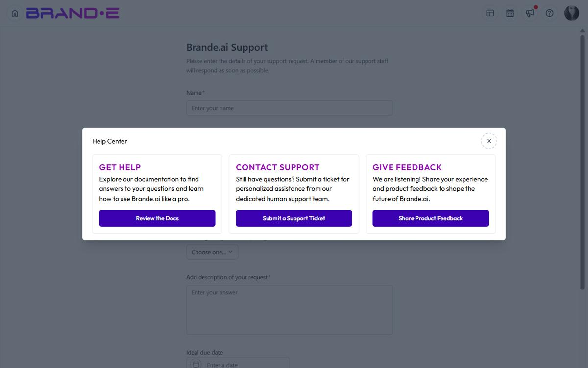

# Use the Help Center

The Help Center is your command center for support, documentation, and feedback.

It's three cards, three options: get help, submit a ticket, or share feedback—all without leaving the app.

## Open the Help Center

**Option A: Profile Dropdown**
1. Click your profile icon (top right)
2. Select **Help** or **Help Center** from the dropdown
3. Help Center modal opens

**Option B: Help Icon in the Header**

Click the help icon in the top header. The Help Center modal opens with three cards — **Get Help** (linking to docs), **Contact Support**, and **Give Feedback**.

**Option C: Account Page**
Navigate to Account (click profile icon → Account) and look for a Help or Support section. Click to open the Help Center.

## Help Center Modal

The Help Center displays as a modal with **three cards**, each offering a different path:

### Card 1: Get Help

**Title:** "Get Help"
**Description:** "Review the Docs"
**Button:** Links to Brande.ai documentation

Click this card to:
- Read help articles and guides
- Find tutorials and walkthroughs
- Learn about features and best practices
- Browse the full documentation library at brande.ai/docs

**Who should use this:**
- You want to learn on your own
- You're looking for comprehensive guides
- You have time to explore and research
- You're troubleshooting a known issue

**Examples of docs you'll find:**
- How to create a new project
- How to manage multiple brands (Agency)
- How to use Content Agent
- How to invite team members
- Keyboard shortcuts reference

### Card 2: Contact Support

**Title:** "Contact Support"
**Description:** "Submit a Support Ticket"
**Button:** Links to support ticket form

Click this card to:
- Report a bug or issue
- Request urgent help from the support team
- Get help with account or billing issues
- Ask questions the docs don't answer

**Who should use this:**
- You've found a bug in the app
- You need urgent assistance
- You have account-specific questions
- You've tried the docs and still need help

**What to include in a support ticket:**
- Clear description of your issue
- Steps to reproduce (if it's a bug)
- Screenshots or error messages
- Your plan type and account details
- What you've already tried

### Card 3: Give Feedback

**Title:** "Give Feedback"
**Description:** "Share Product Feedback"
**Button:** Links to feedback form

Click this card to:
- Request a new feature
- Suggest improvements to existing features
- Report usability issues (not bugs)
- Vote on features others have requested

**Who should use this:**
- You have a feature request
- You think a feature could work better
- You want to upvote ideas from other users
- You want to help shape the product roadmap

**Types of feedback to submit:**
- "I wish projects had a 'draft' status separate from 'planning'"
- "Content Calendar should allow multiple colors per status"
- "I'd love to see integration with [tool name]"
- "The invite flow is confusing—could it be simpler?"

## Using the Help Center Effectively

### Scenario 1: You're Stuck on a Feature

1. Open Help Center (profile icon > Help)
2. Click **"Get Help"** → **"Review the Docs"**
3. Search for your feature (e.g., "How do I invite team members?")
4. Read the guide
5. If you're still stuck, come back and click **"Contact Support"**

### Scenario 2: The App is Broken

1. Open Help Center
2. Click **"Contact Support"** → **"Submit a Support Ticket"**
3. Describe:
   - What you were trying to do
   - What happened instead
   - Any error messages
   - How to reproduce it
4. Attach screenshots if helpful
5. Submit and wait for response

### Scenario 3: You Have an Idea

1. Open Help Center
2. Click **"Give Feedback"** → **"Share Product Feedback"**
3. Describe your idea clearly:
   - What problem it solves
   - Who would benefit
   - How it improves their workflow
4. Submit feedback
5. Encourage others to vote on your idea

## Documentation Links

The Help Center links to **brande.ai/docs**, which contains:

- **Getting Started** guides
- **Feature guides** (Brand DNA, Content Agent, Projects, etc.)
- **Agency guides** (multi-brand management, team collaboration)
- **Account and settings** guides
- **Troubleshooting** common issues
- **Keyboard shortcuts** reference
- **API documentation** (for integrations)

All help articles follow the Brande.ai documentation structure and style.

### Searching Documentation

In the docs, use the search bar to find topics:
- Type keywords (e.g., "approval workflow")
- Results show matching articles
- Click an article to read

### Related Topics Links

Every help article ends with "Related Topics"—links to related guides for deeper learning.

This helps you build context and understand how features connect.

## Support Ticket Response Time

Response times depend on ticket severity and your plan. The team aims to respond within one to two business days for most issues, faster for tickets that block all work. See [Get Support](/section-10-help/get-support) for what to include in a ticket.
- **Low-priority** (feature requests, general inquiry) — Response within 2-5 business days

You'll receive an email acknowledgment with a ticket number. Use that number to reference your issue in follow-ups.

## Feedback and Feature Requests

When you submit feedback:

1. Your request goes to the product team
2. The team reviews it and categorizes it
3. You can see your request on the feedback/roadmap page
4. Other users can vote on your request
5. Highly-voted features are prioritized for development

You'll receive an email confirmation of your feedback submission.

## Finding Previous Help Tickets

Brande.ai does not surface your support ticket history inside the app today — the support form at `/support` is an embedded Asana form. To track an open ticket, reply on the email thread you received from Asana when you submitted it.

If you'd like to find your prior feedback posts, open the `/feedback` page — the Canny.io board lists everything you've posted under your account.

For reference, the legacy guidance was:
1. Go to Account page
2. Look for "Support Tickets" or "Ticket History"
3. Click to view previous tickets and their status

## Help Center Keyboard Shortcut

There is no dedicated keyboard shortcut to open the Help Center today. Use the help icon in the header or the link in the avatar dropdown.

## Common Help Center Scenarios

**"I can't create a project"**
→ Click Get Help → Search "Create a new project"

**"Invites aren't going to my team"**
→ Click Contact Support → Submit ticket with team member email and which brand

**"I'd like a dark mode"**
→ Click Give Feedback → Suggest dark mode feature

**"How do I use the Content Calendar?"**
→ Click Get Help → Search "Content Calendar"

**"The app is logging me out randomly"**
→ Click Contact Support → Report the issue with details

## Related Topics

- [Submit Product Feedback](/section-10-help/submit-feedback)
- [Get Support](/section-10-help/get-support)
- [Understand Product Updates and Changelogs](/section-10-help/understand-product-updates)
- [Navigate Settings and Preferences](/section-8-dashboard/navigate-settings)
