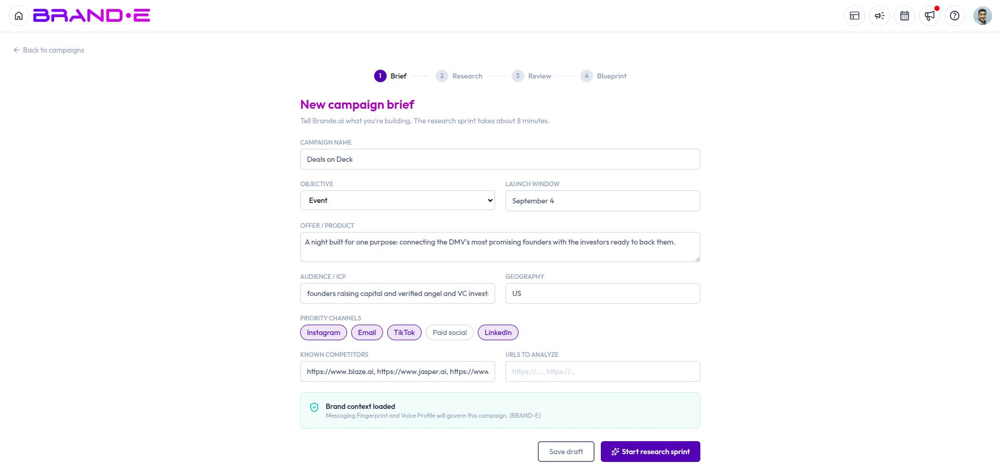

# Create a Campaign

Every campaign starts with a short brief. Brande.ai uses it to scope the entire research sprint that follows.

## Access Campaign Studio

Click **Campaign Studio** in the topbar navigation. You'll land on the Campaign Studio dashboard.

## The Campaign Studio dashboard

The dashboard shows:

- Your active campaigns, as a list of cards with a status badge (Brief, Research, Review, or Blueprint)
- Your monthly campaign-run usage against your plan's limit
- How many campaigns currently have a blueprint ready to act on
- A button to start a new campaign

## Fill out the campaign brief

Click **New Campaign** to open the brief form:

- **Campaign name**
- **Objective** — Launch, Evergreen, Webinar, Waitlist, Reactivation, Event, or Other
- **Offer** — what you're promoting
- **Audience** — who the campaign targets
- **Geography** (optional)
- **Launch window** (optional) — when you want this campaign to go live
- **Channels** — where the campaign will run
- **Known competitors** — prefilled from your brand's onboarding settings; add or remove as needed
- **Reference URLs** (optional) — pages you want the research sprint to consider

You can **save as a draft** and come back later, or **start the research sprint** directly from the brief.

## What happens when you start research

Starting research kicks off Brande.ai's multi-agent research sprint on your brief — see [Review Campaign Research](/section-11-campaign-studio/review-campaign-research) for what happens next and how to read the results.

## Plan gating

Campaign Studio's availability and monthly usage depend on your subscription plan:

- **Feature access** — If your plan doesn't include Campaign Studio, you'll see an upgrade banner instead of the dashboard content.
- **Monthly run limit** — Each research sprint you start counts against a monthly quota (e.g., a handful of runs/month on lower tiers, more on Agency plans). Resuming a stuck or failed run does **not** use up an additional run. If you're on a brand with multiple collaborators, the quota is shared and counted against the brand owner's plan — collaborators don't carry a separate quota of their own.

If you hit your limit, you'll see a message similar to: *"You've reached your monthly campaign limit. Upgrade your plan to unlock more."* Click **Upgrade Now**, or wait until next month's quota resets.

Check your current plan and usage at **Account > My Plan**.

## Related Topics

- [Understanding Campaign Studio](/section-11-campaign-studio/understanding-campaign-studio)
- [Review Campaign Research](/section-11-campaign-studio/review-campaign-research)
- [How To Complete Your Brand Profile Step by Step](/section-1-getting-started/complete-brand-profile)
- [How To Understand the Brande.ai Agency Plan](/section-7-agency/understand-agency-plan)
