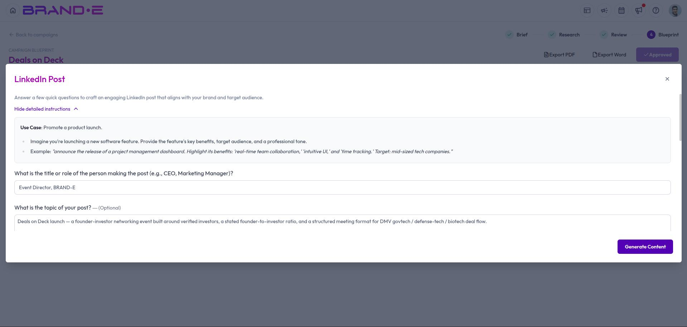
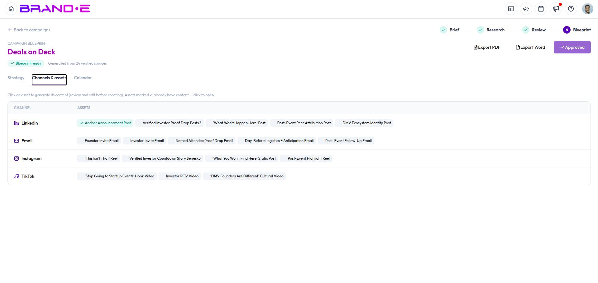

# Turn Blueprint Assets Into Content

A blueprint plans your campaign — this is where you turn each planned asset into a real piece of content, using the project-creation flow you already know from the rest of Brande.ai.

## Generate content for a planned asset

On the **Channels & Assets** tab of your approved blueprint, each asset has a **Create content** action. Clicking it:

1. Prefills a title and the content template's input variables, drawing on your blueprint's big idea, positioning, audience, and core messages, plus that specific asset's own brief
2. Opens the same project-creation dialog you'd see when starting a project manually or from a Content Agent brief
3. Lets you review and edit everything before you generate

The template used matches the asset's suggested content type — for example, Ideation, LinkedIn Post, Long-Form Content, Repurpose Content, or Write from Scratch. See [Choose Project Templates](/section-3-creating-content/choose-project-templates) if you want to understand what each template produces.

## Tracking generated content against your plan

Once you create the project, it's tagged back to the campaign and the specific asset it came from. You'll see it listed against that asset on the campaign page, so you can track at a glance which planned assets already have content and which are still outstanding.

## Related Topics

- [Generate and Approve Your Campaign Blueprint](/section-11-campaign-studio/generate-and-approve-blueprint)
- [Create a New Project](/section-3-creating-content/create-new-project)
- [Choose Project Templates](/section-3-creating-content/choose-project-templates)
- [Understanding Campaign Studio](/section-11-campaign-studio/understanding-campaign-studio)
