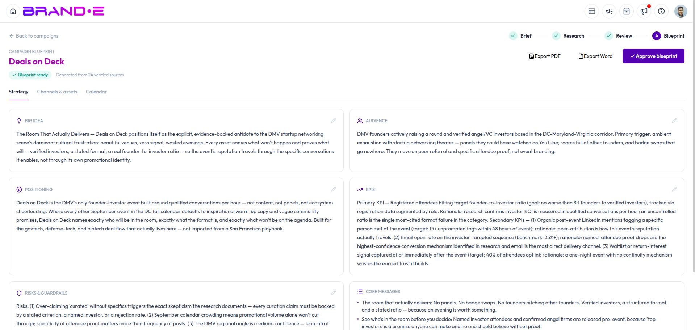
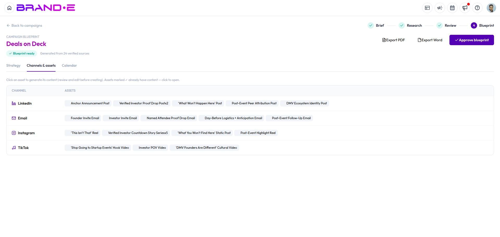
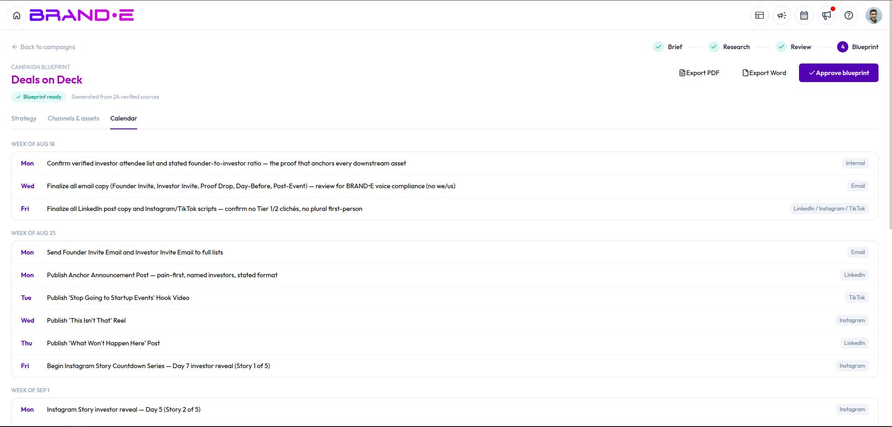

# Generate and Approve Your Campaign Blueprint

Once every research section is approved, Brande.ai turns your brief and approved research into a full campaign blueprint — the strategic plan you'll actually execute against.

## Generate the blueprint

With all five research sections approved, the **Generate Blueprint** action becomes available. Brande.ai builds the blueprint from your original brief, the approved research pack, and any notes you left during review — so it's worth going back to add a note on a research section before generating if you want the blueprint to reflect it.

## What's in a blueprint

The blueprint view is organized into three tabs:

**Strategy**
- The big idea behind the campaign
- Your audience, summarized
- Positioning
- Core messages
- KPIs to track
- Risks and guardrails to watch for

**Channels & Assets**

- Every channel in your plan, with its role in the campaign
- The assets planned for that channel — each with a name, a quantity (e.g. "x3"), a suggested content type, and a short brief describing what it should cover

**Calendar**

- A launch timeline laying out what publishes, on which channel, week by week and day by day

## Edit or approve

You can edit any part of the blueprint and save your changes at any time. When you're happy with the plan, click **Approve** — this marks the blueprint as finalized for your team. You can still return to it later if your plans change.

## Related Topics

- [Review Campaign Research](/section-11-campaign-studio/review-campaign-research)
- [Turn Blueprint Assets Into Content](/section-11-campaign-studio/create-content-from-blueprint)
- [Understanding Campaign Studio](/section-11-campaign-studio/understanding-campaign-studio)
