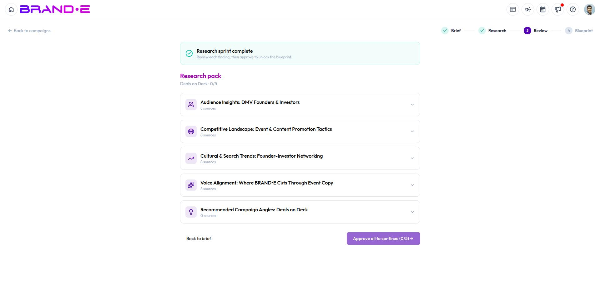

# Review Campaign Research

Once you start a research sprint, Brande.ai investigates your audience, competitors, and brand fit before it plans anything. You review and approve what it finds before a blueprint gets built.

## Watching the research sprint run

While research runs, you'll see a live activity feed of each step Brande.ai is taking:

- A planning step scopes out the specific research tasks for your brief
- A team of researcher agents investigates each task using live web search plus your brand's own reference materials and uploaded files
- A synthesis step organizes all the findings into a structured research pack
- A verification step checks the findings and flags anything it's not confident about

The page refreshes automatically every few seconds so you can watch progress without doing anything — no need to keep reloading.

### If a run looks stuck or fails

If a run shows no progress for a few minutes, or fails outright, Brande.ai marks it as stalled and offers a **Resume** option. Resuming doesn't start over — it picks up from whatever research is already complete, so you don't lose progress and it doesn't use up another monthly run.

## Reviewing the research pack

Once research completes, you land on the Review stage: five sections, each covering a different angle on your campaign:

- **Audience Insights** — who you're talking to and what matters to them
- **Competitive Landscape** — what competitors are doing in this space
- **Cultural & Search Trends** — relevant trends and conversations happening right now
- **Voice Alignment** — how well different angles fit your brand voice
- **Recommended Angles** — specific angles Brande.ai suggests for this campaign

Each section shows a summary, individual findings, and the sources behind them, so you can check where a claim came from.

## Approve or annotate each section

Every section has an **approve** toggle and a free-text note field. Use the note field to tell Brande.ai what to change, add, or reconsider — your notes are fed directly into the blueprint-generation step, so this is the place to steer the plan before it's built.

**All five sections must be approved before you can generate a blueprint.** If you're not satisfied with a section, leave a note instead of approving it and revisit once you've made your point — approval is what unlocks the next stage.

## Related Topics

- [Create a Campaign](/section-11-campaign-studio/create-a-campaign)
- [Generate and Approve Your Campaign Blueprint](/section-11-campaign-studio/generate-and-approve-blueprint)
- [Understanding Campaign Studio](/section-11-campaign-studio/understanding-campaign-studio)
