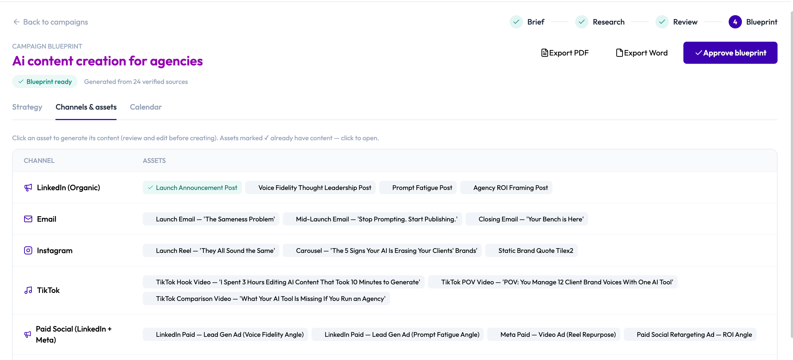

# Understanding Campaign Studio

Campaign Studio is Brande.ai's AI-assisted campaign planning workflow — it turns a short brief into a researched, strategic plan before a single piece of content gets written.

Where Content Agent hands you one recommendation at a time, Campaign Studio plans an entire multi-channel campaign at once: it researches your audience and competitors, checks the plan against your brand voice, and lays out a full channel and asset plan with a launch timeline — all before you generate anything.

## What Campaign Studio does (and doesn't do)

Campaign Studio compresses the strategy phase of campaign planning — research, positioning, and channel/asset planning — into a guided, largely-automated pipeline. What used to be a manual, multi-hour exercise becomes a short brief plus two review checkpoints.

It does **not** generate finished content on its own. Campaign Studio's job stops at planning and prefilling; the actual writing still happens through Brande.ai's existing project-creation system — the same one Content Agent and manual project creation use. Think of Campaign Studio as the strategy layer that feeds that system better-informed, pre-briefed starting points.

## The four-stage lifecycle

Every campaign moves through the same stepper:

1. **Brief** — You describe the campaign: objective, offer, audience, channels, competitors, and any constraints.
2. **Research** — Brande.ai runs a research sprint on your brief, investigating your audience, competitors, cultural and search trends, and how well different angles fit your brand voice.
3. **Review** — You read through the research findings, section by section, and approve them (or leave a note asking for something different).
4. **Blueprint** — Brande.ai generates a full strategic plan: a big idea, positioning, core messages, a channel and asset plan, and a launch timeline. You review it, edit anything you like, and approve it.

Once your blueprint is approved, you move into a fifth, ongoing step: generating real content for each planned asset, one at a time, through the same project-creation flow you already know.

There are two human checkpoints built into the process — you approve the research findings before a blueprint is generated, and you approve the blueprint before treating it as final. Nothing moves forward automatically without your review.

## Where to find it

Look for **Campaign Studio** in the top navigation bar. It opens to a dashboard showing your active campaigns, how many blueprint-ready campaigns you have, and your monthly campaign-run usage against your plan.

## Plan availability

Campaign Studio access and monthly research-run quotas depend on your subscription plan. See [Create a Campaign](/section-11-campaign-studio/create-a-campaign) for what plan-gating looks like in the product, and [How To Understand the Brande.ai Agency Plan](/section-7-agency/understand-agency-plan) for plan details.

## Related Topics

- [Create a Campaign](/section-11-campaign-studio/create-a-campaign)
- [Review Campaign Research](/section-11-campaign-studio/review-campaign-research)
- [Generate and Approve Your Campaign Blueprint](/section-11-campaign-studio/generate-and-approve-blueprint)
- [Turn Blueprint Assets Into Content](/section-11-campaign-studio/create-content-from-blueprint)
- [Understanding the Content Agent](/section-2-content-agent/understanding-content-agent)
