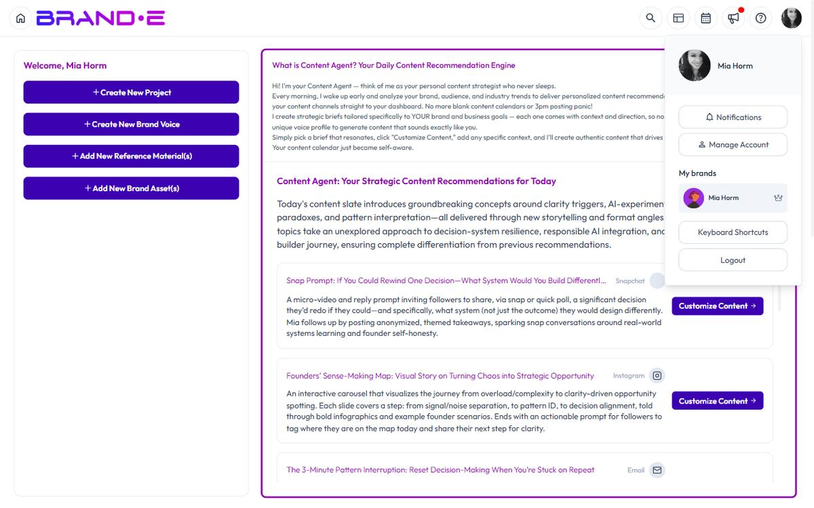

# Use Content Agent for Multiple Brands

Content Agent works independently for each brand in your workspace. Agencies and multi-brand companies can switch between brands and manage separate content strategies without mixing voices or channels.

## How Multi-Brand Content Agent Works

Each brand in your workspace has:
- Its own Brand DNA (business objectives, audience, voice, channels)
- Its own daily Content Agent recommendations
- Its own projects and content calendar

When you switch brands, Content Agent automatically generates recommendations based on that brand's unique profile. No manual switching of contexts or risk of mixing content strategies.

## Switch Between Brands

In the top-left of your dashboard, find the profile dropdown. It shows the currently selected brand.

Click the dropdown to:
- View all brands you have access to
- Select a different brand
- Switch instantly

When you switch brands:
- Your dashboard updates to show that brand's recommendations
- Your Content Agent recommendations change based on that brand's profile
- Your projects and folders update to that brand's workspace

Each brand operates in complete isolation. Content from Brand A never appears in Brand B's workspace.

## Example: Agency With Multiple Clients

An agency managing 3 client brands demonstrates how multi-brand Content Agent works:

**Brand A: SaaS Company**
- Brand Profile: Enterprise software, B2B audience
- Content Agent generates: Technical blog posts, LinkedIn thought leadership, email campaigns
- Channels: Blog, LinkedIn, Email, Podcasts

**Brand B: Consumer Skincare**
- Brand Profile: Direct-to-consumer, lifestyle audience
- Content Agent generates: Instagram lifestyle content, TikTok tutorials, email promotions
- Channels: Instagram, TikTok, Email, Pinterest

**Brand C: B2B Services Firm**
- Brand Profile: Professional services, B2B buyer focus
- Content Agent generates: Case studies, LinkedIn posts, webinar content
- Channels: Blog, LinkedIn, Email, YouTube

The agency team logs in, sees Brand A's dashboard, reviews its 4 daily recommendations, generates 2 of them into projects.

Then they click the brand dropdown, select Brand B, and see a completely different set of recommendations tailored to skincare and lifestyle content.

No confusion. No mixed-up voices. Each brand's strategy stays intact.

## Creating New Brands

To add a new brand to your workspace, go to your account settings and create a new brand profile. Once created, it will appear in the brand dropdown.

Each new brand requires full Brand DNA setup (business objectives, audience, channels, brand voice). Content Agent will not generate recommendations until setup is complete.

## Managing Projects Across Brands

Your projects are segregated by brand:
- Click a brand in the dropdown
- View only that brand's projects
- Your folders and organization are brand-specific

If you have 50 projects for Brand A and 100 for Brand B, each workspace stays clean because they are completely separated.

## Subscription Limits With Multiple Brands

Your subscription plan determines how many brands you can manage:
- **Starter plan** — 1 brand
- **Pro plan** — Up to 3 brands
- **Agency plan** — Unlimited brands

Each brand has its own recommendation limit based on your plan. If your plan includes 30 recommendations per month, each brand gets 30, not shared across all brands.

Check your plan details to see how many brands and recommendations you have available.

## Tips for Managing Multiple Brands

**Tip 1: Complete each brand's profile fully.**
Brand DNA quality directly impacts recommendation quality. If Brand B's profile is vague, its recommendations will be generic. Invest in setup.

**Tip 2: Use the profile dropdown strategically.**
Before you start your workday, decide which brand you are focusing on. Switch once and work through all that brand's content before switching again.

**Tip 3: Use folder structures to organize by brand.**
Even though projects are separated by brand, use consistent naming conventions. Example: "Brand A – Q2 Blog" and "Brand B – Q2 Blog" so you can find them quickly.

**Tip 4: Update Brand Profiles independently.**
If Brand A's audience changes, update Brand A's profile. This change does not affect Brand B. Use this flexibility to test new positioning for one brand without impacting others.

**Tip 5: Delegate by brand.**
If you have a team, assign each person to manage specific brands. This reduces context-switching and improves accountability.

## Team Collaboration Across Brands

If you are working with team members:
- Create separate logins for each team member
- Assign team members to specific brands they manage
- Invite collaborators to review or approve projects
- Track who generated what across brands

Content Agent itself doesn't have a separate invite flow. Recommendations are scoped to the selected brand, so anyone you invite to a brand (via the **Invite** dialog with **Brand Collaborator** or **Client Collaborator** role) automatically sees that brand's daily recommendations on the dashboard when they switch into it.

## Common Multi-Brand Scenarios

### Scenario 1: Manage Client Brands (Agency)

You are an agency with 5 clients. Each client is a separate brand in Brande.ai. Content Agent generates daily briefs for each client's unique audience. Your team generates content per brand and delivers it to clients.

### Scenario 2: Manage Multiple Sub-Brands (Corporate)

Your company has 3 product lines with different brands, voices, and audiences. Each product line has its own brand profile in Brande.ai. Marketing teams can work on their brand without contaminating the others.

### Scenario 3: Test New Positioning (Experimentation)

You want to test a new brand positioning before rolling it out. Create a test brand in Brande.ai, set up the new positioning, and run Content Agent for a month. If the recommendations feel right, update your main brand profile. If not, keep the test brand separate and continue with the original.

### Scenario 4: Manage Personal Brand + Company Brand

As a founder, you have your personal brand (thought leadership, personal posts) and your company brand (product updates, company news). Each is separate in Brande.ai with different voices, audiences, and channels.

## Related Topics

- [Understanding the Content Agent](/section-2-content-agent/understanding-content-agent)
- [How To Use Content Agent](/section-2-content-agent/use-content-agent)
- [Get Daily Content Recommendations](/section-2-content-agent/get-daily-recommendations)
- [How To Understand the Brande.ai Agency Plan](/section-7-agency/understand-agency-plan)