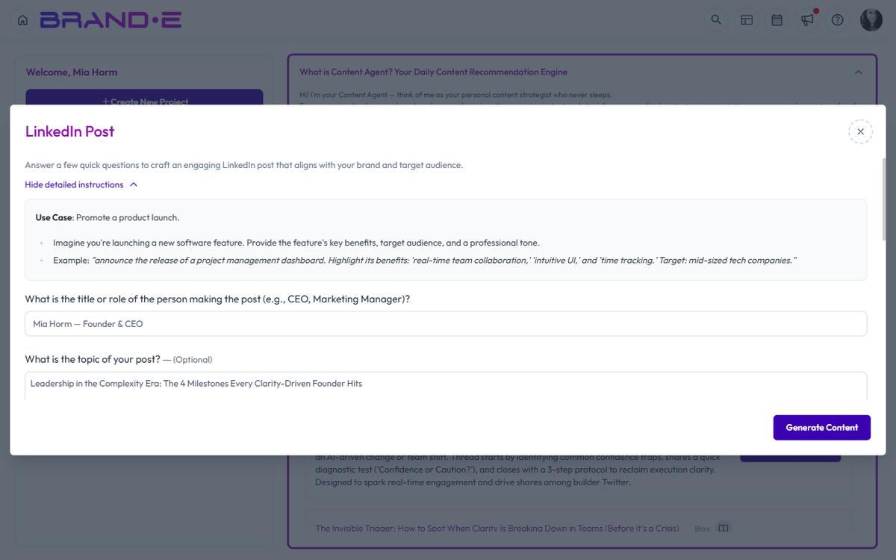

# Customize a Content Brief Before Generating

The customization step is where a Content Agent brief becomes your content strategy. You review the pre-filled variables, add context, and ensure the brief fits your current situation before generating.

## Open the Customization Dialog

From the dashboard or Content Opportunities page, click **"Customize Content"** on any recommendation.

A dialog opens showing:
- The recommended template
- All template variables
- Fields for you to review and edit
- A **"Generate"** button to create the content

## Review Template Variables

Template variables are pre-filled with context from your Brand DNA. Review each variable to confirm it is accurate for this piece of content.

Common variables include:
- **Brand positioning** — How you describe your value to the market
- **Target audience pain points** — The challenges your audience faces
- **Key differentiator** — What makes you different
- **Call to action** — Where you want the audience to go next
- **Tone or brand voice indicators** — Emotional style, personality traits

If a variable is not quite right, edit it. Your changes apply only to this piece of content, not your Brand Profile.

## Add Context-Specific Details

The template variables provide the foundation. Layer in details specific to this content moment:

### Add a Recent Win or Example
If the brief recommends a case study, add the specific customer name and measurable result you want highlighted.

### Reference Current Trends
If the brief recommends thought leadership on a trending topic, add the specific trend, statistic, or news event you want to address.

### Specify Your Angle
If multiple approaches exist, clarify which one you prefer. Example: "Focus on the ROI angle, not the time-savings angle."

### Include Calls to Action
Customize the call to action to match your current marketing priorities. Example: "Direct readers to sign up for the webinar, not the free trial."

## Edit Before Generating

All fields in the customization dialog are editable. You can:
- Change any variable value
- Add new information
- Remove information that does not apply
- Clarify tone or intent

The variable dialog is fully editable: every variable defined on the underlying template appears as an input. Brande.ai pre-fills the fields based on the recommendation's brief (so you start with sensible defaults), but you can rewrite any field before clicking **Generate**.

## Generate Your Content

Once you are satisfied with the customized brief, click **"Generate"**.

Brande.ai will:
1. Use the template you customized
2. Apply your customized variables
3. Generate content in your brand voice
4. Create a project in your workspace

The output is ready for review, refinement, or publication.

## Common Customization Scenarios

### Scenario 1: The Brief is Too Generic

The variable is accurate but the recommended content angle is too broad for your audience right now.

**Action:** Edit the summary or add context in the variables field to narrow the focus. Example: "Instead of general tips, focus specifically on what e-commerce brands should do, not B2B SaaS."

### Scenario 2: You Have a Specific Customer Story to Use

The brief recommends a case study, but you want to feature a particular customer.

**Action:** Edit the customer-related variables to name the specific customer, their measurable result, and their industry. Brande.ai will weave these into the content.

### Scenario 3: The Recommended Channel Does Not Match Your Calendar

Content Agent recommends LinkedIn, but you are overstocked on LinkedIn posts this week and need a blog post instead.

**Action:** Change the template from LinkedIn Post to Long-Form Content and re-customize the variables to fit a blog format. The underlying strategy remains the same, just in a different format.

### Scenario 4: You Want to Combine Two Briefs

Content Agent recommends two briefs on related topics. You want to combine them into one longer piece.

**Action:** Customize the first brief and add variables from the second brief. Write a note in the custom context field explaining the combined angle.

## Tips for Effective Customization

**Tip 1: Customize for specificity, not completeness.**
Content Agent fills in 80% of the context. Customization is your 20% that makes it specific to your situation right now.

**Tip 2: Change variables, not tone.**
The template and variables drive tone and brand voice automatically. Focus customization on *what* the content says, not *how* it sounds.

**Tip 3: Save time by using pre-filled variables.**
If a variable is already accurate, leave it as-is. Only edit what needs adjustment.

**Tip 4: Use customization to test a new angle.**
If you want to test a different messaging approach, customize the variables to test it. If results are good, update your Brand Profile for future recommendations.

## Related Topics

- [Understanding the Content Agent](/section-2-content-agent/understanding-content-agent)
- [How To Use Content Agent](/section-2-content-agent/use-content-agent)
- [Read and Interpret Content Briefs](/section-2-content-agent/read-content-briefs)
- [Get Daily Content Recommendations](/section-2-content-agent/get-daily-recommendations)