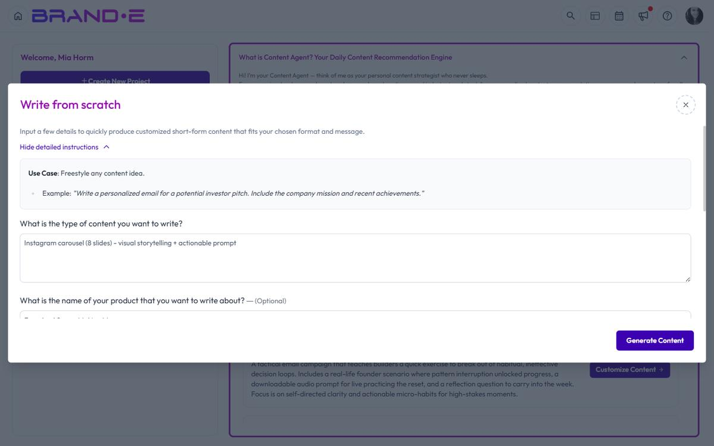

# Read and Interpret Content Briefs

Each Content Agent brief is a strategic instruction. It tells you what to create, why it matters, and where it fits in your content strategy.

## Anatomy of a Content Brief

Every brief contains four pieces of information:

### 1. Title

A clear, specific description of what to create. Examples:
- "Explain how your solution solves a common customer pain point"
- "Share a case study of a successful client implementation"
- "Post a behind-the-scenes look at your product development process"

The title is not the final headline for your content. It is a directive that describes the strategic purpose of what you are about to create.

### 2. Summary

A paragraph explaining why this content matters and what your audience needs to hear. The summary includes:
- The audience problem or need being addressed
- Why your brand is the right voice to address it
- How this content fits into your broader strategy

Example summary:
> "Your audience is comparing solutions and wants proof that your approach works. A case study showing a customer's measurable results will build confidence and reduce sales cycle friction."

This summary answers the "why" before you start writing.

### 3. Template

A pre-selected template based on the distribution channel. Common templates include:
- **LinkedIn Post** — For LinkedIn channel recommendations
- **Long-Form Content** — For Blog channel recommendations
- **Write from Scratch** — For channels without a specific template
- **Email** — For Email channel recommendations
- **Social Media Thread** — For Twitter, TikTok, or other social channels

The template is not random. Content Agent selects it based on which channel the recommendation is for.

### 4. Template Variables

Pre-filled fields that provide brand context for the content. These variables come from your Brand DNA and may include:
- Your brand positioning statement
- Key customer pain points
- Your unique value proposition
- Audience demographic information
- Competitor insights

When you click **"Customize Content"**, a dialog opens where you can review and edit these variables before generating.

## How to Use This Information

### Step 1: Read the Title and Summary

Decide if this brief aligns with your current priorities. If it does, proceed. If it does not, you can:
- Skip it and move to the next recommendation
- Mark it as Done and revisit it later
- Customize it to fit a different angle

### Step 2: Review the Template

The template is already selected for you. Familiarize yourself with what kind of output format you will receive (a short social post, a long-form article, an email, etc.).

### Step 3: Customize Before Generating

Click **"Customize Content"** to open the customization dialog. Here you can:
- Review all template variables
- Edit any variable that needs adjustment
- Add context-specific details (a recent customer win, a timely trend, etc.)
- Refine the angle to match your current marketing focus

The customization step is where the brief becomes your content strategy—specific to your situation right now.

### Step 4: Generate

After customizing, click **"Generate"** to create the content. Brande.ai will use the template, your brand voice, and the customized variables to produce finished content ready for review and refinement.

## Understanding Template Variables

Template variables are the intelligence layer of Content Agent. They are not placeholders for you to fill in manually. They are pre-filled with brand context that Brande.ai has learned from your Brand DNA.

Common variables include:
- `brand_positioning` — How you position your brand relative to competitors
- `audience_pain_points` — The top challenges your audience faces
- `key_differentiator` — What makes your approach unique
- `target_outcome` — The transformation your customer experiences
- `call_to_action` — Where you want the audience to go next

When you customize, you are not re-entering this information. You are confirming it is correct and adding any context specific to this particular piece of content.

## Why Briefs Matter

The brief is the strategic layer that separates Brande.ai from a generic writing tool. Instead of starting with a blank page and a vague prompt, you start with:
- A clear strategic purpose (the summary)
- The right format for the channel (the template)
- Brand context already loaded (the variables)

Your job is to decide if the strategy makes sense right now, customize it if needed, and generate the content.

## Related Topics

- [Understanding the Content Agent](/section-2-content-agent/understanding-content-agent)
- [How To Use Content Agent](/section-2-content-agent/use-content-agent)
- [Get Daily Content Recommendations](/section-2-content-agent/get-daily-recommendations)
- [Customize a Content Brief Before Generating](/section-2-content-agent/customize-content-brief)