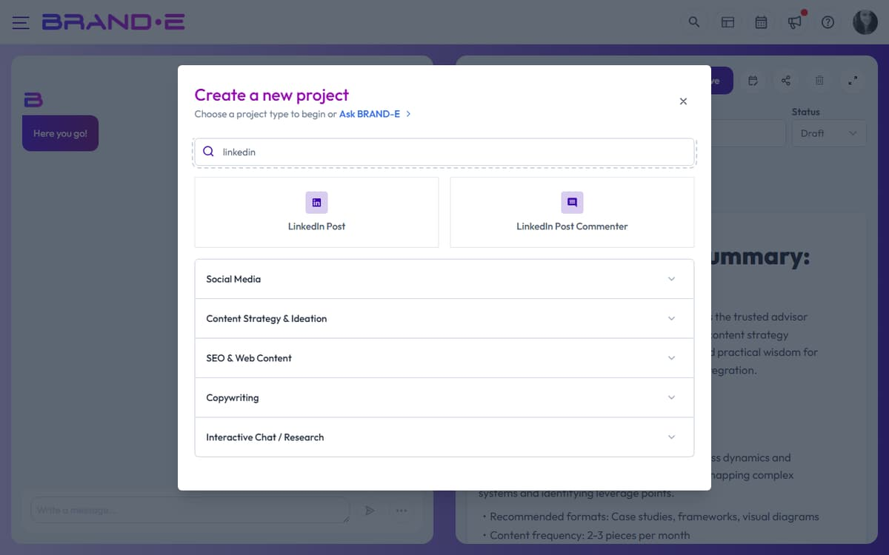

# Create High-Quality LinkedIn Content

LinkedIn rewards specificity and authenticity. Generic "how to scale your business" posts get lost; posts from your actual voice that address a specific founder's pain point get engagement and opportunities. The LinkedIn Post template generates brand-aligned short-form content that feels like you, not like an AI.

## What LinkedIn Post Template Generates

The LinkedIn Post template produces:
- **Hook** — First 1–2 sentences that stop the scroll
- **Body** — 3–5 sentences that support or elaborate the hook
- **Benefit or takeaway** — What the reader learns or should do
- **CTA** — Call to engagement (comment, share, or link)

Output is complete, ready to post directly to LinkedIn.

## When to Use LinkedIn Post Template

**Use for:**
- Thought leadership posts (industry insights, methodology, expertise)
- Founder perspectives (personal learning, mistakes, wins)
- Quick tips or tactics (process breakdown, checklist, framework)
- Commentary on industry trends or news
- Customer success stories or case study snippets
- Engagement posts (questions, debates, discussion prompts)
- Milestone or company announcements

**Do not use for:**
- Blog posts or long-form articles (use Long-Form Content)
- Website pages or landing pages (use Website Copy)
- Email campaigns or newsletters (use Write from Scratch)
- Repurposing full articles to multiple formats (use Repurpose Content)

## Step 1: Select LinkedIn Post Template

In the New Project dialog:
1. Search for "linkedin" or browse the **LinkedIn Post** category
2. Click the **LinkedIn Post** template card

The variables dialog opens.

## Step 2: Configure LinkedIn Post Variables

The LinkedIn Post template asks for:

**Post Topic or Angle** (required)
What is this post about? Be specific. Example: "Why hiring for attitude beats hiring for experience" or "How we reduced onboarding time from 4 weeks to 1 week"

**Main Message or Key Point** (required)
What is the one thing you want readers to remember? Example: "Skill transfer takes 6 months; culture fit determines longevity."

**Target Audience** (required)
Who is this post for? Be specific. Example: "Technical founders at 5–50 person SaaS companies" or "VP of Product at B2B SaaS"

**Tone or Style** (optional)
How should the post feel? Example: "Conversational and vulnerable," "Data-driven and authoritative," "Provocative and opinionated"

**Brand Voice** (if available)
Select which voice profile to use. The post will match that voice's personality and tone.

**Include images** (optional)
Check to generate a featured image to accompany the post.

**Image Instructions** (if enabled)
Describe the visual style. Example: "Bold, minimalist design with a single icon or shape in brand colors."

**Reference Material** (optional)
Select a past LinkedIn post, article, or case study to reference for tone and messaging.

**Folder** (optional)
Choose or create a folder to organize this project (e.g., "Thought Leadership," "Weekly Posts").

## Step 3: Generate the Post

Click **Done**. The editor opens and the AI generates the complete post.

You'll see:
- A hook that stops the scroll
- Supporting body paragraphs that explain the key point
- A clear takeaway or benefit
- A CTA that encourages engagement

The post uses your Brand DNA voice and audience language throughout.

## Step 4: Refine in the Chat

Use the chat to adjust messaging, tone, or structure:

**"Make the hook more controversial"**
The AI rewrites the opening to be more provocative and stop more scrolls.

**"Add data or numbers to support the claim"**
The body includes specific statistics that back up your main point.

**"Make this more vulnerable—add a personal mistake"**
The post becomes more authentic and relatable.

**"Shorten this to 3 sentences per paragraph"**
The post becomes punchier and more scannable on mobile.

**"Change the CTA from 'share your thoughts' to 'what's one thing you'd add?'"**
The engagement CTA becomes more specific and invitation-oriented.

**"Make the tone less corporate"**
The entire post becomes more conversational and less formal.

The AI regenerates sections based on your feedback while maintaining your Brand DNA voice.

## Step 5: Copy to LinkedIn

When the post is ready:

1. **Copy the text** from the editor
2. **Paste into LinkedIn** (create a new post)
3. **Paste the image** if you generated one
4. **Post or schedule** for your chosen time

Or use the **Export** menu to download as PDF or Word for review before posting.

## Step 6: Track Engagement

After posting, set this project's status to **Published**. Monitor the post on LinkedIn:
- Engagement rate (comments, shares, reactions)
- Click-through rate (if you included a link)
- Follower growth (if the post drives new followers)

Use this insight for future posts. Which hooks work for your audience? Which CTAs drive comments?

## LinkedIn Post Best Practices

**Best Practice 1: Hook is 40% of success**
The first 1–2 sentences determine whether someone scrolls past or reads on. Use:
- A surprising statement ("Most growth advice is backwards")
- A question ("What if your hiring process is costing you millions?")
- A contrarian take ("We stopped hiring senior people—best decision we made")
- A personal insight ("I just realized I've been building wrong for 5 years")

**Best Practice 2: Back up claims with specificity**
Generic: "We grew our team efficiently."
Specific: "We added 12 people in 6 months without a single poor hire."

Even better: Include numbers, timelines, or outcomes. Your audience believes what's verifiable.

**Best Practice 3: Use the rule of three**
Post structure that works: Hook + 3 supporting points/examples + CTA

Example:
1. "Why hiring for attitude beats experience"
2. Example 1: "Skill transfer takes 6 months"
3. Example 2: "Culture determines 2-year retention"
4. Example 3: "Your story: here's what we learned"

**Best Practice 4: CTA should ask for engagement, not clicks**
Weak: "Learn more here →"
Strong: "What's your take? Have you experienced this?"

Strong CTAs get comments, which boost algorithm reach. Weak CTAs get clicks but no engagement signal.

**Best Practice 5: 150–200 words is ideal**
Scan-ability matters on mobile. Shorter posts outperform long walls of text. If you need more, use Long-Form Content template instead.

**Best Practice 6: Post when your audience is active**
LinkedIn shows highest engagement 8am–10am workday times. Avoid weekends unless your audience is always-on (solopreneurs, founders).

## Example: Fractional CMO LinkedIn Post

**Topic:** "Why fractional CMOs fail in their first 90 days"

**Generated post:**

"Most companies hire a fractional CMO expecting immediate campaign wins. They get disappointed by month 3. It's not the CMO's fault—it's the foundation.

Here's what actually matters:

1. **First 30 days = strategy, not tactics.** Understand your brand DNA, audience, and competitive position before writing one piece of content.

2. **Month 2 = channel setup.** Where does your audience actually live? Not where you think. Test and measure.

3. **Month 3 = first real content.** Now you have context. Your content hits different.

I've watched this happen 20+ times. The CMOs who skip to campaign planning fail. The ones who pause and set foundation win.

What's one area where you've rushed into tactics before getting strategy clear? Comment below—your answer helps others avoid the same trap."

**Refine requests:**
- "Make the hook punchier. I want this to stop someone mid-scroll."
- "Add specific data. How many CMOs fail in 90 days?"
- "Make the personal perspective stronger. This should feel like it's from real experience."
- "Change the CTA. Instead of asking what happened to them, ask what they'd change about their hiring process."

## Step-by-Step Example: Complete Flow

1. **Create project** → Click Create New Project (Alt+N)
2. **Search for LinkedIn** → Type "linkedin" in search
3. **Select template** → Click LinkedIn Post
4. **Fill variables:**
   - Topic: "Why we fire fast instead of hire slow"
   - Main message: "Speed of decision beats perfection of hire"
   - Audience: "Technical founders at Series A"
   - Tone: "Direct and conversational"
   - Brand voice: "Your voice"
5. **Generate** → Click Done
6. **See draft** → Read generated post
7. **Refine** → "Make this less corporate" → AI rewrites
8. **Copy** → Highlight all, copy, paste into LinkedIn
9. **Post** → Click Share
10. **Track** → Set status to Published, monitor engagement

## Tips for Consistent LinkedIn Success

**Tip 1: Post weekly, not daily**
One solid post weekly beats 5 mediocre posts. Quality > frequency on LinkedIn.

**Tip 2: Reference your own experience**
Posts from your real stories outperform theoretical advice. Use the chat to say "Make this personal—I want to add a story from my own hiring."

**Tip 3: Vary your post types**
Don't post only tips. Mix in perspectives, questions, stories, and commentary. Variety keeps followers engaged.

**Tip 4: Reply to comments in first hour**
High early engagement signals quality to the algorithm. Reply to first comments immediately.

**Tip 5: Create a posting schedule**
Use the date you're planning to publish in your folder structure. Example: "LinkedIn Posts - Feb 2024 - Week 1"

## Related Topics

- [Choose and Use Project Templates](/section-3-creating-content/choose-project-templates)
- [Edit, Refine, and Regenerate Content](/section-3-creating-content/edit-refine-regenerate)
- [Include Images When Generating Content](/section-3-creating-content/include-images)
- [Create a New Content Project](/section-3-creating-content/create-new-project)
- [Use Brand Voice Profiles in Projects](/section-3-creating-content/use-brand-voice-in-projects)
