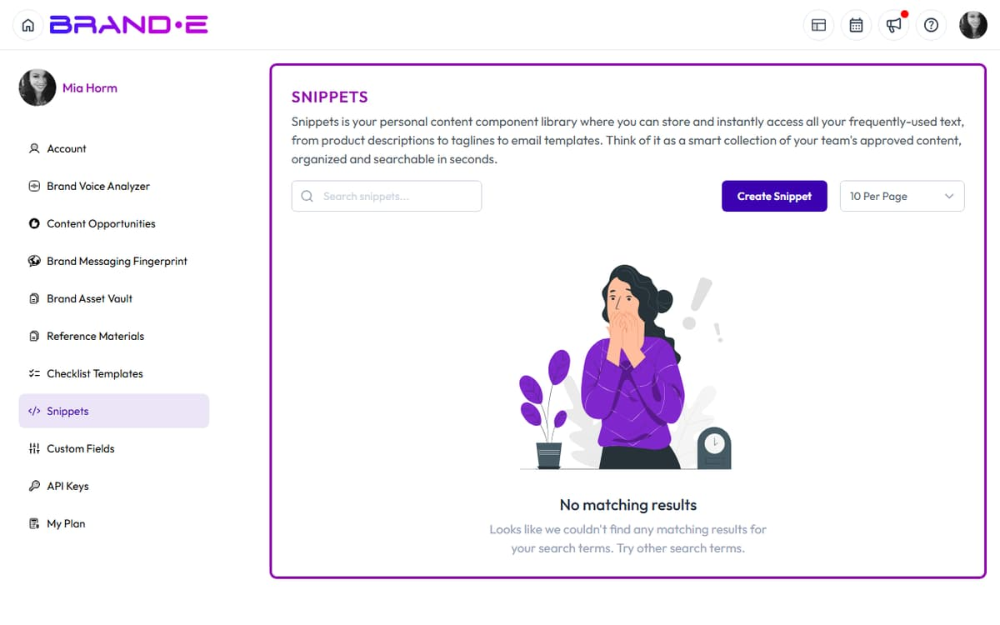

# Create and Manage Snippets

You repeat the same messaging across projects. "Our 3-step framework." Your value proposition. Your credentials or credibility statement. Instead of rewriting them every time, save them as snippets—reusable text blocks you insert with a keyboard shortcut.




Snippets are your message library. Create them once, use them everywhere, and keep messaging consistent across all projects.

## What Are Snippets?

Snippets are short, reusable text blocks with three components:

**Description** — What the snippet contains (for searching)
Example: "3-step framework summary"

**Shortcut** — A keyboard command to insert the snippet
Example: `3step` or `framework`

**Snippet Text** — The actual content to insert
Example: "Our proven 3-step framework: (1) Audit your current approach, (2) Design your custom strategy, (3) Execute and measure."

When you're in a project, press the snippet shortcut (`Ctrl+C` on macOS or `Alt+C` on Windows/Linux), then pick or type your snippet name to insert the full text.

## When to Use Snippets

**Use snippets for:**
- Repeated value propositions
- Methodology or framework descriptions
- Signature credibility statements (credentials, company stage, social proof)
- Standard CTAs or sign-off language
- Frequently used brand examples or case studies
- Standard disclaimers or legal language
- URLs or email addresses
- Formatting templates or outlines

**Don't use snippets for:**
- One-time content (defeats the purpose)
- Long blocks (over 500 words—too much to reuse identically)
- Highly personalized content (names, specific client details)
- Content that changes frequently

## Access Snippets

Snippets are managed in your **Account** area.

**To access Snippets:**
1. Click your user avatar (top right)
2. Click **Account** or navigate to `/account/`
3. In the sidebar, click **Snippets**
4. The **Snippets** list page opens at `/account/snippets/list`

## Create a New Snippet

### Step 1: Navigate to Snippets

Account sidebar → **Snippets** → click **Create Snippet**.

Or open a snippet directly at `/account/snippets/[id]`.

### Step 2: Fill the Snippet Form

Three required fields:

**Shortcut** (required)
The trigger you'll type after `Ctrl/Alt+C` to insert this snippet.
- Keep it short (2–6 characters) so it's quick to type
- Use alphanumeric characters; hyphens and underscores work too
- Example: `3step`, `vpvalue`, `cta-main`
- Brande.ai does not enforce a length, character pattern, or duplicate check on shortcuts — to avoid collisions, scan your existing shortcuts on the Snippets list before creating a new one

**Description** (required)
A human-readable name for searching.
- Example: "3-step framework," "Value proposition," "Main CTA"
- This is the column you'll search by on the Snippets list
- Keep it concise so it reads well in the list

**Snippet** (required)
The actual content to insert.
- Paste or type the text you want to reuse
- Line breaks and special characters are preserved on insert

### Step 3: Save the Snippet

Click **Save Snippet**.

A toast confirms "Snippet created successfully!". The snippet is saved to your brand and is immediately available in any project.

## Use a Snippet in Your Project

### Method 1: Keyboard Shortcut

While editing in a project:

1. **Click where you want to insert the snippet**
2. **Press `Ctrl+C`** (macOS) or **`Alt+C`** (Windows/Linux) to open the snippet picker
3. **Find your snippet** by shortcut or description
4. **Click the snippet** to insert it at your cursor

The full snippet text appears at your cursor.

### Method 2: Snippet Picker (button)

If keyboard shortcuts feel awkward, the picker is also reachable from the UI:

- **In the new-project chat**: open the action menu in the chat composer and click the **Snippets** item.
- **In the document editor**: open the inline-tool toolbar on a block and select the snippet tool.

A modal opens listing your snippets. Click any snippet card to insert it at your cursor.

## Search Snippets

On the Snippets list page:

**Search bar** placeholder reads "Search snippets...".
- Type a keyword from the description, shortcut, or snippet text
- Results filter as you type

**Browse all snippets**
- Without a search term, snippets appear in a paginated table with **Shortcut**, **Description**, and **Snippet** columns
- Click any row to open the snippet for editing

## Edit a Snippet

On the Snippets list page:

1. **Find your snippet** (search or browse)
2. **Click the snippet row** to open edit view
3. **Modify the description, shortcut, or text**
4. **Click Save** to update

Existing instances of this snippet in published content do NOT update retroactively. Only new insertions use the updated snippet text.

## Delete a Snippet

On the Snippets list page or in edit view:

Click the **Delete Snippet** button (or trash icon).

A confirmation dialog appears: "Are you sure you want to delete this snippet?".

Click **Delete Snippet** to confirm.

Deleted snippets cannot be recovered. Existing content that already contains this snippet text is unaffected (the text is embedded, not linked).

## Copy Snippet Text to Clipboard

From the snippet picker modal, every snippet card shows two icon buttons on the right:

- A pencil icon to open the snippet for editing
- A copy icon (tooltip: **Copy**) to copy the snippet text to your clipboard

Click the copy icon, and a toast confirms "Snippet copied to clipboard". Paste the text wherever you need it.

## Snippet Organization Best Practices

**Best Practice 1: Use consistent shortcut naming**
Example naming scheme:
- `3step` — Frameworks (3step, 5point, method)
- `vpval` — Value props
- `cta` — CTAs (cta-main, cta-secondary)
- `proof` — Social proof or credentials

**Best Practice 2: Create descriptions that are searchable**
Instead of "Text 1" or "Stuff," use "3-step framework description" or "Main value proposition."

**Best Practice 3: Review snippets quarterly**
Outdated snippets stay in your library forever. Regularly review and delete snippets that are no longer relevant.

**Best Practice 4: Create snippets with built-in line breaks**
If your snippet is 3 paragraphs, include line breaks so it reads properly when inserted.

**Best Practice 5: Use short, punchy shortcuts**
Short shortcuts are easier to remember and faster to type.
- Good: `3step`, `vpval`, `cta`
- Awkward: `my_three_step_framework_description`

**Best Practice 6: Document snippet usage**
If your team uses snippets, create a shared document listing all shortcuts and what they contain. This prevents creating duplicate snippets for the same content.

## Snippet Examples

### Example 1: Framework Snippet

**Shortcut:** `3step`
**Description:** "3-step framework"
**Text:**
```
Our proven 3-step process:

(1) Audit — We analyze your current approach, gaps, and opportunities.
(2) Design — We create a custom strategy tailored to your business and audience.
(3) Execute — We implement and measure results monthly.

This framework has helped 50+ B2B SaaS companies scale their marketing.
```

**Usage:** Type `3step` when describing your methodology in blog posts, LinkedIn posts, or website copy.

### Example 2: CTA Snippet

**Shortcut:** `cta`
**Description:** "Main call-to-action"
**Text:**
```
Ready to transform your content strategy? Schedule a 30-minute discovery call with our team—no prep needed, no sales pressure.
```

**Usage:** Type `cta` at the end of blog posts, long-form content, or website pages.

### Example 3: Credentials Snippet

**Shortcut:** `creds`
**Description:** "Author credentials"
**Text:**
```
Sarah Chen is the fractional CMO for 8 Series A+ SaaS companies. She's published 100+ LinkedIn posts with 2M+ impressions and led 3 companies from $0 to $10M ARR.
```

**Usage:** Type `creds` when adding author bio to blog posts or LinkedIn articles.

### Example 4: Sign-Off Snippet

**Shortcut:** `signoff`
**Description:** "Email sign-off"
**Text:**
```
Looking forward to building with you,

[Name]
Founder, [Company]
```

**Usage:** Type `signoff` at the end of email campaigns.

## Snippet Workflow for Teams

If your team shares a brand:

1. **Brand owner creates core snippets** — Value props, frameworks, credentials
2. **Share shortcut list** — Document all available shortcuts so team members know what's available
3. **Team uses snippets** — Everyone inserts same snippets, ensuring consistency
4. **Update quarterly** — Brand owner audits and refreshes snippets as messaging evolves

This prevents the "we all write value props differently" problem.

## Troubleshooting Snippets

**"Keyboard shortcut isn't working"**
→ The shortcut may be too long, contain invalid characters, or conflict with browser/app shortcuts. Try a simpler shortcut (e.g., `3step` instead of `3-step-framework`).

**"I can't remember my shortcut names"**
→ Create a shared doc or screenshot listing all shortcuts. Or use the Snippet Picker dialog instead of keyboard shortcuts.

**"Snippet didn't insert"**
→ Make sure you're in edit mode (cursor is in a text block). Click the text area first, then type the keyboard shortcut.

**"I want to change a snippet but don't want to break existing content"**
→ Create a new snippet with a different shortcut instead. Keep the old one for existing content.

**"Snippet is too long to type all at once"**
→ Save it in Snippets and use the keyboard shortcut or picker dialog instead of typing.

## Related Topics

- [Edit, Refine, and Regenerate Content](/section-3-creating-content/edit-refine-regenerate)
- [Create a New Content Project](/section-3-creating-content/create-new-project)
- [Generate Website Copy](/section-3-creating-content/generate-website-copy)
- [Create High-Quality LinkedIn Content](/section-3-creating-content/create-linkedin-content)
