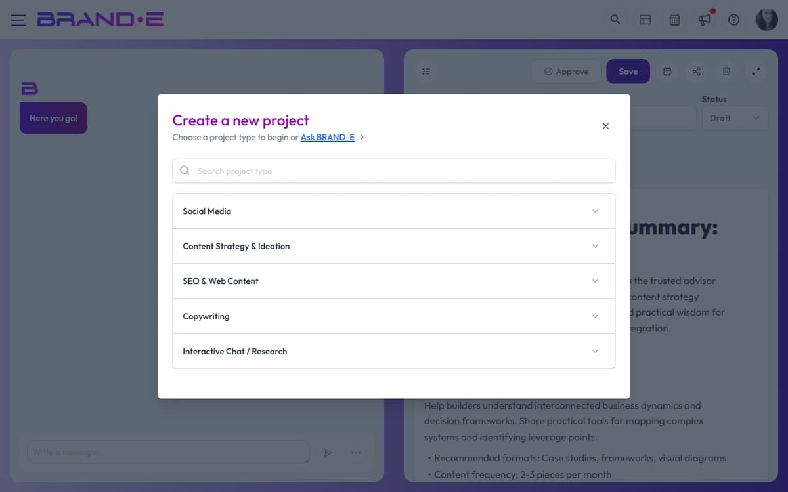

# Create a New Content Project

You have a brand strategy and daily recommendations, but nothing happens until you open a blank canvas and start creating. Creating a new project is where Brand DNA transforms into shipping content.

The new project dialog guides you through template selection, variables, and brand voice alignment in three steps—setting up for AI-assisted generation instead of AI-powered guessing.

## Step 1: Open the New Project Dialog

**Option A: Use the keyboard shortcut**
Press **Alt+N** (Windows/Linux) or **Control+N** (Mac) from anywhere in the app.

**Option B: Click the button**
Navigate to your Projects page and click **Create New Project** in the top right. The dialog opens immediately.

The dialog shows the title "Choose your project type" with a subtitle and a link to **Ask Brande.ai** (a template for custom content requests).

## Step 2: Find Your Template

The new project dialog displays templates in three ways:

**Search for a specific template:**
Type at least 3 characters in the search field. Results appear instantly. If no templates match, you'll see "{search term} project type not found."

**Browse by category:**
Templates are grouped into categories: Content Strategy & Ideation, Copywriting, Social Media, SEO & Web Content, and Interactive Chat / Research (which includes Ask Brande.ai).

Click any category to expand and see available templates in that category.

**Note:** Some templates are locked behind plan upgrades. Hover over a locked template to see the tooltip "Upgrade your plan to access this template".

## Step 3: Select a Template

Click the template you want. The dialog closes and the **variables dialog** opens immediately (unless you're in trial mode, in which case you'll see "You can't access this feature during trial period").

The template you selected is now ready for configuration.

## Step 4: Configure Template Variables and Brand Settings

The variables dialog shows:
- The template name as the heading
- A brief description of what you're creating
- Input fields for template-specific variables (e.g., topic, audience, main point)
- Optional settings like Include images, Source Material, Folder, and Brand Voice

**Configure variables:**
Fill in each required field (marked with an asterisk or validation rule). These provide Brand DNA context to the AI for generation.

**Select Brand Voice** (if available for your template):
Use the Brand Voice dropdown to choose which voice profile to use. Your selection appears in the button label. Content generated will match that voice's tone and personality.

**Include images** (if your template supports it):
Check "Include images" to generate accompanying visuals. If enabled, an Image Instructions text area appears below.

**Add image instructions** (when enabled):
Describe the visual style, composition, or subject matter you want. Example: "Bold, flat design with bright colors and modern sans-serif typography." Leave blank to use default image generation based on Brand DNA.

**Choose reference material** (if needed):
Some templates allow you to select source material or previous projects to reference for context.

**Select a folder:**
Choose an existing folder or type a new folder name to organize your project in the sidebar.

## Step 5: Start Creating

Click **Done** to create the project. The editor opens with a chat interface where you can start conversing with the AI to generate and refine content.

Your project is now saved with a **Planning** status (default). You can change the status manually anytime.

## Tips for Best Results

**Tip 1: Fill variables thoughtfully**
Template variables are placeholders for brand context. Specific, detailed inputs produce more aligned content than generic answers.

**Tip 2: Match the template to your goal**
Choose the template whose format matches your output goal. Website Copy templates generate structured website sections; LinkedIn Post templates generate short-form social content.

**Tip 3: Use Brand Voice to enforce consistency**
If you manage multiple voices within one brand, always select the appropriate voice before generating. This prevents voice blending across projects.

**Tip 4: Plan folder structure early**
As you create more projects, organize them into folders by campaign, channel, or date. This makes finding past work and collaborating with team members easier.

**Tip 5: Save images with intent**
If your template supports images, use Image Instructions to specify visual alignment with your brand identity. Generic image instructions produce generic visuals.

## Related Topics

- [Choose and Use Project Templates](/section-3-creating-content/choose-project-templates)
- [Use Brand Voice Profiles in Projects](/section-3-creating-content/use-brand-voice-in-projects)
- [Include Images When Generating Content](/section-3-creating-content/include-images)
- [Edit, Refine, and Regenerate Content](/section-3-creating-content/edit-refine-regenerate)
- [Understand Brand DNA in Brande.ai](/section-1-getting-started/understand-brand-dna)
