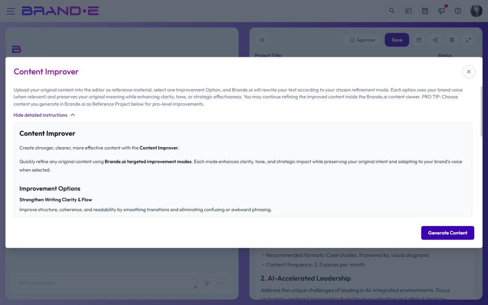

# Use the Content Improver

Generated content is functional. Improved content converts. **Content Improver** is one of Brande.ai's project templates (under the Copywriting category). You paste an existing piece of content into the variable dialog, pick the improvement modes you want applied, and Brande.ai rewrites the content using your Brand DNA.

Use it when you have a draft that's close but not landing — a launch announcement that feels flat, a LinkedIn post that's too corporate, a landing-page section that buries the value.

## Where Content Improver Lives

Content Improver is a project template, not a separate panel inside the editor. You reach it through the new-project flow:

1. From the **Projects** page or dashboard, start a new project
2. In the **Create a new project** dialog, search for or scroll to **Content Improver** (Copywriting category)
3. Select it to open the template's variable dialog

## How to Use Content Improver

### Step 1: Have your draft ready

Copy the content you want to improve. It can be content Brande.ai generated earlier or content from outside the app.

### Step 2: Open the Content Improver template

From the Create a new project dialog, choose **Content Improver**. The variable dialog opens.

### Step 3: Fill the variable dialog

Paste your draft into the content field. Then select one or more **improvement modes** — each one tells Brande.ai which dimension of the content to prioritize in the rewrite.

**Pro tip:** if you originally generated the source content in Brande.ai, attach that earlier project as a Reference Project in the variable dialog. The improver then has full context for the rewrite.

### Step 4: Generate the rewrite

Click **Done**. Brande.ai rewrites your content using your Brand DNA and the improvement modes you selected. The output appears as a new project in the editor — you can continue refining it with chat or direct edits from there.

## Improvement Modes

Content Improver doesn't score your content — it rewrites it. You pick one or more improvement modes from the variable dialog, and the rewrite emphasises those goals while keeping your Brand DNA intact:

- **Strengthen writing clarity and flow** — Make ideas easier to follow; cut ambiguity
- **Make it more concise** — Trim without losing meaning; respect your reader's time
- **Boost brand voice and alignment** — Rewrite to sound more authentically like you
- **Humanize the content** — Add warmth, personality, or vulnerability where it's missing
- **Increase persuasiveness** — Sharpen the argument; strengthen the CTA and value prop

You can select multiple modes in one pass.

## Best Practices for Content Improver

**Start with one or two modes**
Picking every mode at once makes the rewrite more aggressive. Start with the one or two dimensions that need the most work, then refine further if needed.

**Use it on content you already understand**
Content Improver works best when you know *why* the draft isn't working. If the issue is a weak CTA, select "Increase persuasiveness." If the tone feels wrong, select "Boost brand voice." Guessing gets generic results.

**Attach the original project when available**
If the draft came from Brande.ai, linking it as a Reference Project gives the improver full context — including your brand voice profile, template variables, and any customizations you made.

**Trust your instinct over the tool**
If the rewrite changes something that was working, revert it. You know your brand better than any tool. Use the editor's revision history to compare versions.

**Use it as a learning tool**
Over time you'll see patterns in what needs improving. "My CTAs are always too generic" or "My openings lack urgency." Use these patterns to improve your default writing.

## Content Improver Limitations

**Content Improver does not:**
- Provide a score, rating, or health indicator — it rewrites content, not evaluates it
- Write content for you (you must supply the draft)
- Guarantee higher engagement (suggestions are strong practices, not guarantees)
- Replace human judgment (your instinct matters more)

**Content Improver works best for:**
- Website copy and landing pages
- LinkedIn posts
- Blog post introductions
- Email subject lines and CTAs
- Any brand-facing content that needs more voice or punch

## Related Topics

- [Edit, Refine, and Regenerate Content](/section-3-creating-content/edit-refine-regenerate)
- [Create a New Content Project](/section-3-creating-content/create-new-project)
- [Use Brand Voice Profiles in Projects](/section-3-creating-content/use-brand-voice-in-projects)
- [Choose and Use Project Templates](/section-3-creating-content/choose-project-templates)
