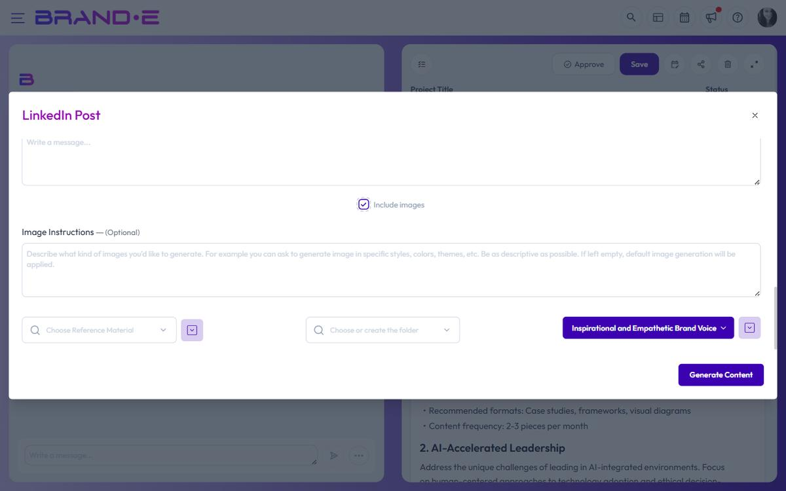

# Create Visual Content for Different Platforms

Different platforms have different image requirements. Brande.ai generates images in the right dimensions and aspect ratios for each channel—so your visuals fit perfectly on Instagram, LinkedIn, Twitter/X, blogs, and more.

## Platform-specific image requirements

When you create a project or generate images, Brande.ai adapts to your platform:

**Social Media Feeds:**

- Instagram: Square (1:1) or portrait (4:5) formats
- Facebook: Square (1:1), landscape (1.91:1), or portrait (4:5)
- LinkedIn: Square (1:1) or landscape (1.2:1)
- Twitter/X: Landscape (16:9) or square (1:1)

**Stories & Vertical Formats:**

- Instagram Stories: Portrait (9:16)
- LinkedIn Stories: Portrait (9:16)
- TikTok: Vertical (9:16)

**Web & Blog Content:**

- Hero images: Landscape (16:9)
- Featured images: Landscape (1.5:1)
- Thumbnails: Square (1:1)

**Other Channels:**

- Google My Business: Square (1:1)
- WhatsApp: Portrait or square
- Email headers: Landscape (600x200px or wider)

**Important:** Brande.ai does not currently auto-size images based on the project's target platform. The image generator uses a single default of 1365×1024 (16:9) and only branches when your **Image Instructions** explicitly request a different aspect ratio. To get a square image for Instagram or a vertical image for Stories, type that into Image Instructions (for example, "square 1:1 composition" or "vertical 9:16 mobile").

## Generate images for your target platform

When setting up a project:

1. Pick the template that matches your destination platform (LinkedIn Post, Instagram Post, Facebook Post, etc.) — the template is the platform proxy
2. Tick **Include images** in the variable dialog
3. Use the **Image Instructions** textarea to call out the aspect ratio you need (square, portrait, landscape) — the model uses 1365×1024 by default
4. Your Brand DNA styling is applied at every aspect ratio

If you need a different aspect ratio later, regenerate the image with updated Image Instructions or crop in your own tool before posting.

## Use images across multiple platforms

If you're repurposing content for multiple channels, create separate projects per platform (the **Repurpose Content** template streamlines this by spinning up one project per content type into the same folder). There is no single-project, multi-platform image picker; each project's image generation reflects its own Image Instructions, with Brand DNA applied throughout.

## Aspect ratio and composition tips

Different shapes require different composition:

**Square (1:1):**

- Centered subject works well
- Good for product images or headshots
- Less wasted space on edges

**Landscape (16:9):**

- Horizontal subject or multiple elements
- Works for hero images and banners
- More expansive feel

**Portrait (9:16):**

- Tall vertical subjects
- Good for stories and mobile-first content
- Draws eye top-to-bottom

Brande.ai composes images to use the full aspect ratio effectively.

## Resize or adapt after generation

If you need to use an image on a different platform:

- Right-click the image in the editor to save it locally
- Resize or recompose in your favourite image tool, or regenerate with new Image Instructions
- Schedule with **Add to Calendar** so the project surfaces on the right day
- Adapt the post copy to the destination platform manually — platform-specific content adaptation is not automatic

## Related Topics

- [Generate On-Brand Images](/section-4-visual-content/generate-on-brand-images)
- [Customize Image Style Using Plain English](/section-4-visual-content/customize-image-style)
- [Maintain Visual Brand Consistency](/section-4-visual-content/maintain-visual-consistency)
- [Publish Content Directly to Channels](/section-6-collaboration/publish-to-channels)
