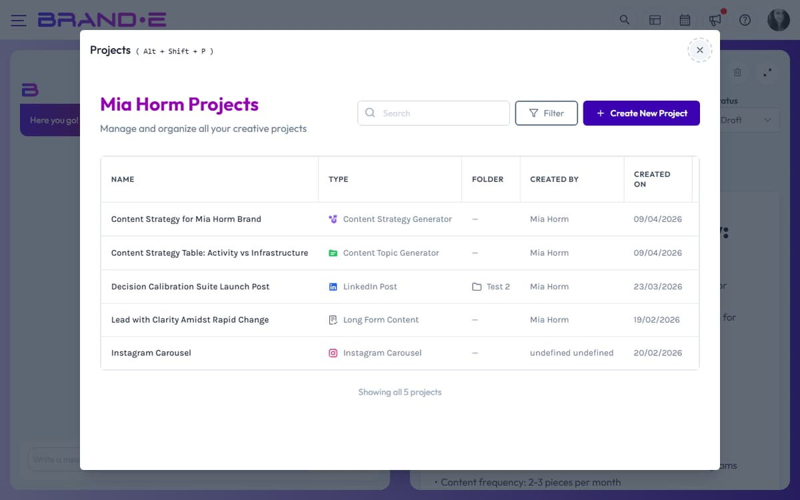

# Find Projects Using Sidebar Search

Need to find a specific project fast? Use Project Search to locate any project by name across your entire brand—no matter how many folders you have or where it lives.

## Open Project Search

Click the **View Projects** button in the sidebar (magnifying glass icon). Keyboard shortcut: **Modifier+Shift+P** (Cmd+Shift+P on Mac, Ctrl+Shift+P on Windows/Linux).

The Projects page opens with a full searchable list of all projects.

## Search by project name

Type in the search field to find projects:

- Search is instant as you type
- Matches project name and type
- Results update in real-time
- Shows all matching projects across all folders

Examples:
- Search "Q2" to find all Q2 campaign projects
- Search "blog" to find blog-related content
- Search "client name" to find work for that client

## Filter and sort

Beyond text search, you can filter projects by:

- **Status:** Planning, Brief, Draft, Review, Approved, Published, Archived
- **Folder:** Which folder contains the project
- **Template:** The content type (blog post, email, social post, etc.)
- **Creator:** Who created the project
- **Date:** When the project was created
- **Custom fields:** Any custom metadata you've added to projects

Click the **Filter** button above the project list to open filtering options. Active filters show a count badge.

## Reset filters

Click the number badge on the Filter button to clear all active filters. Or deselect individual filters one by one.

## View all projects

The Projects page shows:

- Project name and type (template)
- Folder it belongs to
- Creator name
- Creation date
- Current status with color indicator
- Any custom fields you've defined

Click any project row to open it and start editing.

## Navigate back to sidebar

After searching and finding a project:

1. Click the project row to open it
2. The editor closes the search view
3. The sidebar collapses back to your folder/project overview
4. Your project is now active and ready to edit

Close the project search modal by:
- Clicking X in the modal
- Pressing Escape
- Selecting a project to open

## Search limitations

- Searches within your current brand only
- Archived projects are excluded from default view (filter to include)
- Project search finds by name and type, not by content inside the project

For more powerful filtering, use the Projects page filters instead of just text search.

## Related Topics

- [Understand Projects, Folders, and Campaigns](/section-5-projects-organization/understand-projects-folders)
- [Organize Content at Scale](/section-5-projects-organization/organize-at-scale)
- [Project Statuses](/section-5-projects-organization/understand-projects-folders)