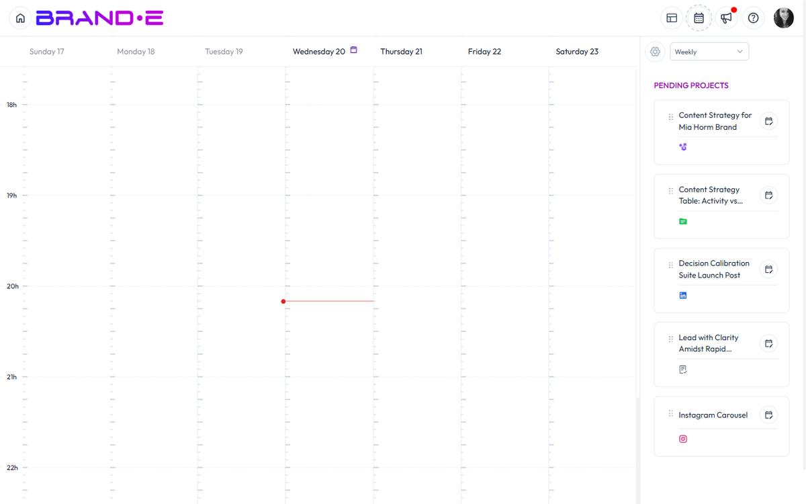

# Organize Content at Scale

Managing dozens—or hundreds—of projects requires structure. Folders, statuses, and calendars are your tools for staying organized when volume grows fast.

## Structure for high-volume creation

If you're creating many projects monthly:

**Use folders heavily.** Create a folder structure that mirrors your workflow:

- By month: "January 2026", "February 2026"
- By campaign: "Black Friday Campaign", "Product Launch"
- By channel: "Blog Posts", "Social Media", "Email"
- By team: "Sarah's Content", "Marketing Team"
- By client: "Client A", "Client B" (if agency)

Review and refresh your folder structure quarterly. Archive old months or campaigns to keep active folders clean.

**Leverage project statuses.** Status filters help you find what needs attention:

- **Planning + Brief:** Early-stage content needing work
- **Draft + Review:** Content in active development
- **Approved:** Signed off and ready to publish
- **Published + Archived:** Completed and historical

At a glance, you know how much is in each pipeline stage.

**Use the Content Calendar.** Plan publishing schedule:

- Drag projects onto the calendar to schedule them
- Weekly, Monthly, or Quarterly views
- See what's coming and avoid gaps
- Adjust timing without changing the project

## Finding what you need fast

With hundreds of projects:

**Project Search (Modifier+Shift+P)** becomes essential:
- Search by name, type, or creator
- Filter by status, folder, date, template
- Find any project in seconds
- No need to navigate through folders

**Custom fields** add metadata you search on:
- Client name (for agencies)
- Campaign name
- Stakeholder or approver
- Content theme or topic
- Performance metrics (views, engagement, etc.)

Set up custom fields that matter to your workflow, then filter by them.

## Approval workflows at scale

If clients or stakeholders review before publishing:

1. **Create projects in Draft status**
2. **Move to Review status** when ready for feedback
3. **Use Comments** for feedback threads (instead of email)
4. **Enable project approval** (plan feature) to gate publishing
5. **Move to Approved status** when signed off
6. **Publish via integrations** when ready to go live

This keeps everything in Brande.ai instead of scattered across email threads.

## Publishing at scale

If you publish to multiple channels:

**Use publishing integrations:**
- Set up integrations for Instagram, LinkedIn, Facebook, Twitter/X, WordPress, Google My Business, HubSpot
- Publish one project to multiple platforms at once
- Schedule posts for consistent cadence
- Track which posts published where

**Schedule via Content Calendar:**
- Plan your month on the calendar
- Drag projects to dates
- Let Brande.ai publish automatically at scheduled times
- No manual posting needed

## Agency-specific organization

If you manage multiple brands or clients:

**Create one brand per client:**
- Each brand has its own folder structure
- Separate project list per brand
- Team members assigned to specific brands
- Clear boundaries between client work

**Use folders for campaign phases:**
- Client Review (draft waiting for approval)
- Approved (ready to publish)
- Published (live content)
- Archived (completed campaigns)

**Set up custom fields:**
- Client name
- Campaign phase
- Budget or performance target
- Approval stakeholder

This scales to dozens of concurrent client projects.

## Preventing chaos

Best practices when managing at scale:

**Archive, don't delete:**
- Mark projects "Archived" instead of deleting
- Keeps history intact
- Removes them from active view
- Recoverable if needed later

**Naming conventions:**
- Use consistent project naming: "[Client] [Date] [Type]"
- Example: "Acme Q2 Blog Post 1" (clear and searchable)
- Avoid generic names like "Post 1" or "Draft"

**Folder limits:**
- Keep active folders under 20-30 projects each
- Organize subfolders if one category gets too large
- Archive completed campaigns monthly

**Regular cleanup:**
- Monthly: Review and archive old drafts
- Quarterly: Update folder structure if needed
- Yearly: Archive entire seasons or years

## Scaling team collaboration

As your team grows:

**Assign roles clearly:**
- Content creators (write in drafts)
- Reviewers (add comments, approve)
- Approvers (clients or stakeholders)
- Publishers (have integration credentials)

**Use project approval:**
- Brand owner approves before publishing
- Prevents premature or incorrect posts
- Creates audit trail of who approved what

**Comments for feedback:**
- Collaborators comment on projects
- Threaded conversations stay in context
- No email required
- Builds knowledge base over time

**Share with collaborators:**
- Invite team members to your brand
- Set read-only access for clients (client collaborator role)
- Different team members see different views based on role

## When organization breaks down

If you find yourself:
- Lost in folders unable to find projects
- Publishing wrong versions
- Missing approval deadlines
- Duplicate project creation

**Reset your system:**
1. Archive all old content from last quarter
2. Rebuild folder structure for current month
3. Set up consistent naming
4. Add status filters to your workflow
5. Train team on the new system

## Related Topics

- [Understand Projects and Folders](/section-5-projects-organization/understand-projects-folders)
- [Find Projects Using Sidebar Search](/section-5-projects-organization/find-projects-search)
- [Manage Client Review and Approval](/section-6-collaboration/manage-client-review-approval)
- [Content Calendar (coming soon)](/section-8-dashboard/manage-content-calendar)