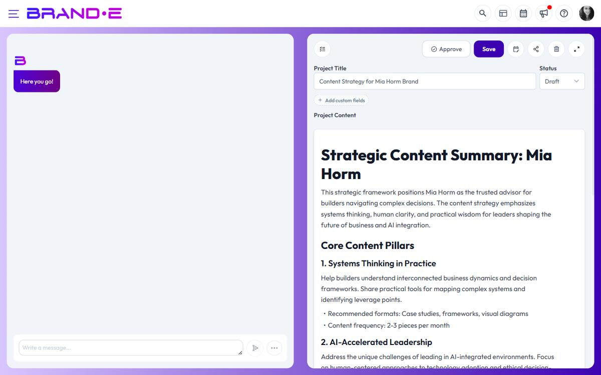

# Understand Projects, Folders, and Campaigns

Projects are your individual content pieces. Folders organize projects into meaningful groups. Together, they give you structure at any scale—from a single post to a multi-channel campaign.

## What is a project?

A project is one piece of content: a blog post, social media caption, email, webpage copy, or any standalone asset. Each project:

- Has its own name, status, and content
- Can be edited, approved, shared, or published independently
- Belongs to one folder (or no folder)
- Tracks creation date, creator, and approval status
- Can be exported as PDF or Word

Projects are the unit of work in Brande.ai. Everything else organizes them.

## What is a folder?

A folder is a container for related projects. Folders help you:

- Group projects by campaign, month, or theme
- Find content faster when you have dozens of projects
- Organize work by team or stakeholder
- Structure your workflow visually

A project can belong to one folder or no folder. You can move projects between folders anytime (drag and drop).

## Working with folders

**Create a folder:** Click "New Folder" in the Projects sidebar. Give it a name like "Q2 Campaign" or "Blog Series."

**View folder contents:** Click the folder name to expand it and see all projects inside. Collapse to hide them.

**Rename or delete:** Right-click a folder to rename or remove it. Moving a project out or deleting a folder doesn't delete the projects—they stay in your project list.

**Drag projects into folders:** Select a project and drag it into a folder. It moves instantly. Drag it out to remove it from that folder.

## Project statuses

Every project has a status that reflects its stage:

- **Planning:** Initial ideation, not ready for review
- **Brief:** Brief document created, awaiting content creation
- **Draft:** Content written, still in development
- **Review:** Ready for feedback or client approval
- **Approved:** Approved by brand owner or client
- **Published:** Live on your platform or channel
- **Archived:** No longer active, kept for reference

Use status to track workflow and find projects at a glance.

## When to use folders

Create a folder for:

- A specific marketing campaign (e.g., "Black Friday 2026")
- A content calendar month (e.g., "March 2026 Posts")
- A series of related posts (e.g., "Product Launch Emails")
- Work for a specific client (if you're an agency)
- Content by team member (e.g., "Sarah's Blog Drafts")

Don't create a folder for:
- Every single project (too granular)
- Temporary groupings (use project status instead)
- Archived content (mark projects "Archived" instead)

## Project limits and sidebar display

The Projects sidebar shows up to 10 projects at the root level (not in folders). If you have more:

- Click "View more" to see all projects in the Projects page
- Use folders to keep root level clean
- Use Project Search (Modifier+Shift+P) to find projects across all folders

## Campaigns

There is no separate **Campaigns** entity in Brande.ai today. "Campaign" is a usage pattern, not a feature: group related projects in a shared folder (for example, "Q3 Product Launch") and use Custom Fields to tag campaign metadata across projects. The Content Calendar then renders all those projects together by date.

## Related Topics

- [Find Projects Using Sidebar Search](/section-5-projects-organization/find-projects-search)
- [Organize Content at Scale](/section-5-projects-organization/organize-at-scale)
- [Project Statuses](/section-5-projects-organization/understand-projects-folders)