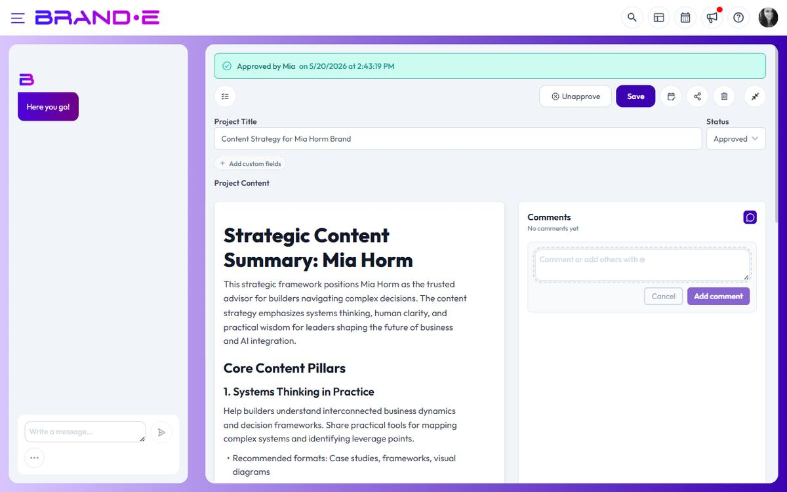

# Leave and Respond to Comments

Collaborate without leaving Brande.ai. Leave feedback on projects, reply to comments, and keep discussions in context—all in the Comments sidebar.

## Open the comments sidebar

While editing a project:

1. Click the chat-bubble icon in the editor toolbar (tooltip: **Comments**) to toggle the sidebar
2. The Comments sidebar slides in on the right side of the editor with the heading **Comments**
3. Existing comment threads on this project appear here

The sidebar stays open while you edit, so you can see feedback in real time. To start a new comment from a specific passage, highlight the text in the editor and click the **Add comment** button on the floating selection toolbar.

## Leave a comment

To add feedback:

1. Open the Comments sidebar
2. Click in the comment text box at the bottom
3. Type your comment
4. Click **Post** or press Enter

Your comment appears in the thread with:
- Your name and avatar
- Timestamp
- Comment text
- Reply option

Comments stay with the project forever—no cleanup needed.

## Comment on specific text (selection comments)

Selection-based comments are fully supported. To comment on a specific part of the project:

1. Highlight text in the editor
2. Click **Add comment** on the floating selection toolbar that appears
3. Type your feedback
4. Click **Post**

The comment is anchored to that text block. When the text changes, you can see what it was when you commented.

## Reply to comments

When someone comments on your project:

1. You get a notification in Brande.ai
2. Open the Comments sidebar to see their comment
3. Click **Reply** under their comment
4. Type your response
5. Click **Post**

Replies appear indented under the original comment, forming a thread.

**Example conversation:**

> **Sarah (comment 1):** The opening paragraph feels weak. Can you strengthen the value prop?
>
> > **You (reply):** Good catch. I've rewritten it to emphasize ROI. Check the first paragraph now.
>
> > **Sarah (reply):** Much better! Approved.

## Resolve comments

Once you've addressed feedback:

1. Click **Mark Resolved** on the comment thread
2. The comment is marked as complete
3. You can still view it but it's hidden by default
4. Helps keep active feedback visible

Only the original commenter or you can mark comments resolved.

## Edit or delete comments

If you made a typo or need to change your comment:

1. Hover over your comment
2. Click the three-dot menu (more options)
3. Choose **Edit** or **Delete**
4. Save changes

You can only edit/delete your own comments (not others').

## Comment notifications

When someone comments on your project:

1. You get a notification in Brande.ai (badge or toast)
2. Click the notification to jump to that comment
3. Or check the Comments sidebar manually

## When comments are hidden (client view)

Comments are only visible to people with edit access to the project. When you share a project with a client collaborator:

- Comments are not gated by role. Both Brand Collaborators and Client Collaborators can read, write, and reply to comments on any project they can open.
- Commenting itself can be turned off at the plan level (the **Comments** toggle and Add-comment controls only render when the active subscription plan includes the comments feature). If you don't see the chat-bubble icon, your plan doesn't include comments — contact your brand owner about upgrading.

## Comment-related features

**@mentions:** Type `@` in the comment composer to open a list of brand users. Selecting one inserts a `@FullName` token and tags that user on the comment, so they show in the **Assigned** chip row of the thread for follow-up.

**Highlighted text quote:** When a comment was started from a text selection, the original passage is captured and shown as a collapsible **Highlighted text** block on the thread. Reviewers can expand it to see the exact wording the comment refers to.

**Status tags:** Each thread carries a status tag — **Open**, **Approved**, **Rejected**, or **Resolved**. Click **Change** on a thread to move it through these states.

**Threaded discussions:** Comments nest replies, keeping related feedback together. The thread header shows **Show {N} replies** / **Hide {N} replies** to expand or collapse the conversation.

## Comments feature requirement

Comments require your plan to include the **project_comments** feature. If you don't see a Comments sidebar or can't post:

- Your current plan doesn't include collaboration features
- Upgrade to unlock commenting and team collaboration
- Check with support for pricing on comment features

## Best practices for commenting

**For giving feedback:**
- Be specific: "This needs a stronger opening" vs. "Rewrite this"
- Ask questions: "Did you consider...?" invites collaboration
- Acknowledge good work: "Love this section!" builds morale
- Reference the issue: "The paragraph about features needs..." anchors feedback

**For responding to feedback:**
- Respond promptly (within 24 hours if possible)
- Explain your changes: "I've updated the intro to focus on ROI"
- Ask for re-review: "Please check the revised version"
- Mark resolved when complete

**For managing comment threads:**
- Don't leave comments hanging (respond or resolve them)
- Archive closed projects to stop comments on old work
- Use comments for collaborative feedback, not one-way broadcasting

## Comment workflow example

**Typical feedback cycle:**

1. **Designer:** Shares project via link
2. **Client:** Opens and reads project
3. **Client:** Leaves comment: "I'd like to see different colors"
4. **Designer:** Replies: "What color palette are you thinking?"
5. **Client:** Replies: "Blues and greens, like the logo"
6. **Designer:** Updates project with new colors
7. **Designer:** Replies: "Updated. Please review"
8. **Client:** Replies: "Perfect!"
9. **Designer:** Marks comment as "Resolved"
10. **Designer:** Approves and publishes

All in the Comments sidebar. No email required.

## Related Topics

- [Manage Client Review and Approval](/section-6-collaboration/manage-client-review-approval)
- [Share Content Projects](/section-6-collaboration/share-content-projects)
- [Understand Internal vs Client Content Views](/section-6-collaboration/internal-vs-client-views)