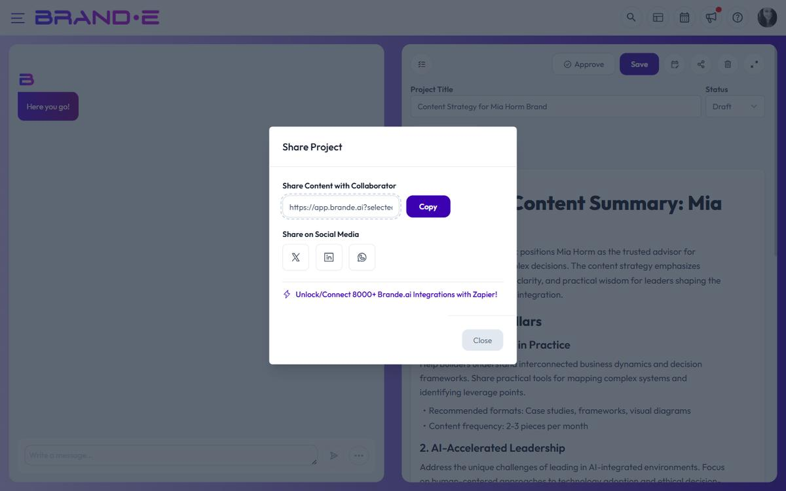

# Publish Content Directly to Channels

Post content directly from Brande.ai to Instagram, Facebook, LinkedIn, Twitter/X, WordPress, Google My Business, and HubSpot. No copy-paste. No manual posting. Your content goes live through official platform connections.

## Supported platforms

Brande.ai can publish directly to:

**Social Media:**
- Instagram
- Facebook
- LinkedIn
- Twitter/X (formerly Twitter)

**Publishing & Business Platforms:**
- WordPress (self-hosted or WordPress.com)
- Google My Business (local business listings)
- HubSpot (blog and CMS)

More platforms coming. Check the integrations screen to see what's available in your region.

## Set up integrations first

Before publishing, you must connect your platform accounts:

1. Go to Settings > Integrations
2. Click "Connect" for each platform you want to publish to
3. Follow the authentication flow:
   - **OAuth platforms** (Instagram, Facebook, LinkedIn, Twitter/X): Authorize Brande.ai to post on your behalf
   - **API/credentials platforms** (WordPress, Google My Business, HubSpot): Provide your credentials or API key

Once connected, your integration status shows as **Active**.

## Integration status

Each connected integration displays a status:

- **Active:** Connected and ready to publish. Last checked successfully.
- **Expired:** Token expired (common with social platforms). Re-authenticate.
- **Revoked:** You revoked access in your platform settings. Reconnect.
- **Error:** Something went wrong. Check error details and retry.

If integration status is anything but Active, fix it before publishing.

## Publish immediately

> **Heads up.** The in-app one-click **Publish** button is not yet wired into the editor. The backend publishing pipeline (LinkedIn, Facebook, WordPress, Instagram, HubSpot, Google Business Profile) is live and is reachable through the Brande.ai API and Zapier/Make. The two ways to publish today are:
>
> - Use the project's **Share** options (LinkedIn, Twitter/X, Facebook, WhatsApp) to push the copy to the platform manually.
> - Connect Zapier or Make to your brand using an API key (Account → **API Keys**) and trigger publishing from there.
>
> A native in-editor Publish button is on the roadmap; this article will be updated when it ships.

## Schedule posts for later

Instead of publishing now, schedule for a specific date and time:

1. Click **Publish**
2. Select platform(s)
3. Enable **Schedule for Later**
4. Pick date and time
5. Click **Schedule**

The post publishes automatically at the scheduled time. You don't need to be online.

### Using the Content Calendar

The Content Calendar provides a visual way to schedule:

1. Open Content Calendar
2. Drag your project onto a date/time
3. Configure scheduling options
4. Confirm
5. Project auto-publishes when scheduled time arrives

## Platform-specific options

Each platform has unique fields and requirements:

**Instagram:**
- Caption text
- Optional: Media (required for visual posts)
- Optional: Location tag
- Optional: Alt text for accessibility

**Facebook:**
- Post text
- Optional: Shared link or media
- Optional: Choose which page to post to (if multiple page access)

**LinkedIn:**
- Post text (professional tone recommended)
- Optional: Media
- Optional: Visibility (Public, Connections Only, or Specific Audience)

**Twitter/X:**
- Tweet text (character limit enforced)
- Optional: Media attachments
- Optional: Link preview

**WordPress:**
- Post title
- Post content (your project text)
- Post status (Draft, Published, or Scheduled)
- Optional: Categories, tags, featured image
- Optional: Post excerpt for previews

**Google My Business:**
- Post text
- Optional: Media (image or video)
- Optional: Call-to-action button (Learn More, Order Now, Book Now, etc.)
- Requires: Location selection (which business location)

**HubSpot:**
- Blog post title
- Post content (your project text)
- Optional: Featured image
- Optional: Blog tags, categories, post status, post format, post type, excerpt, slug
- Required when posting via the API: brand, project, and integration IDs (the WordPress integration must already be connected for that brand)

## Preview before publishing

Before you hit publish:

1. Click **Preview** to see how your post looks on that platform
2. Check text length (platforms have limits; Brande.ai shows warnings)
3. Verify images and media are included
4. Review platform-specific formatting

Brande.ai warns you about:
- Text that will be truncated on the platform
- Missing required fields (e.g., alt text for Instagram)
- Media that's incompatible with the platform
- Unsupported formatting

## Cancel or retry failed posts

If publishing fails:

1. Check the integration status (may need re-authentication)
2. Fix any issues flagged during preview
3. Trigger a retry through your Zapier/Make scenario or by re-running the API call
4. Or cancel the post by deleting/cancelling its scheduled run in your automation tool

Behind the scenes, the Brande.ai post scheduler retries failed publishes with exponential backoff: up to 3 retries, starting at 60 seconds and doubling each attempt (capped at 1 hour). Errors flagged as non-retryable mark the post as Failed immediately. Retry and cancel endpoints exist on the backend (`POST /posts/:id/retry`, `POST /posts/:id/cancel`) but no in-app UI currently surfaces them.

## Track published posts

After publishing:

1. The platform's post URL is recorded against the integration post on success (the data needed to render a "View on platform" link is persisted, even though no front-end button surfaces it yet)
2. Monitor performance on the platform's native analytics
3. Brande.ai records which project published where and when
4. Surface published-post status by querying integration posts via the API or your Zapier scenario

## Publishing limits

Some plans limit publishing volume:

- Free plan: Limited posts per month
- Pro plan: 100+ posts per month
- Enterprise: Unlimited

Check your subscription tier to see your limit.

## Common publishing issues

**"Integration Expired":** Your authorization token expired. Go to Settings > Integrations and re-authenticate with the platform.

**"Platform requires image, but none provided":** Instagram and some platforms require media. Add images to your project or use image generation.

**"Post limit reached":** You've hit your plan's monthly publishing limit. Upgrade to publish more, or wait until next month.

**"Invalid post format":** Check platform-specific requirements (text length, image dimensions, required fields). Preview should highlight issues.

**"Authorization denied":** You didn't grant Brande.ai permission to post on your behalf. Reconnect the integration and allow all requested permissions.

## Best practices

**Before publishing:**
- Draft in your brand voice
- Use your Brand DNA guidelines
- Proofread for tone and accuracy
- Preview on the platform
- Schedule if possible (avoid peak noise, post at optimal times)

**After publishing:**
- Monitor early engagement on the platform
- Reply to comments to build community
- Track which posts perform best
- Use platform insights to refine future posts

**Multi-platform strategy:**
- Schedule consistent posting across platforms
- Tailor copy for each platform (not identical everywhere)
- Use Content Calendar to plan cohesive monthly strategy
- Mix content types (behind-the-scenes, educational, promotional, etc.)

## Related Topics

- [Share and Publish Content](/section-6-collaboration/share-and-publish)
- [Manage Client Review and Approval](/section-6-collaboration/manage-client-review-approval)
- [Content Calendar (coming soon)](/section-8-dashboard/manage-content-calendar)

- [Share and Publish Content](/section-6-collaboration/share-and-publish)
- [Manage Client Review and Approval](/section-6-collaboration/manage-client-review-approval)