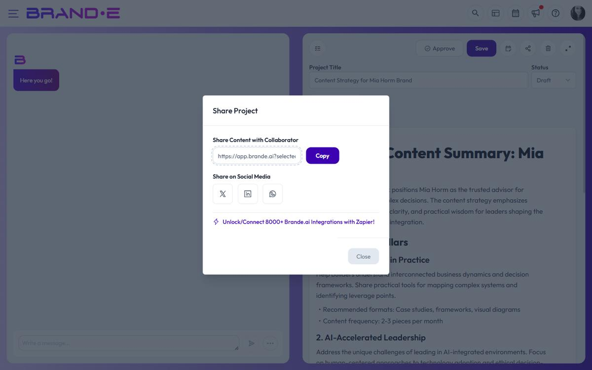

# Share Content Projects

Give collaborators access to your projects without giving them access to your brand settings. Share via link or social media to distribute your work.

## Open the share modal

Click the **Share** button (network icon) in the project editor toolbar. A modal appears with two sharing sections.

## Share with collaborators (link sharing)

**Share Content with Collaborator** section:

1. A URL appears in the text field—this is your shareable project link
2. Click **Copy** to copy to clipboard
3. Send the link to:
   - Team members via email or Slack
   - Clients for review
   - Stakeholders in your org
   - Anyone who needs to see the project

Recipients click the link and see your project in read-only mode. They can view content, images, and tables but cannot edit.

### Copy or Copied button

- **Copy:** Click to copy the link to your clipboard (one click, no dialog)
- **Copied:** Appears briefly after clicking to confirm successful copy

The button text changes back to "Copy" after 2 seconds.

## Share on social media

**Share on Social Media** section:

Choose where to share your project content:

**X (Twitter):**
1. Click the X button
2. A new window opens to Twitter/X
3. Your project text is pre-filled in the compose box
4. You can edit, add hashtags, or adjust before posting
5. Click "Post" to send

**LinkedIn:**
1. Click the LinkedIn button
2. A new window opens to LinkedIn
3. Your project content appears in the share compose
4. Edit or add context for your network
5. Click "Share" to post

**WhatsApp:**
1. Click the WhatsApp button
2. Opens WhatsApp with your content ready to share
3. Select recipients and send

### What gets shared

The text content of your project is extracted and passed to the platform's native share intent. Images are not attached automatically — if you need images on the social post, save the generated images from the editor first, then attach them in the platform's compose window.

## Collaborator limits and upgrades

When sharing projects, there's a collaborator limit based on your plan:

- Each person you share with counts toward your limit
- When you reach the limit: "You have reached collaborator limit, upgrade your plan"
- Only new collaborators hit the limit; existing ones retain access
- Upgrade your subscription to share with more people

Example:
- Creator plan: 1 collaborator
- Growth plan: up to 10 collaborators
- Agency plan: up to 100 collaborators

To add more collaborators, click to upgrade from the message.

## Who can see what

When you share a project:

**Collaborators with the link can:**
- View the project content, images, and structure
- Leave comments (if project_comments feature is enabled)
- See approval status

**Collaborators cannot:**
- Edit the project (read-only access)
- Access your brand dashboard or settings
- See other projects (only the ones you share)
- Publish on your behalf
- Manage integrations

## Differences from inviting team members

**Sharing a link:** Anyone with the link can view. Good for one-off sharing.

**Inviting to brand:** Creates a team member with ongoing access. Good for regular collaborators.

For ongoing collaboration, consider inviting them as a brand team member instead of sharing individual links.

## Share security

Shareable links:
- Are tied to a specific project ID and only work for users with brand access
- Don't appear in public search results
- Don't expire and don't have an explicit revocation button — to cut off access, remove the recipient from the brand or change their role

Note: Don't share project links in public forums or where untrusted users might see them.

## Related Topics

- [Manage Client Review and Approval](/section-6-collaboration/manage-client-review-approval)
- [Share and Publish Content](/section-6-collaboration/share-and-publish)
- [Leave and Respond to Comments](/section-6-collaboration/leave-respond-comments)