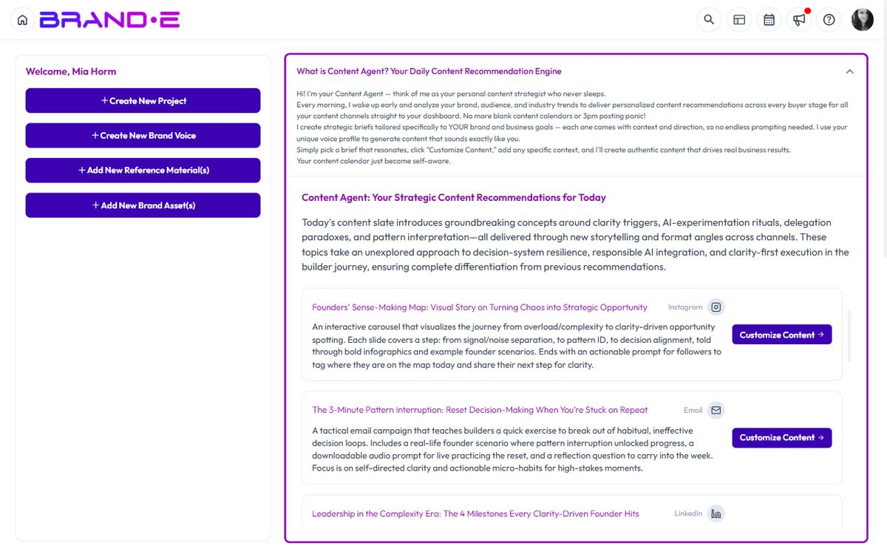

# Use the Agency Dashboard

The dashboard is your command center for each client brand.

Switch brands using the profile dropdown, and the dashboard updates to show that client's projects, recommendations, calendar, and key metrics.

## Dashboard Overview

When you log in, the dashboard displays:

**Welcome Card**
A personalized greeting and quick stat (e.g., "You have 3 projects pending approval")

**Quick Action Buttons**
Fast access to common tasks:
- **New Project** (Ctrl/Alt+N) — Create a new content project
- **New Brand Voice** — Add a new voice profile to this brand
- **New Reference Material** — Upload brand examples
- **New Brand Asset** — Store logos, brand guidelines, etc.

**Content Agent Widget**
Today's personalized recommendations for this brand, with "Go to Project" or "Customize Content" buttons for each recommendation

**Content Calendar Widget**
Weekly, Monthly, or Quarterly view of pending projects and scheduled content. Drag projects to add to calendar or set publish dates.

**Quick Links**
Fast navigation to frequently used pages:
- Account
- Brand Profile
- Brand Voice
- Brand Materials
- Brand Messaging
- Content Reference
- Content Opportunities
- Snippets

**Project Status Overview**
- Scheduled/Recent Projects — List of upcoming and recently created projects
- Recent Folders — Folders you've been working in recently

**Billing Card**
Your current plan and a link to upgrade or manage billing

**Support**
Help Center, documentation, feedback, and support channels

## Switching Brands on the Dashboard

The dashboard is brand-specific. When you switch brands, the entire dashboard context changes.

**To switch brands:**
1. Click your profile icon (top right)
2. Select a brand from the **Brands** dropdown
3. The dashboard automatically refreshes to show that brand's data

What changes when you switch:
- Content Agent recommendations are for that brand only
- Content Calendar shows that brand's projects
- Quick Links point to that brand's Brand Profile, Materials, etc.
- Project status overview shows that brand's recent work

There is no agency-wide "all-brands" dashboard today. The dashboard always shows the currently selected brand. Use the brand switcher in the header to move between clients; everything on the page — Quick Links, Recent Projects, Content Calendar widgets — reflects the active brand only.

## Understanding Dashboard Sections

### Welcome Card

Displays personalized information:
- Greeting with your name
- Key stat (e.g., "3 projects pending approval this week")
- Encouraging message to get started

This helps you quickly understand the day's priorities.

### Quick Action Buttons

One-click access to create:
- **New Project** — Open the project creation dialog
- **New Brand Voice** — Create a new voice profile for this brand (if you manage multiple voices)
- **New Reference Material** — Upload examples to improve Brand DNA
- **New Brand Asset** — Store visual assets, brand guidelines, etc.

These buttons are in the dashboard and are also accessible via keyboard shortcuts:
- Ctrl/Alt+N for New Project

### Content Agent Widget

The centerpiece of the dashboard for strategy.

Displays:
- Recommendation summary (e.g., "5 recommendations for your audience of Product Managers")
- List of today's recommendations with:
  - Title (what to create)
  - Summary (why it matters)
  - Channel icon and name
  - Action button ("Go to Project" if exists, "Customize Content" if new)

Click "Customize Content" to create a project from that recommendation.

If no recommendations appear:
- Your Brand Profile may be incomplete
- Your plan may not include recommendations
- The daily generation hasn't run yet

Complete Brand Profile or check your plan to enable Content Agent.

### Content Calendar Widget

Visual representation of your content schedule.

**View Options:**
- Weekly — Projects grouped by week
- Monthly — Projects grouped by month
- Quarterly — Projects grouped by quarter

**Settings:**
Click the calendar settings icon to adjust:
- Hide Weekends — Remove Sat/Sun from view
- Open From — Start time for the work day (e.g., 9 AM)
- Close At — End time for the work day (e.g., 6 PM)
- Week Starts On — Set to Monday or Sunday

**Pending Projects Area:**
Unscheduled projects appear in a "Pending Projects" section above the calendar.

Drag a pending project onto a calendar date to schedule it for that day.

Once scheduled, the project appears on the calendar with a visual indicator.

Click "Add to Calendar" button on projects to assign a publish/review date.

**What the Calendar Shows:**
- Project titles
- Status badges (Planning, In Progress, Pending Approval, Published)
- Color coding by status or channel

### Quick Links

Jump directly to frequently used Account pages:

**Account Sidebar Pages**
- Account — General account settings
- Brand Profile — Edit Brand DNA for this brand
- Brand Voice — Manage voice profiles
- Brand Materials — Store brand assets and guidelines
- Brand Messaging — Configure messaging framework for this brand
- Content Reference — Store reference materials
- Content Opportunities — View all recommendations
- Snippets — Reusable text blocks

These are all brand-specific. Switching brands changes which Brand Profile, Voice, Materials, etc. you access.

### Project Status Overview

**Scheduled/Recent Projects**
List of your upcoming projects and recently created projects:
- Project title
- Status (Planning, In Progress, Pending Approval, Published)
- Assigned to (if team members are assigned)
- Created/modified date

Click any project to open it.

**Recent Folders**
Folders you've been working in recently:
- Folder name
- Number of projects in folder
- Last modified date

Click to open the folder and see all projects inside.

This helps you quickly navigate back to ongoing client work.

### Billing Card

Shows your current subscription:
- Plan name (Starter, Pro, Agency)
- Renewal date or trial status
- Link to **Upgrade** or **Manage Billing**

Click "Upgrade" if you want to upgrade your plan. Click "Manage Billing" to update payment method or view invoice history.

### Support Section

Quick access to help:
- Help Center — Open the help modal
- Documentation — Links to Brande.ai docs
- Feedback — Share product feedback
- Support — Contact support team

## Best Practices for Dashboard Workflow

**Check Content Agent First**
Every morning, check your dashboard's Content Agent widget. It tells you what you should create that day based on each client's objectives and audience.

**Batch Calendar View**
Once a week, review the Content Calendar. See what's due, what's pending, and what needs scheduling. This prevents missed deadlines.

**Create Projects from Recommendations**
Use Content Agent recommendations as your starting point. Click "Customize Content" to create a project from a recommendation instead of starting from scratch.

This saves research time and ensures recommendations align with Brand DNA.

**Track Project Status**
Use the Project Status Overview to spot bottlenecks:
- Too many "Pending Approval"? Reach out to clients.
- Too many "Planning"? Focus on completing drafts.
- Too few "Published"? Increase publishing frequency.

**Switch Between Brands**
For multi-client agencies, make brand-switching part of your daily workflow:
1. Check Client A's dashboard (review recommendations, pending projects)
2. Switch to Client B (check calendar, see what's due)
3. Switch to Client C (repeat)

This ensures no client gets neglected.

## Troubleshooting

**Q: The Content Calendar doesn't show any projects.**
A: Your projects may not be scheduled yet. Drag pending projects from the "Pending Projects" section onto the calendar, or click "Add to Calendar" on a project.

**Q: I don't see my recent projects in the Project Status Overview.**
A: Refresh your browser. Sometimes the list doesn't update immediately. Or navigate to the Projects page to see your full project list.

**Q: Can I customize which widgets appear on the dashboard?**
A: No. The dashboard layout is fixed today — all users see the same sections (Welcome, Content Calendar, Quick Links, Recent Projects, Recent Folders).

**Q: Why does one brand show different Content Agent recommendations than another?**
A: Each brand's Content Agent is based on that brand's Brand DNA (objectives, audience, channels). Different DNA = different recommendations.

Update the brand's Brand Profile to change recommendations.

## Related Topics

- [View and Manage Content Calendar](/section-8-dashboard/manage-content-calendar)
- [Get Daily Content Recommendations](/section-2-content-agent/get-daily-recommendations)
- [Use Brande.ai for Agencies](/section-7-agency/use-brande-for-agencies)
- [Manage Multiple Client Brands](/section-7-agency/manage-multiple-brands)
- [Create a New Content Project](/section-3-creating-content/create-new-project)
