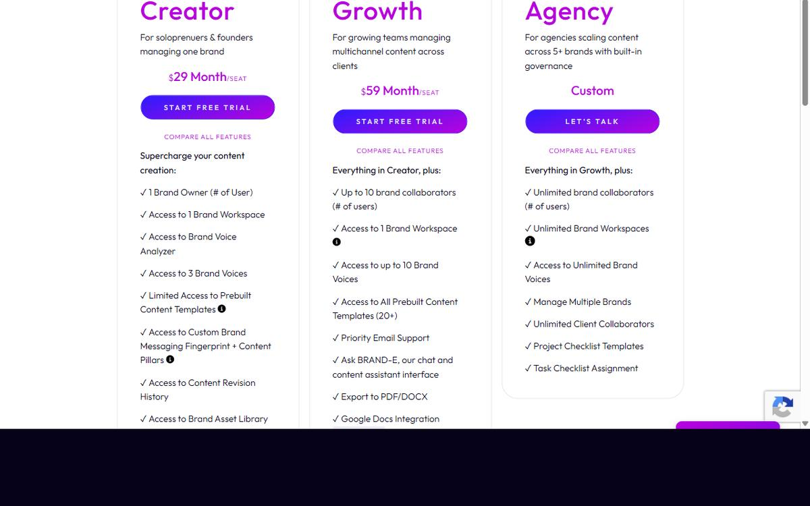

# The Agency Plan: Multi-Brand Content Operating System

The Agency Plan is not an upgraded dashboard.

It's a fundamentally different architecture: unlimited client brands in one workspace, each with independent Brand DNA, Content Agent, projects, and approval workflows. One subscription replaces the cost, friction, and coordination chaos of multiple AI tool subscriptions and manual approval systems.

## The Three Pillars

**Multi-Brand DNA**
Each client gets their own Brand Profile. Their audience is different. Their objectives are different. Their voice is different. Brand DNA captures all of it and stays isolated—no cross-contamination.

**Repeatable Service Delivery**
You use the same content creation workflow for every client. Onboard → Profile → Content Agent → Projects → Approvals → Publish. The process is repeatable because it's process-driven, not client-dependent.

**Defensible Operating Model**
Your competitive advantage isn't technology access (every agency can buy AI tools). It's the system you've built around it. Checklists, templates, approval workflows, and brand standards all live in Brande.ai. They're documented, reusable, and scalable.

When you sign a new client, you don't start from scratch. You spin up their brand, run Brand DNA onboarding, assign checklists, and you're generating personalized content in days—not weeks.

## Why This Matters for Agencies

Agencies survive on three things: repeatable processes, brand differentiation, and profitable unit economics.

The Agency Plan delivers all three.

**Repeatable Process** — One workflow scales across unlimited clients without customization or tool-switching friction.

**Brand Differentiation** — Your proprietary content strategy, templates, and checklists stay in Brande.ai. Clients see a polished, professional approval experience that feels like a premium white-label service.

**Unit Economics** — One subscription per agency (no per-client AI tool costs). Built-in approval flows and checklists reduce revision cycles and client management overhead. Content generation that understands Brand DNA reduces iteration time.

## What You Build

Your Agency Plan workspace becomes a scalable content operating system:

- **Brand Library** — Every client brand with its own DNA
- **Content Template Library** — Reusable project templates, checklists, and workflows
- **Approval Workflows** — Standardized review process for every client
- **Content Calendar** — Switch brands to see each client's timeline and pending projects
- **Performance Baseline** — Track which content types, topics, and channels drive results for each client

This becomes your service offering. Your moat. Your scalability engine.

## Related Topics

- [Use Brande.ai for Agencies](/section-7-agency/use-brande-for-agencies)
- [Set Up an Agency Workspace](/section-7-agency/set-up-agency-workspace)
- [Scale Client Work Without Losing Brand Control](/section-7-agency/scale-without-losing-control)
