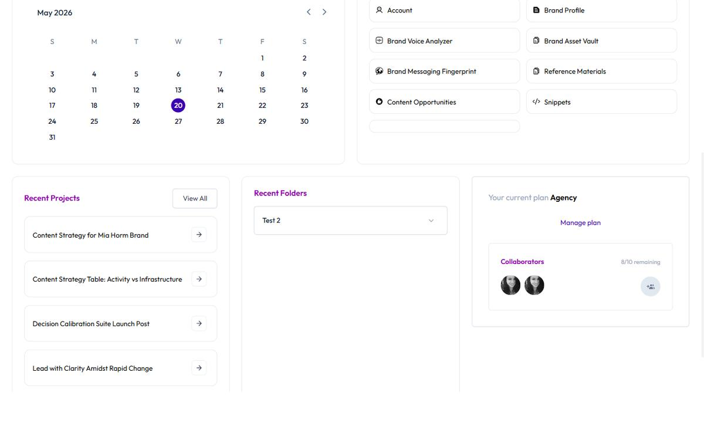

# Use Quick Actions and Shortcuts

Keyboard shortcuts eliminate friction. You don't switch tools, click multiple times, or lose focus.

Press a key combination and immediately create a project, jump to account settings, or find what you need—without touching your mouse.

## Keyboard Shortcuts Reference

Learn these shortcuts and watch your workflow accelerate:

| Shortcut | Action | Use Case |
|----------|--------|----------|
| **Ctrl/Alt+N** | New Project | Create a content project from anywhere |
| **Ctrl/Alt+S** | Toggle Sidebar | Hide sidebar to maximize editor space |
| **Ctrl/Alt+A** | Go to Account | Jump to account settings |
| **Ctrl/Alt+H** | Go to Home | Jump to dashboard |
| **Ctrl/Alt+C** | New Snippet | Create a reusable text block |
| **Modifier+Shift+P** | Project Search | Search your projects by name |

**Note:** On Mac the modifier renders as **Ctrl** (Control). On Windows and Linux it renders as **Alt**. The keyboard-shortcuts modal in the header shows the correct binding for your platform. There are no `Cmd+` shortcuts in Brande.ai today.

## Create a New Project (Ctrl/Alt+N)

Press **Alt+N** (Windows/Linux) or **Ctrl+N** (Mac) from anywhere in the app.

The New Project dialog opens immediately.

**Why this matters:**
- Creates a new project without navigating to the Projects page
- Works from the dashboard, calendar, account settings, or anywhere else
- Speeds up your workflow: idea → dialog → template selection in 2 seconds

**Usage:**
1. Read a Content Agent recommendation
2. Press Ctrl+Alt+N
3. Select the template that matches the recommendation
4. Fill variables and start creating

No page navigation needed.

## Toggle Sidebar (Ctrl/Alt+S)

Press **Ctrl+Alt+S** to hide or show the left sidebar.

**Why this matters:**
- Maximizes your editor space when writing or editing content
- Quick way to focus on the task without UI distraction
- Useful on smaller screens

**Usage:**
- Working on a long-form project? Hide the sidebar to see more content.
- Need to navigate to a different project? Show the sidebar and click.

## Go to Account (Ctrl/Alt+A)

Press **Ctrl+Alt+A** to jump directly to your Account page.

Same as clicking your profile icon (top right) and selecting **Account**.

**Why this matters:**
- Accesses account settings from anywhere without clicking
- Useful when you need to quickly update Brand Profile, Brand Voice, or settings

**Usage:**
1. Realize you need to update your Brand Profile
2. Press Ctrl+Alt+A
3. Click Brand Profile in the sidebar
4. Make updates

No back-and-forth navigation.

## Go to Home (Ctrl/Alt+H)

Press **Ctrl+Alt+H** to jump to your dashboard immediately.

Same as clicking "Home" in the sidebar or refreshing the home page.

**Why this matters:**
- Returns you to your dashboard from anywhere
- Quick reset if you're lost in deep navigation
- Refreshes your content calendar and Content Agent widget

**Usage:**
1. You're deep in a project editor
2. Press Ctrl+Alt+H
3. You're back on the dashboard, seeing Content Agent recommendations and calendar

## New Snippet (Ctrl/Alt+C)

Press **Ctrl+Alt+C** to create a new snippet (reusable text block).

Snippets are stored in your Account > Snippets page and can be inserted into any project.

**Why this matters:**
- Create snippets without navigating to Account > Snippets
- Fast way to capture reusable text (CTAs, sign-offs, disclaimers)

**Usage:**
1. While creating a project, you write a great CTA: "Ready to level up? Book a call with our team."
2. Press Ctrl+Alt+C
3. Name it "CTA — Book a Call"
4. Save it
5. Next project, insert the snippet instead of retyping

## Project Search (Modifier+Shift+P)

Press **Alt+Shift+P** (Windows/Linux) or **Ctrl+Shift+P** (Mac) to open Project Search.

A search box appears allowing you to type a project name and filter your projects.

**Why this matters:**
- Find projects by name instantly
- No need to navigate to Projects page or scroll through folders
- Works from anywhere in the app

**Usage:**
1. You remember creating a "LinkedIn Post — Hiring Content" project
2. Press Shift+P
3. Type "hiring"
4. Results show matching projects
5. Click to open

## Keyboard Shortcuts Modal

To view all keyboard shortcuts, click your profile icon (top right) and select **Keyboard Shortcuts**.

A modal appears showing:
- All available shortcuts
- What each shortcut does
- Platform-specific variations (Mac vs. Windows)

This is your reference guide. Bookmark it or print it.

**Access Keyboard Shortcuts:**
1. Click your profile icon (top right)
2. Select **Keyboard Shortcuts** from dropdown
3. Modal opens
4. Review and memorize

## Dashboard Quick Action Buttons

In addition to keyboard shortcuts, the dashboard has visual buttons for common tasks:

**New Project Button**
Click the **New Project** button on the dashboard (or press Ctrl/Alt+N).

**New Brand Voice Button**
Click **New Brand Voice** to create a new voice profile for this brand.

**New Reference Material Button**
Click **New Reference Material** to upload examples that improve Brand DNA.

**New Brand Asset Button**
Click **New Brand Asset** to store logos, guidelines, and visual standards.

These are mouse alternatives to keyboard shortcuts. Use whichever fits your workflow.

## Building Shortcut Habits

**Day 1-2: Learn**
1. Review the keyboard shortcuts list
2. Print or screenshot it
3. Put it next to your workspace

**Day 3-5: Practice**
1. Consciously use shortcuts for your 3 most common tasks:
   - Ctrl+Alt+N (New Project)
   - Ctrl+Alt+A (Account)
   - Shift+P (Search)
2. Force yourself to use them instead of clicking

**Week 2+: Automatic**
After a week, shortcuts become muscle memory. You'll stop thinking and just press.

This saves 30 seconds per task. Over a year, that's 20+ hours of recovered productivity.

## Shortcuts by Workflow

**Morning Routine:**
1. Ctrl+Alt+H (go to Dashboard)
2. Review Content Agent recommendations
3. Ctrl+Alt+N (create a project from a recommendation)
4. Fill variables and start creating

**Throughout the Day:**
1. Shift+P (search for a project to continue)
2. Ctrl+Alt+S (toggle sidebar for focus)
3. Ctrl+Alt+C (save reusable text as snippet)

**Weekly Planning:**
1. Ctrl+Alt+H (go to Dashboard)
2. View Content Calendar
3. Ctrl+Alt+A (go to Account)
4. Update Brand Profile if strategy changed

## Troubleshooting

**Q: The keyboard shortcut isn't working.**
A: Make sure you're using the right modifier key for your OS:
- Windows/Linux: **Alt** (e.g., Alt+N for New Project)
- Mac: **Ctrl** (Control key, e.g., Ctrl+N for New Project)

Check the Keyboard Shortcuts modal in the app for the full list per platform.

**Q: I can't remember all the shortcuts.**
A: Start with the three most important:
- Ctrl+Alt+N (New Project) — used constantly
- Ctrl+Alt+A (Account) — used weekly
- Shift+P (Project Search) — used multiple times daily

Master these three, then add others as you go.

**Q: The search shortcut opens the browser's search instead.**
A: Project Search uses **Ctrl+Shift+P** on Mac and **Alt+Shift+P** on Windows/Linux. There is no alternative binding for the same action — if your browser steals the shortcut, click the search icon in the sidebar instead.

## Related Topics

- [Use the Brande.ai Dashboard](/section-8-dashboard/use-dashboard)
- [Navigate Settings and Preferences](/section-8-dashboard/navigate-settings)
- [Create a New Content Project](/section-3-creating-content/create-new-project)
