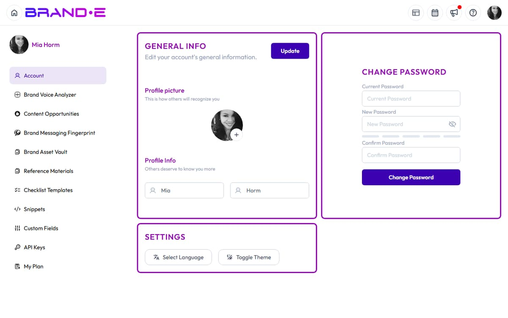

# Access and Update Account Settings

Your account settings control your profile, preferences, and workspace configuration.

All settings are in one place—your Account page—accessible instantly via keyboard shortcut.

## Open Your Account Page

**Option A: Keyboard Shortcut (Fastest)**
Press **Ctrl+Alt+A** (Windows/Linux) or **Control+Option+A** (Mac) from anywhere in the app.

Your Account page opens immediately.

**Option B: Profile Icon Dropdown**
1. Click your profile icon (top right corner)
2. Select **Account** from the dropdown menu
3. Account page loads

**Option C: Sidebar Navigation**
1. Open the sidebar (Ctrl+Alt+S or click menu icon)
2. Click **Account**

## General Info Section

This is your profile information visible to team members and in approvals.

Navigate to: **Account > Account** (or **General Info**)

### Update Your Profile Picture

In the **Profile picture** section:

1. Click the picture area or **Upload** button
2. Select an image file from your computer (PNG, JPG, or similar)
3. The image is cropped to a square
4. Click **Save** or **Confirm**

Your new profile picture appears:
- Next to your name in projects and approvals
- In the profile icon dropdown (top right)
- In team member lists (if you're on an agency plan)

**Tips:**
- Use a professional headshot or branded avatar
- Avoid very large files (keep under 5 MB)
- Ensure the image is square or nearly square for best results

### Update First Name

1. Locate the **First Name** field
2. Clear the current name (or leave it if correct)
3. Type your first name
4. Click **Update** button

Your first name appears on your profile and in team interactions.

### Update Last Name

1. Locate the **Last Name** field
2. Clear the current name (or leave it if correct)
3. Type your last name
4. Click **Update** button

Your last name appears on your profile and in team interactions.

### Save Changes

After editing your profile picture, first name, or last name:

1. Click the **Update** button
2. Success message: "Profile updated successfully" (or similar)

Changes are saved immediately.

## What Information Is Visible to Others

When you invite team members or collaborate with clients, they see:
- Your profile picture
- Your first and last name
- Your role (if assigned)

They do NOT see:
- Your email address (unless you explicitly share it)
- Your password
- Your API keys
- Your subscription plan or billing information
- Your account creation date

## Password Management

See [Change Your Password](/section-9-account/change-password) for detailed instructions on updating your password.

## Theme and Language

See [Update Theme and Language Preferences](/section-9-account/theme-language-preferences) for detailed instructions.

Navigate to: **Account > Settings**

**Language:**
- Click the Language dropdown
- Select **EN** (English) or **ES** (Spanish)
- The interface switches language immediately

**Theme:**
- Click **Toggle Theme** button
- Switch between light mode and dark mode
- Your preference is saved automatically

## Managing Your Plan

Navigate to: **Account > My Plan**

View your current subscription:
- Plan name (Starter, Pro, Agency)
- Renewal date
- Features included at your plan level
- Upgrade option

Click **Upgrade Now** to see higher-tier plans.

Click **Manage Billing** to update your payment method or view invoices.

## Brands You Own or Access

Navigate to: **Account > Brands**

This lists all brands you own or have been invited to collaborate on.

For each brand:
- Brand name
- Crown icon (indicates you own it)
- Your role (Owner, Admin, Collaborator)
- Number of team members
- Options to manage, leave, or switch to that brand

If you're on a solo plan, you see one brand. If you're on an Agency Plan, you may see many brands.

## Related Topics

- [Navigate Settings and Preferences](/section-8-dashboard/navigate-settings)
- [Change Your Password](/section-9-account/change-password)
- [Update Theme and Language Preferences](/section-9-account/theme-language-preferences)
- [Manage Notifications](/section-9-account/manage-notifications)
