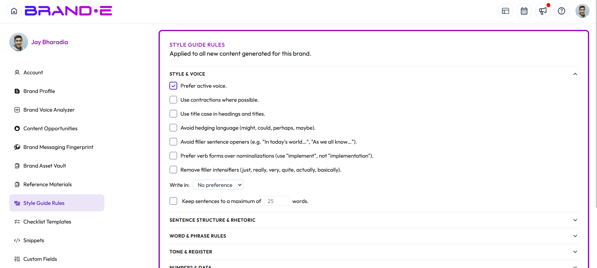

# Style Guide Rules

Style Guide Rules are mechanical writing constraints that Brande.ai applies to every piece of content it generates for a brand — on top of your Brand Voice.

Brand Voice tells Brande.ai *how your brand sounds*. Style Guide Rules tell it *exactly what to do and avoid* — active voice, banned words, sentence length, Oxford commas, and more. They're enforced across every content type: LinkedIn, Instagram, YouTube scripts, content strategy, Facebook, ideation, long-form, reel scripts, write-from-scratch, and repurposed content.

## Access Style Guide Rules

1. Click your profile icon (top right) or press **Ctrl/Alt+A** and select **Account**
2. In the Account sidebar, click **Style Guide Rules**

Style Guide Rules are brand-specific. If you manage more than one brand, switch brands from the profile dropdown before configuring rules — each brand keeps its own saved rules. If you have unsaved changes when you switch brands, those changes are discarded and the newly selected brand's saved rules load in their place.

## Style & Voice

Open by default when you land on the page. Controls the fundamentals of how sentences are built:

- Prefer active voice over passive constructions
- Use contractions where possible
- Avoid filler intensifiers (just, really, very, quite, actually, basically)
- Avoid hedging language
- Avoid filler sentence openers
- Avoid nominalizations (turning verbs into nouns, e.g. "make a decision" instead of "decide")
- Write in a specific point of view — first, second, or third person, or no preference
- Cap sentences at a maximum word count you set (default 25 words)

## Sentence Structure & Rhetoric

Controls how sentences connect ideas to each other:

- Avoid contrastive clauses (but, however, although, though, while, yet, whereas, nevertheless)
- Avoid comparative clauses
- Avoid antithesis (contrasting two opposite ideas in one sentence)
- Avoid rhetorical questions
- Avoid conditional/hypothetical phrasing
- Avoid opening sentences with subordinate clauses
- Avoid parentheticals
- Prefer declarative statements — one idea per sentence, subject + active verb + specific outcome

## Word & Phrase Rules

Controls specific vocabulary:

- **Banned words & phrases** — type a word or phrase and press Enter to add it to the list; it appears as a removable chip. Duplicate entries are rejected automatically.
- **Word replacements** — set up "from → to" pairs (for example, "utilize → use") so Brande.ai substitutes your preferred wording. Both the "from" and "to" fields must be filled in before you can add a pair.
- **Approved terminology** — a list of terms Brande.ai should favor, added the same way as banned words.
- Avoid superlatives (best, most, greatest, leading, top, #1)
- Avoid corporate filler language

## Tone & Register

Four dropdowns, each defaulting to "no preference" until you set them:

- **Formality** — casual, balanced, or formal
- **Humor** — none, subtle, or contextual
- **Urgency** — low, medium, or high
- **Reading level** — grade 8, general, or professional

## Numbers & Data

- Spell out numbers below a threshold you set (default: under 10) and use numerals above it
- Format percentages as symbols (42%) or spelled out (forty-two percent)
- Format large numbers with commas, abbreviations (e.g. 42k), or spelled out

## Punctuation & Formatting

- Remove semicolons
- Replace exclamation points
- Oxford commas — **Use Oxford commas** and **Omit Oxford commas** are a mutually exclusive pair; checking one automatically unchecks the other, and unchecking the active one leaves neither selected
- Set the number of spaces after a period
- Dash preference — em dash, en dash, or avoid dashes entirely
- Ellipsis usage — allowed, avoid, or dialogue-only
- Convert lists to bullet points once they reach a threshold number of items you set (default: 3)

## Spelling & Region

- Enable spelling standardization to lock content to a specific English region
- Once enabled, a **Region** dropdown appears — choose English (US) or English (UK)

## Saving Your Rules

An **Unsaved changes** badge appears in the footer as soon as you change anything, and the **Save Rules** button becomes active. Click **Save Rules** to apply your changes; a confirmation toast appears once they're saved. If you reverse a change back to its saved state before saving, the badge disappears and the button becomes inactive again.

If a brand has no Style Guide Rules configured, nothing changes in how its content is generated — rules are purely additive on top of Brand Voice.

## Troubleshooting

**Q: I set rules but the content Brande.ai generates doesn't seem to follow them.**
A: Confirm you're on the correct brand (rules are brand-specific) and that you clicked **Save Rules** — unsaved changes aren't applied to content generation. Then generate new content; rules only affect content generated after they're saved.

**Q: I checked "Use Oxford commas" but it won't stay checked alongside "Omit Oxford commas."**
A: This is expected. The two checkboxes are mutually exclusive — only one can be active at a time.

**Q: The Region dropdown under Spelling & Region isn't showing up.**
A: Enable the spelling-standardization checkbox first. The Region dropdown only appears once that's turned on.

**Q: I switched brands and my edits disappeared.**
A: Unsaved changes don't carry over between brands. Save your rules before switching, or re-enter them for the new brand.

**Q: Do Style Guide Rules override my Brand Voice?**
A: No. Brand Voice defines your brand's overall tone and personality; Style Guide Rules add specific mechanical constraints on top of it. Both are applied together.

## Related Topics

- [Navigate Settings and Preferences](/section-8-dashboard/navigate-settings)
- [Update Your Brand Voice](/section-1-getting-started/update-brand-voice)
- [Access and Update Account Settings](/section-9-account/access-update-settings)
- [Manage User Preferences](/section-9-account/manage-user-preferences)
