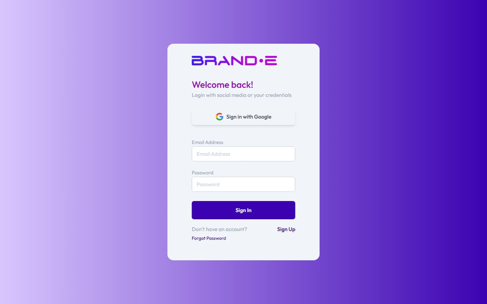

# Account and Login Issues

## Login Fails with "Invalid Email" or "Invalid URL"

**Direct Answer:** The email address or password field contains a formatting error. Check for extra spaces or typos.

### How to Fix This

1. **Verify email format**
   - Email must be: yourname@example.com
   - Check for extra spaces before or after the email
   - Confirm @ symbol is present
   - Common mistake: "your email @example.com" (space before @)

2. **Clear the field and re-enter**
   - Delete the email and type it slowly
   - Watch for autocomplete errors
   - Don't copy/paste if it might include spaces

3. **Check if email is registered**
   - The email might not have an active Brande account
   - Try a different email address you know is registered
   - If unsure, use "Forgot Password" to trigger account recovery

### If This Doesn't Work

- **Try a different browser** — Some browsers have autocomplete issues
- **Clear browser cache** — Cached bad data might be persisting
- **Contact support with your email** — We can verify if your account exists

---

## Password Validation Error "Password Must Match"

**Direct Answer:** The password you entered doesn't match the requirements, or the two password fields don't match (during signup/reset).

### How to Fix This

1. **Check password requirements**
   - Minimum 8 characters
   - A strength indicator guides you — weak passwords are blocked on submission

2. **Verify both fields match** (during signup or reset)
   - Password field and Confirm Password field must be identical
   - Retype both slowly to avoid typos
   - Check for accidental spaces at the end

3. **Avoid common weak passwords**
   - Don't use: password, 123456, qwerty, yourname
   - Don't use: repeating characters (aaaaa, 12345)
   - Use a mix of unrelated words: Coffee7Tiger

### If This Doesn't Work

- **Clear both fields and start over** — Cached values might be interfering
- **Check Caps Lock** — Accidentally enabled Caps Lock is a common issue
- **Use a password manager** — Generate a strong password and save it
- **Contact support** — Rare password validation bugs occasionally occur

---

## Password Reset Email Never Arrives

**Direct Answer:** The email is delayed, went to spam, or the email address isn't registered with Brande.

### How to Fix This

1. **Check spam/junk folder**
   - Look in spam, promotions, or other filtered folders
   - Add noreply@brande.ai to your contacts to prevent future filtering
   - Move the email to inbox and mark as "not spam"

2. **Wait a few minutes**
   - Email can take 2-5 minutes to arrive
   - If nothing arrives after 10 minutes, proceed to step 3

3. **Verify the email is registered**
   - The email might not have a Brande account
   - Try requesting a reset with a different email
   - If that email doesn't work either, your account might not exist

4. **Request a new reset email**
   - Go to login page > "Forgot Password"
   - Enter your email and click "Send Reset Link"
   - Wait 10 minutes before requesting another one
   - Multiple requests within minutes get rate-limited

### If This Doesn't Work

- **Check your email provider's settings** — Some providers block automated emails
- **Try a different email provider** — Gmail, Outlook, Yahoo all work
- **Whitelist Brande's email domain** — Ask your email provider to allow noreply@brande.ai
- **Contact support with your email** — We can manually trigger a reset

---

## Reset Password Link Expires or Shows "Invalid Token"

**Direct Answer:** The reset link expired or was already used. Request a new one.

### How to Fix This

1. **Request a new reset link**
   - Go to login page > "Forgot Password"
   - Enter your email address
   - Check your email for a new link (check spam folder too)

2. **Act quickly on new link**
   - Complete the reset as soon as you receive the email
   - Don't wait to reset later

3. **Use the link in a new tab**
   - If you already used the link, clicking it again fails
   - Open a fresh private/incognito tab and paste the link

### Token Validity Rules

- Reset links expire after a short window from sending
- Each link can only be used once
- Requesting a new reset invalidates the old link
- If the link shows "Invalid Token," request a new reset

### If This Doesn't Work

- **Try the link immediately after receiving email** — Don't wait, timers start on send
- **Don't close browser tab during reset** — Closing/reloading can invalidate the session
- **Contact support** — We can manually reset your password

---

## Related Topics

- [Change Your Password](/section-9-account/change-password)
- [Create Your Account and First Brand](/section-1-getting-started/create-your-account)
- [Access and Update Account Settings](/section-9-account/access-update-settings)
- [Get Support from Brande.ai](/section-10-help/get-support)