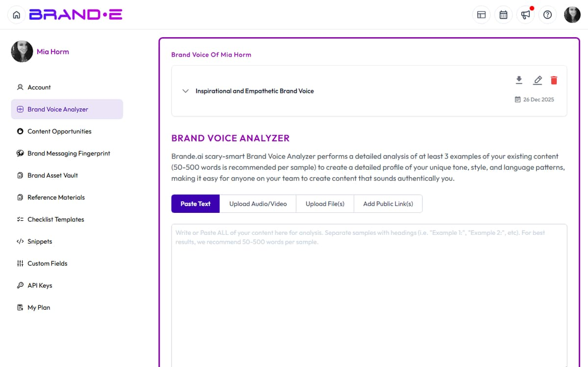

# Brand Voice Analysis Failures

## Analysis Returns "Brand Analysis Failed"

**Direct Answer:** Your input is either empty, unsupported, or the URL is unreachable. The analysis engine can't process what you've provided.

### How to Fix This

1. **Verify your text input isn't empty**
   - If using text input, ensure you've entered at least a few sentences
   - Copy the text into a text editor to confirm it contains characters

2. **Check the URL is valid and reachable**
   - Paste the URL into your browser to confirm it loads
   - Verify the URL starts with `http://` or `https://`
   - Check that the page isn't behind a login wall or firewall

3. **Confirm the file format is supported**
   - Supported formats: PDF, DOCX, TXT, CSV
   - Images, videos, and audio files aren't supported
   - Convert unsupported formats to PDF or DOCX first

4. **Ensure sufficient content length**
   - Provide at least 100-150 words for accurate analysis
   - Short snippets may return incomplete results

### If This Doesn't Work

- **Try a different URL or text sample** — Some web pages have dynamic content that may fail on first load
- **Clear your browser cache** — Outdated session data can cause parsing errors
- **Check your internet connection** — Weak connections may timeout during analysis
- **Contact support with the URL or file** — We can troubleshoot why that specific source is failing

---

## Analysis Starts But Never Completes

**Direct Answer:** The analysis is timing out, usually because the source content is too large or the server is slow.

### How to Fix This

1. **Try a shorter text or smaller file** — If analyzing a URL, test with a simpler page first
2. **Wait longer before refreshing** — Large analyses can take 30-60 seconds
3. **Check your connection speed** — Slow networks extend processing time; switch to a faster network if possible

---

## Analysis Completes But Shows "Missing URL"

**Direct Answer:** The URL field is required even if you uploaded a file. You need to either add a URL or clear that field.

### How to Fix This

1. **Add the source URL** if you have it, or
2. **Switch to text input mode** — Paste the content directly instead of referencing a URL
3. **Remove the invalid URL** from the field before resubmitting

---

## Related Topics

- [Understand Brand Voice Analyzer](/section-1-getting-started/understand-brand-voice-analyzer)
- [Update Your Brand Voice](/section-1-getting-started/update-brand-voice)
- [Complete Your Brand Profile Step by Step](/section-1-getting-started/complete-brand-profile)
- [Get Support from Brande.ai](/section-10-help/get-support)