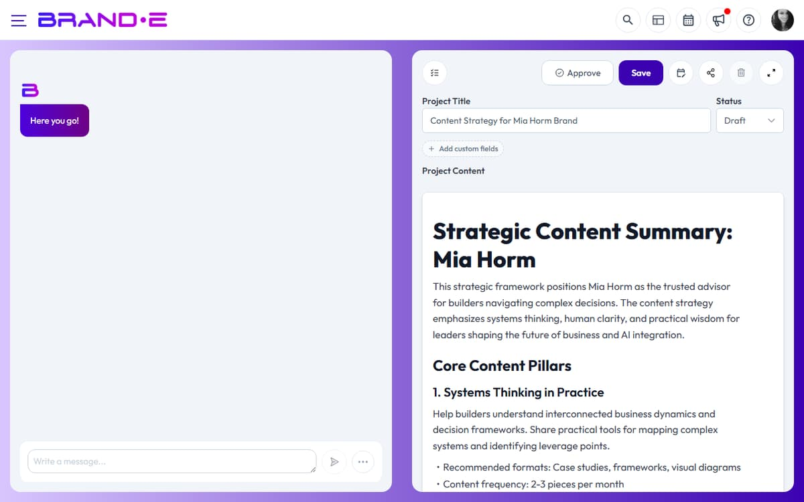

# Content Generation Errors

## Generation Returns "An Error Occurred" or "Oops!"

**Direct Answer:** The API server failed during generation, usually because your Brand DNA is incomplete or the request exceeded service limits.

### How to Fix This

1. **Verify your Brand DNA is complete**
   - Go to Brand Settings and confirm all required fields are filled
   - Brand voice, tone, and core values should be defined
   - Add supporting brand examples if available
   - Incomplete Brand DNA prevents the AI from generating consistent content

2. **Try generating shorter content**
   - Start with 100-200 words instead of a full article
   - Longer requests are more likely to timeout
   - Generate in sections, then combine them

3. **Check your subscription plan**
   - Verify you have monthly API credits remaining
   - Some plans limit generation length or daily requests
   - Contact support if you've exceeded your plan limits

4. **Refresh and retry**
   - Reload the page and try again
   - Temporary server issues sometimes resolve on retry

### If This Doesn't Work

- **Try a different content type** — If blog generation fails, try social media or email copy instead
- **Simplify your Brand DNA** — Remove very detailed guidelines that might confuse the AI
- **Generate during off-peak hours** — Late evening or early morning often has faster servers
- **Contact support with your Brand DNA** — Share what you're trying to generate so we can identify issues

---

## Generation Completes But Returns Empty or Gibberish

**Direct Answer:** Your Brand DNA is too vague or conflicting. The AI can't generate coherent content without clear direction.

### How to Fix This

1. **Review your Brand DNA**
   - Avoid contradictory instructions (e.g., "professional yet playful" without examples)
   - Add specific brand voice examples
   - Define who your audience is clearly

2. **Provide content context**
   - If generating for a specific platform, note it (LinkedIn, Instagram, blog, etc.)
   - Include tone preferences (formal, casual, humorous)
   - Add target audience information

3. **Start with templates**
   - Use recommended content templates instead of generating from scratch
   - Templates provide better structure for the AI

---

## Generation Times Out (Loading for 2+ Minutes)

**Direct Answer:** Your request is too large or the server is under heavy load. Break the request into smaller pieces.

### How to Fix This

1. **Reduce request complexity**
   - Generate a 500-word article instead of 2000 words
   - Create a single social post instead of a full series
   - Use simpler Brand DNA guidelines

2. **Try again after waiting**
   - Server load peaks during business hours (9am-5pm)
   - Retry early morning or evening for faster results

3. **Check your network**
   - Test your connection speed
   - Temporarily disable browser extensions (ad blockers can slow requests)

---

## Related Topics

- [Create a New Project](/section-3-creating-content/create-new-project)
- [Edit, Refine, and Regenerate Content](/section-3-creating-content/edit-refine-regenerate)
- [Choose the Right Project Template](/section-3-creating-content/choose-project-templates)
- [Get Support from Brande.ai](/section-10-help/get-support)