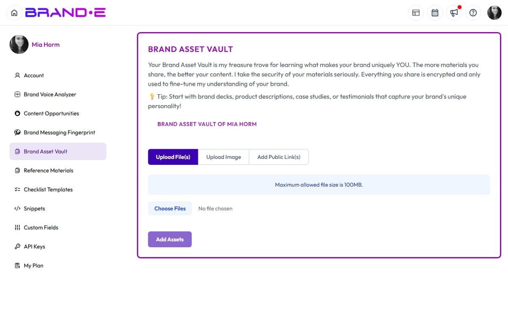

# File Upload Problems

## Upload Fails with "File Size Limit Exceeded"

**Direct Answer:** Your file is larger than the 25MB limit. Compress it or split it into smaller files.

### How to Fix This

1. **Check file size**
   - Right-click the file and select Properties (Windows) or Get Info (Mac)
   - Confirm the size is under 25MB

2. **Compress the file**
   - For PDFs: Use online compression tools (ILovePDF, SmallPDF)
   - For Office documents: Remove embedded media, then re-save
   - For images: Reduce dimensions and quality in an image editor

3. **Split large documents**
   - If you have a 50MB PDF, split it into two 20MB files
   - Upload each file separately and analyze them in sequence

4. **Convert to a smaller format**
   - DOCX files are often smaller than PDF
   - TXT files are minimal size

### If This Doesn't Work

- **Verify actual file size** — Some tools show incorrect sizes
- **Try a different file format** — Convert PDF to DOCX or vice versa
- **Contact support** — We can manually increase limits for enterprise plans

---

## Upload Fails with "File Type Not Supported"

**Direct Answer:** The file format isn't supported. Brande accepts PDF, DOCX, TXT, and CSV only.

### How to Fix This

1. **Convert the file to a supported format**
   - DOC → Convert to DOCX (open in Word, Save As)
   - RTF → Convert to DOCX or PDF
   - XLS/XLSX → Convert to CSV (File > Save As > CSV)
   - PAGES → Export as DOCX or PDF from Pages app
   - Google Docs → Download as DOCX or PDF

2. **Copy and paste content instead**
   - If the file is small, copy the text and use text input instead
   - This works for any format that contains readable text

3. **Check file extension**
   - Confirm the file actually ends in .pdf, .docx, .txt, or .csv
   - Renaming won't work; you must convert the actual file

### If This Doesn't Work

- **Verify the conversion worked** — Open the converted file to confirm it's readable
- **Try online conversion tools** — CloudConvert, Zamzar work for any format
- **Contact support with the original file** — We may be able to help with special formats

---

## File Uploads Successfully But Content Isn't Analyzed

**Direct Answer:** The file was uploaded but the analysis didn't start. Refresh the page and try again, or use text input instead.

### How to Fix This

1. **Refresh the page**
   - Press F5 or Cmd+Shift+R to do a hard refresh
   - Try uploading the same file again

2. **Check for browser errors**
   - Open browser Developer Tools (F12)
   - Look for red error messages in the Console tab
   - Screenshot and send to support if you find errors

3. **Try text input instead**
   - Copy the file content and paste it into the text field
   - This bypasses file upload issues

---

## "File Delete Error" When Trying to Delete an Upload

**Direct Answer:** The file is still being processed or there's a temporary permission issue. Try again in a few seconds.

### How to Fix This

1. **Wait 10-15 seconds**
   - Sometimes files take time to process before they can be deleted
   - Refresh the page and try deleting again

2. **Clear browser cache**
   - In Chrome: Settings > Privacy > Clear Browsing Data (select "Cached images and files")
   - Reload the page and try deleting

3. **Try deleting from a different browser**
   - Switch to Firefox, Safari, or Edge
   - The original browser may have stale data

4. **Manually remove from your account**
   - If a file persists, contact support with the filename
   - We can remove it from the backend

### If This Doesn't Work

- **Try a force refresh** — Ctrl+F5 (Windows) or Cmd+Shift+R (Mac)
- **Sign out and back in** — Session data may be corrupted
- **Use incognito mode** — Browser extensions sometimes interfere with deletion

---

## Related Topics

- [Use Reference Materials to Ground Your Content](/section-1-getting-started/reference-materials)
- [Include Images in Your Projects](/section-3-creating-content/include-images)
- [Preview Files and Images Inside Brande.ai](/section-5-projects-organization/preview-files-images)
- [Get Support from Brande.ai](/section-10-help/get-support)