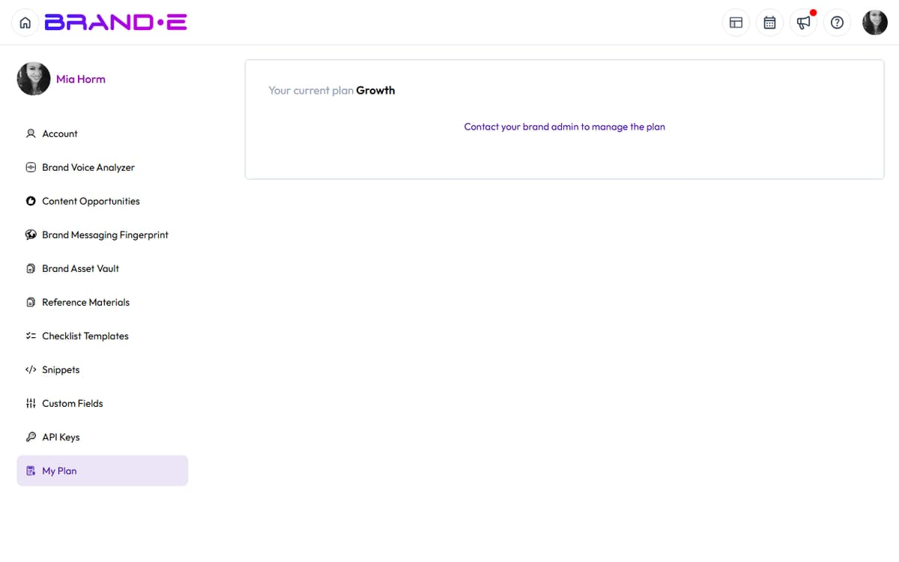

# Premium Feature Access

## Modal Shows "Premium Feature" or "Upgrade Your Plan"

**Direct Answer:** The feature you're accessing isn't included in your current plan. You need to upgrade to unlock it.

### How to Fix This

1. **Check what your plan includes**
   - Go to Account Settings > Subscription
   - Compare your current plan against the feature list
   - Note which features require upgrades

2. **Identify the feature's requirements**
   - Click the info icon next to "Premium Feature"
   - It shows which plan tier includes this feature
   - Some features require Team or Agency plans

3. **Upgrade your plan**
   - Go to Account Settings > Billing
   - Select the plan that includes the feature you need
   - Billing updates immediately; you get access right away

4. **Contact your account manager** (for enterprise/team plans)
   - If you have a team, the account owner may need to approve upgrades
   - Reach out to support to discuss team feature access

### If This Doesn't Work

- **Check that the upgrade processed** — Refresh the page after upgrading
- **Verify you're logged into the right account** — Some users have multiple Brande accounts
- **Contact support** — There may be a caching issue preventing access

---

## "You Can't Access This Feature During Trial Period"

**Direct Answer:** Your trial plan doesn't include this feature. Upgrade to a paid plan to unlock all features.

### How to Fix This

1. **Start a free trial upgrade**
   - Go to Account Settings > Subscription
   - Select "Upgrade Plan" to activate a paid subscription
   - Your trial automatically converts to the paid plan

2. **Choose the right plan tier**
   - Pro plan includes core features and most AI generation
   - Team plan adds collaboration and team management
   - Agency plan includes white-label and API access

3. **Apply any available discount**
   - If you have a promo code, enter it during checkout
   - Some plans offer annual discounts

### Features Limited During Trial

- Advanced AI generation (content length, request limits)
- Brand voice analysis (limited to 3 analyses)
- Team collaboration (single-user only during trial)
- API access (not available in trial)
- Custom integrations (Team/Agency plans only)

### If This Doesn't Work

- **Contact sales** — Special trial extensions available on request
- **Check expiration date** — Your trial may have ended; upgrade to restore access
- **Verify your plan type** — Some trial accounts are restricted by feature, not time

---

## "You Have Reached Collaborator Limit"

**Direct Answer:** Your plan allows a set number of team members. Upgrade your plan or remove inactive collaborators.

### How to Fix This

1. **Check your collaborator limit**
   - Go to Team Settings > Members
   - Count active team members
   - Compare against your plan's limit

2. **Remove inactive members**
   - In Team Settings > Members, click the X next to inactive users
   - Removing members frees up slots immediately
   - They lose access to shared projects

3. **Upgrade your plan**
   - Go to Account Settings > Subscription
   - Team plan: 5 collaborators
   - Agency plan: Unlimited collaborators
   - Upgrade takes effect immediately

4. **Use guest invites instead** (for contractors/clients)
   - Some plans allow guest access without using collaborator slots
   - Guest invites expire after 30 days
   - Check your plan documentation for guest limits

### If This Doesn't Work

- **Contact support for a manual increase** — Enterprise accounts can request custom limits
- **Verify removed members were deleted** — Refresh the page to confirm slots were freed
- **Check if you're on the right account** — Multi-account users sometimes confuse limits

---

## Related Topics

- [Understand Your Agency Plan](/section-7-agency/understand-agency-plan)
- [Access and Update Account Settings](/section-9-account/access-update-settings)
- [Invite Client Collaborators](/section-7-agency/invite-client-collaborators)
- [Get Support from Brande.ai](/section-10-help/get-support)